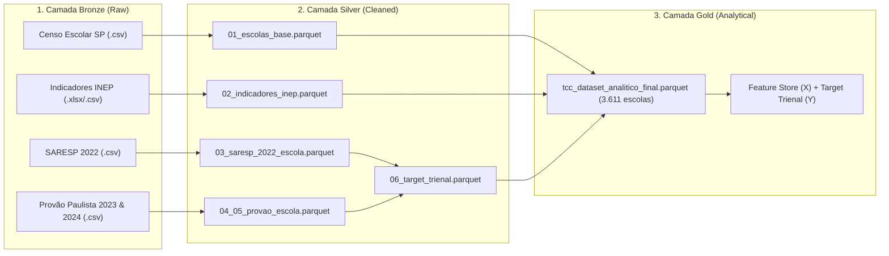

# UNIVERSIDADE VIRTUAL DO ESTADO DE SÃO PAULO
## BACHARELADO EM CIÊNCIA DE DADOS

<br>

**ADEMILSON ACOSTA CIRINO – RA: 24217736**  
**EVERSON DOS SANTOS RODRIGUES – RA: 23223574**  
**LUCAS SILVA DE AQUINO – RA: 2217680**  
**RAFAEL PEIXOTO DE CARVALHO – RA: 23211013**  
**RODRIGO MATHEUS DE OLIVEIRA KOJIMA – RA: 23228077**  
**TARIK RIBEIRO CONSTÂNCIO CAMPESTRINI – RA: 2203974**  

<br><br><br>

# PREDIÇÃO DO DESEMPENHO EM MATEMÁTICA NA EDUCAÇÃO BÁSICA A PARTIR DE INDICADORES EDUCACIONAIS E SOCIOECONÔMICOS: UMA ABORDAGEM BASEADA EM CIÊNCIA DE DADOS

<br><br><br>

> **Vídeo de Apresentação do Trabalho de Conclusão de Curso**  
> *[Link a ser inserido na entrega final]*

<br><br><br>

**SÃO PAULO – SP**  
**2026**

---

<br>

# PREDIÇÃO DO DESEMPENHO EM MATEMÁTICA NA EDUCAÇÃO BÁSICA A PARTIR DE INDICADORES EDUCACIONAIS E SOCIOECONÔMICOS: UMA ABORDAGEM BASEADA EM CIÊNCIA DE DADOS

<br><br>

Relatório Técnico-Científico apresentado na disciplina de Trabalho de Conclusão de Curso do Bacharelado em Ciência de Dados da Universidade Virtual do Estado de São Paulo (UNIVESP).

**Grupo**: TCC530 – BCD – Turma 002  
**Orientador**: Prof. Me. Cássio Silva Takarada  

<br><br><br>

**SÃO PAULO – SP**  
**2026**

---

### FICHA CATALOGRÁFICA / REFERÊNCIA DO TRABALHO

CAMPESTRINI, T. R. C.; CIRINO, A. A.; AQUINO, L. S.; RODRIGUES, E. S.; KOJIMA, R. M. O.; CARVALHO, R. P. **Predição do desempenho em Matemática na Educação Básica a partir de indicadores educacionais e socioeconômicos: uma abordagem baseada em Ciência de Dados**. Relatório Técnico-Científico. Bacharelado em Ciência de Dados – Universidade Virtual do Estado de São Paulo. Orientador: Cássio Silva Takarada. São Paulo, 2026.

---

## RESUMO

A etapa final da Educação Básica brasileira enfrenta um histórico e persistente desafio na consolidação de competências quantitativas essenciais. No Estado de São Paulo, avaliações diagnósticas padronizadas revelam que expressiva parcela dos concluintes da 3ª série do Ensino Médio da rede pública estadual permanece retida em níveis críticos de proficiência em Matemática. Embora a literatura aponte forte determinação socioeconômica sobre o rendimento acadêmico, abordagens estritamente contextuais mostram-se deterministas e pouco acionáveis para formulação de políticas escolares. Este trabalho de conclusão de curso investiga, por meio de modelos de aprendizado de máquina supervisionado acoplados ao arcabouço de Inteligência Artificial Explicável (XAI), em que magnitude os fatores intraescolares controláveis — prioritariamente a regularidade do corpo docente (IRD), a sobrecarga de esforço docente (IED) e a infraestrutura escolar instalada — atuam na mitigação da defasagem em Matemática. A base amostral integra microdados do SARESP (2022), Provão Paulista (2023 e 2024), Censo Escolar da Educação Básica e Indicadores Educacionais do INEP para as escolas estaduais paulistas. Adotou-se a Arquitetura Medalhão para engenharia de dados, fundamentando a adoção de 2023 como ano-pivô após validação empírica da estabilidade longitudinal dos fatores escolares ($r > 0,70$). Os microdados de 884.417 estudantes avaliados ao longo do triênio foram sintetizados em uma variável-alvo contínua ponderada ($Y$), resultando em uma base analítica final (*Camada Gold*) com 3.611 unidades escolares regulares consolidadas sob rigorosos portões de qualidade (*quality gates*). Os modelos preditivos avaliados e a subsequente decomposição de Shapley (valores SHAP) visam identificar limiares críticos de proteção docente e subsidiar a construção de uma matriz diagnóstica acionável para tomada de decisão em Diretorias de Ensino.

**Palavras-chave**: Aprendizado de Máquina, Inteligência Artificial Explicável (XAI), SHAP, Desempenho Escolar, SARESP, Fatores Intraescolares, Arquitetura Medalhão.

---

## ABSTRACT

The final stage of Brazilian Basic Education faces a historical and persistent challenge in consolidating essential quantitative skills. In the State of São Paulo, standardized diagnostic assessments reveal that a substantial portion of public secondary school seniors remains trapped at critical proficiency levels in Mathematics. Although literature highlights strong socioeconomic conditioning over student achievement, purely contextual approaches provide deterministic and non-actionable frameworks for educational management. This capstone project investigates, using supervised machine learning models combined with Explainable Artificial Intelligence (XAI), to what extent controllable within-school factors — primarily teacher regularity (IRD), teacher workload (IED), and installed educational infrastructure — mitigate critical learning deficits in Mathematics. The analytical sample integrates microdata from SARESP (2022), Provão Paulista (2023 and 2024), Basic Education School Census, and INEP Educational Indicators across São Paulo state public schools. A Medallion Architecture was employed for data engineering, confirming 2023 as a representative pivot year through empirical longitudinal stability validation ($r > 0.70$). Microdata from 884,417 students evaluated across the triennium were synthesized into a continuous weighted target variable ($Y$), yielding a consolidated final analytical dataset (*Gold Layer*) comprising 3,611 regular public high schools under strict quality gates. Predictive modeling and subsequent Shapley Additive Explanations (SHAP values) aim to identify protective thresholds for teacher stability and support an actionable diagnostic decision matrix for regional educational boards.

**Keywords**: Machine Learning, Explainable Artificial Intelligence (XAI), SHAP, School Performance, SARESP, Within-school Factors, Medallion Architecture.

---

## LISTA DE ILUSTRAÇÕES

*Figura 1 – Arquitetura do Pipeline de Dados e Fluxo Metodológico Ponta a Ponta*  
*Figura 2 – Diagrama da Arquitetura Medalhão de Dados (Bronze, Silver e Gold)*  
*Figura 3 – Diagrama do Funil Amostral Metodológico de 9 Etapas da Pesquisa*  
*Figura 4 – Dispersão Interanual e Correlação de Pearson dos Indicadores Docentes (2022–2024)*  
*Figura 5 – Distribuição de Densidade da Variável-Alvo Trienal Ponderada ($Y$)* *(Em processamento)*  
*Figura 6 – Curva de Desempenho e Comparativo das Métricas dos Modelos Preditivos* *(Previsto)*  
*Figura 7 – SHAP Summary Plot: Ranqueamento Global de Importância dos Fatores Escolares* *(Previsto)*  
*Figura 8 – SHAP Dependence Plot: Interação Bivariada entre Regularidade Docente (IRD) e Vulnerabilidade (INSE)* *(Previsto)*  

---

## LISTA DE TABELAS

*Tabela 1 – Cronograma Geral de Execução e Entregas Quinzenais do TCC*  
*Tabela 2 – Síntese das Fontes de Dados Governamentais Integradas*  
*Tabela 3 – Dicionário de Variáveis das Features Independentes ($X$)*  
*Tabela 4 – Funil Amostral de Seleção das Escolas Estaduais de Ensino Médio (SP)*  
*Tabela 5 – Estatísticas Descritivas e Validação da Estabilidade Trienal (2022–2024)*  
*Tabela 6 – Matriz de Correlação Interanual de Pearson ($r$) dos Fatores Escolares*  
*Tabela 7 – Síntese do Processamento dos Microdados de Avaliação Discente (2022–2024)*  
*Tabela 8 – Estatísticas Descritivas das Variáveis Centrais da Camada Gold ($N = 3.611$)*  
*Tabela 9 – Diagnóstico de Cobertura e Auditoria de Preenchimento das Features ($X$)*  
*Tabela 10 – Métricas de Desempenho dos Algoritmos de Aprendizado Supervisionado* *(Previsto)*  
*Tabela 11 – Matriz Diagnóstica Acionável de Recomendações para a Gestão Escolar* *(Previsto)*  

---

## LISTA DE SIGLAS E ABREVIATURAS

| Sigla | Significado |
| :--- | :--- |
| **ABNT** | Associação Brasileira de Normas Técnicas |
| **AFD** | Adequação da Formação Docente |
| **CIE** | Cadastro de Informações Educacionais (Código Estadual da Escola - SEDUC-SP) |
| **EDA** | *Exploratory Data Analysis* (Análise Exploratória de Dados) |
| **ETL** | *Extract, Transform, Load* (Extração, Transformação e Carga) |
| **IED** | Indicador de Esforço Docente |
| **INEP** | Instituto Nacional de Estudos e Pesquisas Educacionais Anísio Teixeira |
| **INSE** | Indicador de Nível Socioeconômico das Escolas |
| **IRD** | Indicador de Regularidade do Corpo Docente |
| **LAI** | Lei de Acesso à Informação (Lei nº 12.527/2011) |
| **LGPD** | Lei Geral de Proteção de Dados Pessoais (Lei nº 13.709/2018) |
| **LightGBM**| *Light Gradient Boosting Machine* |
| **MAE** | *Mean Absolute Error* (Erro Médio Absoluto) |
| **RMSE** | *Root Mean Squared Error* (Raiz do Erro Quadrático Médio) |
| **SAEB** | Sistema de Avaliação da Educação Básica |
| **SARESP** | Sistema de Avaliação do Rendimento Escolar do Estado de São Paulo |
| **SEDUC-SP**| Secretaria da Educação do Estado de São Paulo |
| **SHAP** | *SHapley Additive exPlanations* |
| **UNIVESP**| Universidade Virtual do Estado de São Paulo |
| **XAI** | *Explainable Artificial Intelligence* (Inteligência Artificial Explicável) |

---

## SUMÁRIO

```text
1. INTRODUÇÃO
   1.1. Contextualização da Defasagem em Matemática no Ensino Médio Paulista
   1.2. Fatores Intraescolares versus Condicionantes Socioeconômicos
   1.3. Relevância da Inteligência Artificial Explicável (XAI) na Gestão Pública
   1.4. Organização do Documento

2. DELIMITAÇÃO DO PROBLEMA E OBJETIVOS
   2.1. Formulação da Pergunta-Problema
   2.2. Critérios de Demarcação do Campo de Estudo
   2.3. Hipóteses de Pesquisa
   2.4. Objetivos
        2.4.1. Objetivo Geral
        2.4.2. Objetivos Específicos

3. MATERIAIS E AMBIENTE COMPUTACIONAL
   3.1. Fontes de Dados e Arcabouço Jurídico-Institucional (LAI e LGPD)
   3.2. Caracterização das Bases e Dicionário de Atributos
   3.3. Infraestrutura Tecnológica e Bibliotecas Utilizadas
   3.4. Especificação dos Artefatos de Dados Gerados (Silver e Gold)

4. METODOLOGIA E ENGENHARIA DE DADOS
   4.1. Delineamento Metodológico da Pesquisa
   4.2. Arquitetura Medalhão de Dados
   4.3. Funil Amostral e Critérios de Elegibilidade
   4.4. Padronização de Chaves Primárias Duplas e Resolução de Inconsistências
   4.5. Engenharia de Atributos e Construção das Features (X)
   4.6. Validação Científica da Estabilidade Trienal do Ano-Pivô (2023)
   4.7. Processamento dos Microdados e Agregação do Desempenho Escolar
        4.7.1. SARESP 2022 (Silver)
        4.7.2. Provão Paulista 2023 (Silver)
        4.7.3. Provão Paulista 2024 (Silver)
   4.8. Consolidação do Target Trienal Ponderado (Y)
   4.9. A Camada Gold e o Corte Amostral de Robustez Estatística
   4.10. Portões de Qualidade de Dados (Quality Gates)
   4.11. Estratégia de Validação e Prevenção de Data Leakage
   4.12. Modelagem Preditiva Supervisionada
   4.13. Interpretabilidade e Explicabilidade Algorítmica via SHAP

5. DESENVOLVIMENTO E ANÁLISE EXPLORATÓRIA DOS DADOS [SEÇÃO VIVA]
   5.1. Estatísticas Descritivas e Perfilamento da Camada Gold
   5.2. Diagnóstico da Distribuição do Target Trienal Ponderado
   5.3. Análise Espacial e Assimetrias Regionais de Rendimento
   5.4. Correlações Bivariadas entre Fatores Intraescolares e Desempenho

6. RESULTADOS E DISCUSSÕES [PREVISTO - FASE DE MODELAGEM]
   6.1. Desempenho Comparativo dos Modelos Preditivos
   6.2. Importância Global dos Fatores Escolares via Valores SHAP
   6.3. O Efeito Moderador Protetivo da Estabilidade Docente
   6.4. Análise de Casos Locais e Diagnósticos Escolares

7. CONSIDERAÇÕES FINAIS E PROPOSTA DE APLICAÇÃO [PREVISTO]
   7.1. Síntese das Contribuições em Relação às Hipóteses
   7.2. Matriz Diagnóstica Acionável para Políticas Públicas Educacionais
   7.3. Limitações do Estudo e Direcionamentos Futuros

REFERÊNCIAS
APÊNDICE A – Dicionário Completo de Variáveis e Metadados da Base Gold
APÊNDICE B – Códigos Executáveis dos Pipelines de ETL (Pipelines 06 e 07)
```

---

<br>

# 1. INTRODUÇÃO

## 1.1. Contextualização da Defasagem em Matemática no Ensino Médio Paulista

A etapa final da Educação Básica no Brasil vivencia desafios estruturais profundos e persistentes no que tange ao desenvolvimento e à consolidação de competências quantitativas fundamentais. No Estado de São Paulo — detentor da maior rede escolar pública da América Latina —, os resultados históricos de avaliações diagnósticas padronizadas em larga escala, com destaque para o Sistema de Avaliação do Rendimento Escolar do Estado de São Paulo (SARESP) e o recente Provão Paulista Seriado, revelam um cenário de severa estagnação: parcela expressiva dos estudantes concluintes da 3ª série do Ensino Médio encerra seu ciclo compulsório classificada nos níveis de proficiência "Abaixo do Básico" e "Básico".

Esse contingente de estudantes conclui a Educação Básica sem o domínio de operações matemáticas elementares, raciocínio lógico-algébrico e interpretação quantitativa de fenômenos cotidianos. Essa defasagem não apenas obstaculiza o ingresso e a permanência no ensino superior técnico e universitário, mas consolida barreiras quase intransponíveis para a inserção qualificada no mercado de trabalho formal, crescentemente pautado pela digitalização e pela tomada de decisão orientada a dados. Em última análise, a defasagem matemática crônica atua como um potente mecanismo de reprodução e aprofundamento das desigualdades socioeconômicas geracionais.

## 1.2. Fatores Intraescolares versus Condicionantes Socioeconômicos

A literatura clássica e contemporânea em Sociologia da Educação e Eficácia Escolar — desde o seminal Relatório Coleman até produções contemporâneas nacionais — converge em reconhecer que fatores exógenos à escola, com ênfase no nível socioeconômico das famílias (INSE), no capital cultural e na localização geográfica, exercem correlação preponderante sobre a variância do rendimento acadêmico dos estudantes.

Entretanto, limitar a lente analítica aos determinantes socioeconômicos produz uma perspectiva essencialmente determinista e de reduzida utilidade prática para a formulação e execução de políticas educacionais. O meio familiar e as condições econômicas dos estudantes fogem à governabilidade imediata da gestão escolar e dos órgãos executivos educacionais. Torna-se, por conseguinte, imperativo investigar e mensurar em que magnitude os **fatores intraescolares controláveis** — aqueles passíveis de intervenção deliberada por políticas públicas setoriais — são capazes de modular e atenuar a desvantagem socioeconômica de partida.

Entre esses fatores, ganham centralidade:
1. A **regularidade do corpo docente (IRD)**, representativa da permanência e continuidade dos professores na mesma unidade escolar ao longo dos anos letivos;
2. O **esforço e sobrecarga docente (IED)**, quantificado pelo número de turmas, escolas de atuação e turnos acumulados;
3. A **adequação da formação profissional (AFD)** dos docentes que lecionam o componente curricular de Matemática;
4. Os **recursos de infraestrutura escolar**, abrangendo conectividade tecnológica, laboratórios didáticos e condições físicas dos edifícios escolares.

## 1.3. Relevância da Inteligência Artificial Explicável (XAI) na Gestão Pública

A fundamentação técnica e acadêmica deste estudo assenta-se na mobilização de técnicas contemporâneas da Ciência de Dados para além da modelagem puramente preditiva. Modelos preditivos complexos baseados em aprendizado de máquina (como algoritmos de *ensemble learning* baseados em árvores de decisão) alcançam patamares superiores de acurácia em comparação com regressões paramétricas clássicas, todavia comportam-se como "caixas-pretas" (*black-boxes*), opacificando as relações funcionais subjacentes.

Para superar essa barreira epistêmica e viabilizar a aplicação dos resultados no setor público, incorpora-se o ferramental de **Inteligência Artificial Explicável (XAI)**, operacionalizado via valores SHAP (*SHapley Additive exPlanations*). Fundamentado na teoria dos jogos cooperativos, o método decompõe a contribuição marginal de cada atributo escolar na predição do desfecho de proficiência, preservando propriedades fundamentais de aditividade e consistência local. Essa abordagem permite quantificar não apenas a relevância global de cada fator, mas também desvelar não-linearidades e efeitos moderadores locais — avaliando, empiricamente, se e em que intensidade uma elevada estabilidade do corpo docente consegue exercer efeito protetivo em unidades escolares inseridas em contextos de severa vulnerabilidade socioeconômica.

## 1.4. Organização do Documento

Para proporcionar leitura fluida e alinhada ao rigor metodológico exigido pela Universidade Virtual do Estado de São Paulo (UNIVESP), este relatório técnico-científico está estruturado em sete capítulos principais:
- O **Capítulo 2 (Delimitação do Problema e Objetivos)** formaliza a questão norteadora, os limites temporais, espaciais e amostrais, as hipóteses estatísticas ($H_0, H_1, H_2$) e os objetivos geral e específicos.
- O **Capítulo 3 (Materiais e Ambiente Computacional)** discrimina detalhadamente as bases de dados governamentais utilizadas, o enquadramento legal de transparência e privacidade (LAI e LGPD), os dicionários de variáveis e a especificação completa dos artefatos de dados e ferramentas tecnológicas.
- O **Capítulo 4 (Metodologia e Engenharia de Dados)** apresenta o delineamento metodológico, a Arquitetura Medalhão, os funis amostrais de microdados (SARESP 2022 e Provão Paulista 2023–2024), a consolidação do target trienal ponderado ($Y$), a composição da Camada Gold ($N = 3.611$) com seus portões de qualidade (*quality gates*), os testes de estabilidade do ano-pivô 2023 e o protocolo de modelagem supervisionada e SHAP.
- O **Capítulo 5 (Desenvolvimento e Análise Exploratória dos Dados)** compõe a seção viva do relatório, documentando os resultados empíricos da Camada Gold, estatísticas descritivas das variáveis centrais e auditoria de preenchimento.
- O **Capítulo 6 (Resultados e Discussões)** sintetizará a performance preditiva dos modelos supervisionados, o ranqueamento de importância via SHAP e a verificação empírica das hipóteses formuladas.
- O **Capítulo 7 (Considerações Finais e Proposta de Aplicação)** sintetiza as conclusões da pesquisa, apresenta a proposta de Matriz Diagnóstica para a gestão educacional, debate as limitações do estudo e sinaliza caminhos para trabalhos futuros.

---

<br>

# 2. DELIMITAÇÃO DO PROBLEMA E OBJETIVOS

## 2.1. Formulação da Pergunta-Problema

Com base no cenário diagnosticado, formula-se a seguinte questão de pesquisa norteadora:

> *"Em que magnitude os fatores intraescolares controláveis — prioritariamente a regularidade do corpo docente (IRD), a sobrecarga de esforço docente (IED) e os recursos de infraestrutura pedagógica — atenuam a probabilidade de defasagem crítica em Matemática entre os concluintes da 3ª série do Ensino Médio da rede pública estadual paulista, após o controle dos condicionantes socioeconômicos?"*

## 2.2. Critérios de Demarcação do Campo de Estudo

- **Delimitação Populacional**: Estabelecimentos públicos de ensino vinculados exclusivamente à rede estadual administrada pela Secretaria da Educação do Estado de São Paulo (SEDUC-SP).
- **Objeto e Unidade Observacional**: A unidade de análise é a **escola**, permitindo articular agregados contextuais institucionais com distribuições de proficiência sem violar o sigilo individual dos estudantes, atendendo estritamente à LGPD.
- **Público-Alvo**: Alunos matriculados e avaliados nas turmas regulares ativas da 3ª série do Ensino Médio.
- **Delimitação Espacial**: Estado de São Paulo, abrangendo as unidades distribuídas na Capital, Região Metropolitana de São Paulo e Interior, contemplando as 91 Diretorias Regionais de Ensino.
- **Delimitação Temporal**: Recorte trienal consolidado pós-pandêmico (2022, 2023 e 2024), capturando a transição dos modelos avaliativos (SARESP tradicional para Provão Paulista Seriado) e a evolução dos indicadores contextuais federais.

## 2.3. Hipóteses de Pesquisa

Para guiar a modelagem estatística e a interpretação causal orientada por XAI, estabelecem-se as seguintes hipóteses:

- **Hipótese Nula ($H_0$)**: Os fatores intraescolares controláveis (regularidade docente, esforço docente e infraestrutura física/tecnológica) não exercem contribuição marginal estatisticamente relevante na predição do rendimento em Matemática, sendo o desfecho acadêmico explicado preponderantemente pelo nível socioeconômico (INSE).
- **Hipótese Principal ($H_1$)**: Unidades escolares que sustentam maior regularidade docente (alto IRD) e menor sobrecarga de esforço (baixo IED) exibem médias de desempenho significativamente superiores em Matemática, mantendo-se essa relação mesmo após o controle estrito do nível socioeconômico da unidade.
- **Hipótese Secundária ($H_2$)**: A regularidade docente atua como um fator moderador protetivo, amortecendo o efeito adverso da alta vulnerabilidade socioeconômica (baixo INSE) nas escolas periféricas e atenuando o percentual de defasagem crítica.

## 2.4. Objetivos

### 2.4.1. Objetivo Geral
Investigar e quantificar a influência dos fatores intraescolares controláveis na mitigação da defasagem em Matemática entre concluintes do Ensino Médio da rede pública estadual paulista (2022–2024), mediante a aplicação de modelos de aprendizado de máquina supervisionado e algoritmos de Inteligência Artificial Explicável (XAI).

### 2.4.2. Objetivos Específicos
1. **Integrar e tratar microdados educacionais públicos**: Construir uma base relacional unificada por escola, cruzando chaves estaduais (CIE) e federais (INEP), consolidando atributos do Censo Escolar, indicadores docentes do INEP (IRD, IED, INSE) e os desfechos de proficiência do SARESP (2022) e Provão Paulista (2023 e 2024).
2. **Validar a consistência temporal dos dados**: Testar a estabilidade longitudinal dos indicadores escolares entre 2022 e 2024 para justificar matematicamente a escolha do ano de 2023 como pivô representativo das variáveis independentes ($X$).
3. **Mapear assimetrias espaciais e socioeducacionais**: Executar análise exploratória espacial e tabular para caracterizar a heterogeneidade da rede estadual quanto à regularidade docente, infraestrutura tecnológica e taxas de defasagem em Matemática.
4. **Treinar e comparar modelos preditivos supervisionados**: Ajustar algoritmos lineares regularizados e modelos baseados em árvores de decisão (*Random Forest*, *LightGBM*), avaliando-os sob validação cruzada estratificada em $k$-folds para prevenir vazamento de dados (*data leakage*).
5. **Decompor as contribuições marginais com SHAP**: Mensurar os impactos globais e locais das variáveis escolares e estimar a curva de dependência e moderação entre regularidade docente e vulnerabilidade socioeconômica.
6. **Propor uma matriz diagnóstica acionável**: Estruturar um modelo conceitual de suporte à decisão para gestores educacionais e Diretorias de Ensino, traduzindo as inferências do modelo em subsídios de alocação de pessoal e infraestrutura.

---

<br>

# 3. MATERIAIS E AMBIENTE COMPUTACIONAL

## 3.1. Fontes de Dados e Arcabouço Jurídico-Institucional (LAI e LGPD)

A integridade metodológica e a legitimidade ética da pesquisa fundamentam-se na utilização exclusiva de **dados públicos abertos e desidentificados**, obtidos diretamente dos repositórios oficiais governamentais:
- **Secretaria da Educação do Estado de São Paulo (SEDUC-SP)**: Portal de Dados Abertos (`dados.educacao.sp.gov.br`), de onde foram extraídos o Cadastro Oficial de Escolas Ativas e os microdados de desempenho escolar (SARESP 2022 e Provão Paulista 2023–2024);
- **Instituto Nacional de Estudos e Pesquisas Educacionais Anísio Teixeira (INEP)**: Portal de Dados Abertos (`gov.br/inep`), fonte dos microdados do Censo Escolar da Educação Básica e dos Indicadores Educacionais Especializados (INSE, IRD, IED e AFD).

A extração e manipulação dos dados atendem com rigor à **Lei de Acesso à Informação (Lei Federal nº 12.527/2011)**, assegurando publicidade e transparência da informação estatal. Adicionalmente, em conformidade com a **Lei Geral de Proteção de Dados Pessoais (LGPD - Lei Federal nº 13.709/2018)**, todas as agregações de desempenho e proficiência foram efetuadas na granularidade da **unidade escolar** (escola), com eliminação de identificadores individuais de estudantes (nome, CPF, RA discente), inviabilizando qualquer processo de reidentificação ou estigmatização de sujeitos.

*Tabela 2 – Síntese das Fontes de Dados Governamentais Integradas*

| Órgão Produtor | Base / Indicador | Granularidade Original | Período Coletado | Chave Identificadora |
| :--- | :--- | :--- | :---: | :--- |
| **SEDUC-SP** | Cadastro de Escolas Ativas | Unidade Escolar | 2023 | `CD_ESCOLA` (CIE) / `CD_INEP` |
| **SEDUC-SP** | Microdados SARESP | Aluno / Turma | 2022 | `CD_ESCOLA` / `SERIE_ANO` |
| **SEDUC-SP** | Microdados Provão Paulista | Aluno | 2023 e 2024 | `CODESC` / `SERIE_ANO` |
| **INEP** | Censo Escolar (Educação Básica)| Escola / Matrícula | 2022, 2023, 2024| `CO_ENTIDADE` (8 dígitos) |
| **INEP** | Nível Socioeconômico (INSE) | Escola | 2021 (Saeb 2021) | `CO_ESCOLA` |
| **INEP** | Regularidade Docente (IRD) | Escola | 2022, 2023, 2024| `CO_ENTIDADE` |
| **INEP** | Esforço Docente (IED) | Escola | 2022, 2023, 2024| `CO_ENTIDADE` |
| **INEP** | Adequação Formativa (AFD) | Escola | 2022, 2023, 2024| `CO_ENTIDADE` |

*Fonte: Elaborado pelos autores (2026).*

## 3.2. Caracterização das Bases e Dicionário de Atributos

As variáveis independentes ($X$) e dependentes ($Y$) foram estruturadas em grupos semânticos homogêneos para alimentar os modelos preditivos:

*Tabela 3 – Dicionário de Variáveis das Features Independentes ($X$)*

| Domínio | Nome da Variável | Tipo | Descrição Técnica e Operacionalização |
| :--- | :--- | :--- | :--- |
| **Identificação** | `CO_ENTIDADE` | `string` | Código de identificação federal da escola no INEP (8 dígitos). |
| **Identificação** | `CODESC` | `string` | Código de identificação estadual da escola na SEDUC (6 dígitos). |
| **Geográfico** | `NOMEMUN` / `NM_MUNICIPIO` | `string` | Município de localização da unidade escolar no Estado de SP. |
| **Geográfico** | `DS_LATITUDE` / `DS_LONGITUDE` | `float64` | Coordenadas geográficas padronizadas em graus decimais. |
| **Infraestrutura** | `QT_SALAS_UTILIZADAS` | `int64` | Número de salas de aula ativas utilizadas no funcionamento regular. |
| **Infraestrutura** | `QT_COMP_ALUNO` | `int64` | Total de computadores (desktop e portáteis) para uso exclusivo de alunos. |
| **Infraestrutura** | `IN_INTERNET_BANDA_LARGA` | `float64` | Indicador binário de presença de internet de alta velocidade na unidade. |
| **Infraestrutura** | `IN_LABORATORIO_INFORMATICA`| `float64` | Indicador binário de presença de laboratório de informática escolar. |
| **Infraestrutura** | `IN_LABORATORIO_CIENCIAS` | `float64` | Indicador binário de presença de laboratório de ciências da natureza. |
| **Contexto Docente** | `MEDIA_IRD` | `float64` | Indicador de Regularidade do Corpo Docente no Ensino Médio (0.0 a 5.0). |
| **Contexto Docente** | `IED_SCORE_MEDIO` | `float64` | Score médio ponderado de esforço docente no Ensino Médio (1.0 a 6.0). |
| **Contexto Docente** | `IED_ESFORCO_ALTO` | `float64` | Percentual de docentes da escola enquadrados nos níveis 5 e 6 de sobrecarga. |
| **Socioeconômico** | `MEDIA_INSE` | `float64` | Média contínua padronizada do nível socioeconômico da escola (Saeb). |
| **Amostral / Escala**| `TOTAL_ALUNOS_TRIENIO` | `int64` | Total acumulado de estudantes avaliados no triênio (peso e corte amostral). |
| **Amostral / Escala**| `ANOS_AVALIADOS` | `int64` | Número de edições anuais com participação válida da escola (1 a 3). |

*Fonte: Elaborado pelos autores (2026).*

A **variável-alvo dependente ($Y$)** corresponde à média ponderada de acertos em Matemática ao longo do triênio:
$$\text{TARGET\_TRIENAL\_MAT} = \frac{\sum_{t \in \{2022, 2023, 2024\}} (QTD\_ALUNOS_t \cdot MEDIA\_ACERTOS_t)}{\sum_{t \in \{2022, 2023, 2024\}} QTD\_ALUNOS_t}$$

## 3.3. Infraestrutura Tecnológica e Bibliotecas Utilizadas

O pipeline de dados e os experimentos computacionais foram desenvolvidos em linguagem **Python (versão 3.11+)**, estruturados no ambiente de desenvolvimento integrado (IDE) e gerenciados sob controle de versão Git/GitHub:
- **Engenharia e Processamento Tabular**: `pandas` (leitura, limpeza e transformação) acoplado ao motor `pyarrow` para persistência e serialização de alto desempenho no formato **Apache Parquet**;
- **Computação Científica e Estatística**: `numpy` e `scipy.stats` (para estimativas paramétricas, testes de normalidade e correlações bivariadas);
- **Visualização Analítica**: `matplotlib` e `seaborn` para produção de figuras vetoriais de alta resolução gráfica (300 DPI);
- **Modelagem Preditiva**: `scikit-learn` (pré-processamento, imputação estatística, padronização, validação cruzada $k$-fold e algoritmos de regressão/árvores) e `lightgbm` (modelo de *gradient boosting* otimizado para árvores de decisão);
- **Inteligência Artificial Explicável (XAI)**: biblioteca `shap` para cálculo exato de valores de Shapley (*TreeExplainer*), visualizações de ranqueamento global (*summary plot*) e curvas de dependência de efeitos moderadores (*dependence plot*).

## 3.4. Especificação dos Artefatos de Dados Gerados (Silver e Gold)

A execução automatizada dos pipelines de engenharia de dados gerou um conjunto estruturado de artefatos intermediários e finais:

1. **Camada Silver (Tabelas Padronizadas e Validadas)**:
   - `01_escolas_base.parquet` (64,2 KB): Espinha dorsal de 3.734 escolas estaduais ativas de Ensino Médio com variáveis de infraestrutura física e tecnológica.
   - `02_indicadores_inep.parquet` (145,8 KB): Indicadores contextuais do INEP (INSE, IRD e IED) limpos e equalizados.
   - `03_saresp_2022_escola.parquet` (84,3 KB): Agregação das médias de proficiência e taxas de acerto de 307.827 estudantes regulares do SARESP 2022.
   - `04_provao_2023_escola.parquet` (62,7 KB): Agregação de acertos de 266.761 concluintes do Provão Paulista 2023.
   - `05_provao_2024_escola.parquet` (58,1 KB): Agregação de acertos de 309.829 concluintes do Provão Paulista 2024.
   - `06_target_trienal.parquet` (130,9 KB): Tabela consolidada da variável dependente ponderada ($Y$), integrando 3.705 escolas estaduais avaliadas.
2. **Camada Gold (Base Analítica de Machine Learning)**:
   - `tcc_dataset_analitico_final.parquet` (417,3 KB): Dataset analítico oficial filtrado sob corte amostral de robustez ($N_{\text{triênio}} \ge 10$), totalizando **3.611 escolas estaduais regulares**, com tipos de dados estritos prontos para treino algorítmico.
   - `tcc_dataset_analitico_final.csv` (983,4 KB): Versão em texto tabular formatada no padrão brasileiro (delimitador `;` e vírgula decimal) para auditoria, inspeção e reprodutibilidade independente.

---

<br>

# 4. METODOLOGIA E ENGENHARIA DE DADOS

## 4.1. Delineamento Metodológico da Pesquisa

Esta investigação classifica-se como de **natureza quantitativa e aplicada**, com objetivos **descritivos, explicativos e prescritivos**. O procedimento técnico adota a pesquisa documental a partir de dados secundários abertos do poder público, guiada pelo ciclo de vida formal da Ciência de Dados:
1. Ingestão e perfilamento de dados brutos (*Data Profiling*);
2. Limpeza, padronização e enriquecimento (*ETL*);
3. Validação estatística longitudinal das hipóteses metodológicas;
4. Modelagem preditiva supervisionada multialgorítmica;
5. Interpretação algorítmica por explicabilidade pós-hoc (*XAI*);
6. Proposição de matriz prescritiva para políticas públicas.

## 4.2. Arquitetura Medalhão de Dados

Para garantir **auditabilidade, reproducibilidade e isolamento de dependências** no processamento de dezenas de gigabytes de microdados educacionais, adotou-se o padrão da **Arquitetura Medalhão (Medallion Architecture)**:



- **Camada Bronze (Raw)**: Repositório somente-leitura dos arquivos brutos baixados diretamente do INEP e da SEDUC-SP, mantidos sem qualquer alteração manual.
- **Camada Silver (Padronizada e Validada)**: Conjunto de tabelas intermediárias processadas por domínio temático. Cada script de pipeline é responsável exclusivo por uma fonte, padronizando chaves primárias, tratando codificações de caracteres, saneando valores nulos e gerando artefatos compactados em `.parquet`.
- **Camada Gold (Analítica / Feature Store)**: Base tabular final unificada no nível da escola, contendo exclusivamente unidades que satisfazem os critérios amostrais estatísticos, contendo todas as variáveis preditoras ($X$) e a variável-alvo trienal ponderada ($Y$).

## 4.3. Funil Amostral e Critérios de Elegibilidade

A delimitação exata da população escolar paulista obedeceu a um funil de filtragem rigoroso implementado sobre o Censo Escolar da Educação Básica (ano-base 2023):

*Tabela 4 – Funil Amostral de Seleção das Escolas Estaduais de Ensino Médio (SP)*

| Etapa | Critério de Filtragem Aplicado | Registros Resultantes | Redução Relativa |
| :---: | :--- | :---: | :---: |
| 1 | Universo Brasil de Estabelecimentos de Ensino Básico (2023) | 217.625 | – |
| 2 | Filtragem por Unidade da Federação (`SG_UF == 'SP'`) | 34.099 | -84,33% |
| 3 | Filtragem por Dependência Administrativa Estadual (`TP_DEPENDENCIA == 2`) | 6.524 | -80,87% |
| 4 | Filtro de Funcionamento Ativo (`TP_SITUACAO_FUNCIONAMENTO == 1`) | 5.750 | -11,86% |
| 5 | Filtro de Ensino Regular Ativo (`IN_REGULAR == 1`) | 5.400 | -6,09% |
| 6 | Oferta Ativa de Ensino Médio Regular (`IN_MED == 1`) | 3.964 | -26,59% |
| 7 | **Cruzamento Relacional com Cadastro Oficial SEDUC-SP** | **3.734** | -5,80% |

*Fonte: Elaborado pelos autores (2026).*

As **3.734 escolas** constituem a espinha dorsal (*spine*) definitiva de análise institucional.

## 4.4. Padronização de Chaves Primárias Duplas e Resolução de Inconsistências

Durante a execução dos pipelines da Camada Silver, foram identificadas e solucionadas inconsistências fundamentais de engenharia de dados:
1. **Padronização das Chaves Primárias**:
   - Código Estadual da Escola (CIE / `CODESC`): Convertido para string de texto padronizada em **6 dígitos** preenchidos com zeros à esquerda (`zfill(6)`), por exemplo, `"000024"`.
   - Código Federal da Escola (INEP / `CO_ENTIDADE`): Convertido para string de texto em **8 dígitos** (`zfill(8)`), por exemplo, `"35000024"`.
   - Verificou-se a relação determinística estrutural para o Estado de São Paulo:
     $$\text{CO\_ENTIDADE} = \text{"35"} + \text{CODESC}$$
2. **Correção do Bug Numérico de Escala do IRD**: Na base de dados aberta em formato textual/CSV, o Indicador de Regularidade Docente apresentava valores distorcidos em ordens de trilhões (`2.739.558.666...`) em virtude da conversão inadequada de separadores de milhar e decimais do padrão brasileiro. O saneamento foi implementado consumindo diretamente o arquivo oficial `.xlsx` com o cabeçalho técnico localizado na linha 10 (`header=10`), restaurando com sucesso a escala contínua canônica do indicador entre **0.0 e 5.0**.
3. **Tratamento do Byte Order Mark (BOM)**: Identificou-se a presença de cabeçalhos ocultos corrompidos (`NOMEDEP`) nas exportações de dados da SEDUC-SP originadas de ambientes Windows, devidamente saneados nos scripts via leitura com codificação `utf-8-sig`.

## 4.5. Engenharia de Atributos e Construção das Features (X)

A engenharia de atributos sintetizou variáveis primárias em métricas compostas:
- **Tecnologia por Aluno**: Totalização de infraestrutura de computação discente:
  $$\text{QT\_COMP\_ALUNO} = \text{QT\_DESKTOP\_ALUNO} + \text{QT\_COMP\_PORTATIL\_ALUNO}$$
- **Score Ponderado de Esforço Docente (IED Médio)**: O INEP categoriza o esforço docente no Ensino Médio em 6 níveis ordinais crescentes de sobrecarga (`MED_CAT_1` a `MED_CAT_6`). Sintetizou-se um índice contínuo contido no intervalo $[1,0; 6,0]$:
  $$\text{IED\_SCORE\_MEDIO} = \frac{\sum_{i=1}^{6} i \cdot \text{MED\_CAT\_i}}{100}$$
- **Sobrecarga Extrema de Esforço Docente**: Percentual acumulado de docentes da escola nos níveis 5 e 6 de esforço (professores que lecionam em 3 turnos, com mais de 300 alunos ou em múltiplas escolas):
  $$\text{IED\_ESFORCO\_ALTO} = \text{MED\_CAT\_5} + \text{MED\_CAT\_6}$$

## 4.6. Validação Científica da Estabilidade Trienal do Ano-Pivô (2023)

Uma das decisões metodológicas basilares deste estudo foi a seleção de **2023 como ano-pivô representativo** dos fatores intraescolares independentes ($X$). Para conferir sustentação empírica a essa escolha e comprovar que as características de infraestrutura e do corpo docente não sofreram flutuações estruturais espúrias no triênio, executou-se uma **validação longitudinal estrita sobre as 3.691 escolas estaduais presentes simultaneamente nos três anos avaliados (2022, 2023 e 2024)**.

*Tabela 5 – Estatísticas Descritivas e Validação da Estabilidade Trienal (2022–2024)*

| Indicador Escolar | Média 2022 (±DP) | Média 2023 (±DP) | Média 2024 (±DP) | Variação Global (22–24) |
| :--- | :---: | :---: | :---: | :---: |
| **IRD (Regularidade Docente)** | 2,64 (±0,46) | 2,65 (±0,45) | 2,54 (±0,46) | -0,10 (-3,79%) |
| **IED (Score Médio de Esforço)**| 3,71 (±0,56) | 3,69 (±0,46) | 3,68 (±0,45) | -0,03 (-0,81%) |
| **Salas de Aula Utilizadas** | 13,14 (±4,58) | 13,29 (±4,55) | 13,30 (±4,52) | +0,16 (+1,22%) |
| **Computadores para Alunos** | 43,13 (±31,60) | 68,04 (±49,87) | 86,94 (±59,70) | Expansão planejada |

*Fonte: Elaborado pelos autores (2026).*

*Tabela 6 – Matriz de Correlação Interanual de Pearson ($r$) dos Fatores Escolares*

| Indicador Escolar | $r$ (2022–2023) | $r$ (2023–2024) | $r$ (2022–2024) | Interpretação Científica |
| :--- | :---: | :---: | :---: | :--- |
| **Salas de Aula Utilizadas** | **0,968** | **0,966** | **0,949** | Estabilidade física estrutural quase perfeita |
| **IRD (Regularidade Docente)** | **0,856** | **0,911** | **0,715** | Altíssima persistência temporal do corpo docente |
| **IED (Score Médio de Esforço)**| **0,706** | **0,730** | **0,684** | Forte consistência na alocação de carga horária |
| **Computadores para Alunos** | **0,547** | **0,616** | **0,446** | Dinâmica evolutiva decorrente do programa da SEDUC |

*Fonte: Elaborado pelos autores (2026).*

A altíssima correlação linear de Pearson ($r > 0,70$ em todos os indicadores estruturais e docentes) valida cientificamente que as características das escolas no ano de 2023 representam com extrema fidelidade a realidade institucional do triênio avaliado, afastando riscos de viés temporal na modelagem preditiva.

## 4.7. Processamento dos Microdados e Agregação do Desempenho Escolar

O tratamento dos microdados discentes constituiu a etapa analítica mais densa do pipeline, processando mais de 3,8 milhões de registros brutos de avaliações para derivar métricas padronizadas no nível de cada unidade escolar.

*Tabela 7 – Síntese do Processamento dos Microdados de Avaliação Discente (2022–2024)*

| Avaliação Oficial | Volume Bruto de Registros | Critérios Principais de Filtragem | Estudantes Regulares Válidos | Escolas com Cruzamento Censo |
| :--- | :---: | :--- | :---: | :---: |
| **SARESP 2022** | 1.330.650 | 3ª EM regular; validade=1; presença em Matemática | **307.827** | 3.404 (91,2%) |
| **Provão Paulista 2023** | 1.280.227 | 3ª EM regular; validade=1; presença no Dia 2 | **266.761** | 3.663 (98,1%) |
| **Provão Paulista 2024** | 1.279.758 | 3ª EM regular; validade=1; presença no Dia 2 | **309.829** | 3.658 (98,0%) |
| **Consolidado Trienal** | **3.890.635** | **Filtros unificados de participação e coorte** | **884.417** | **3.705 (99,2%)** |

*Fonte: Elaborado pelos autores (2026).*

### 4.7.1. SARESP 2022 (Silver)
A extração partiu da base completa de estudantes do SARESP (`MICRODADOS SARESP 2022 - DADOS ABERTO_0.csv`, 387,7 MB). Aplicaram-se os filtros de coorte da 3ª série do Ensino Médio (`SERIE_ANO == 'EM-3 serie'`), turmas regulares (`TIPOCLASSE == '0'`), presença no exame de Matemática (`particip_mat == '1'`), nota válida (`porc_ACERT_MAT.notna()`) e crivo oficial da SEDUC (`validade == '1'`). A agregação por escola (`CODESC` com 6 dígitos) gerou o artefato `03_saresp_2022_escola.parquet`.

A análise preliminar dos 307.827 estudantes revelou o impacto pedagógico severo do retorno presencial pós-pandemia: **57,7%** (177.487 estudantes) encontravam-se no nível crítico **Abaixo do Básico**, **36,9%** (113.608) no nível **Básico** e apenas **5,4%** (16.732) atingiram proficiência considerada adequada ou avançada.

### 4.7.2. Provão Paulista 2023 (Silver)
Em 2023, a SEDUC-SP instituiu o Provão Paulista Seriado, unificando a avaliação diagnóstica com o acesso direto a vagas nas universidades públicas paulistas (USP, UNICAMP, UNESP, FATEC e UNIVESP). A partir do arquivo bruto (`Microdados de Alunos - Anos Finais SARESP - 2023.csv`, 384,5 MB), foram filtrados 266.761 estudantes concluintes com presença válida na prova de Matemática e Ciências Humanas (`particip_mat_ch == '1'`), gerando o artefato `04_provao_2023_escola.parquet`. A cobertura escolar atingiu a marca de 3.663 unidades (98,1% da rede regular).

### 4.7.3. Provão Paulista 2024 (Silver)
Na segunda edição do Provão Paulista (`Microdados de Alunos - Ensino Medio PROVAO - 2024.csv`, 427,3 MB), registrou-se o maior contingente de concluintes avaliados no triênio: 309.829 estudantes válidos em 3.658 escolas regulares cruzadas (98,0% de cobertura). A média de acertos em Matemática situou-se em 28,53% ($\sigma = 5,54\%$), consolidada no artefato `05_provao_2024_escola.parquet`.

## 4.8. Consolidação do Target Trienal Ponderado (Y)

Em econometria educacional, o desempenho pontual de uma escola em um único ano letivo está sujeito a flutuações estocásticas decorrentes do tamanho das turmas, rotatividade sazonal e incidentes contextuais no dia da aplicação. Para neutralizar esses ruídos e conferir robustez psicométrica à variável-alvo, adotou-se o princípio da **média ponderada pelo volume de estudantes avaliados** (derivado do arcabouço psicométrico de Spearman-Brown):

$$\text{TARGET\_TRIENAL\_MAT} = \frac{\sum_{t \in \{2022, 2023, 2024\}} (QTD\_ALUNOS_t \cdot MEDIA\_ACERTOS_t)}{\sum_{t \in \{2022, 2023, 2024\}} QTD\_ALUNOS_t}$$

Essa formulação assegura que:
1. O peso relativo de cada edição anual no escore final da escola seja rigorosamente proporcional ao número de estudantes que efetivamente realizaram a avaliação;
2. Escolas com turmas reduzidas em determinado ano não sofram distorções provocadas por pequenos grupos amostrais atípicos;
3. As notas de cada edição individual permaneçam preservadas no artefato para fins de auditoria estatística.

A junção completa (*outer merge*) das três avaliações anuais no artefato `06_target_trienal.parquet` (130,9 KB) revelou altíssima persistência longitudinal da rede escolar paulista: **3.597 escolas (89,8%)** participaram de todas as três edições ininterruptamente, 333 escolas (8,3%) participaram de duas edições e apenas 77 escolas (1,9%) possuíam registro em apenas uma edição.

## 4.9. A Camada Gold e o Corte Amostral de Robustez Estatística

A Camada Gold representa a síntese definitiva do estudo (`tcc_dataset_analitico_final.parquet`), integrando a Espinha de Escolas e Infraestrutura (`01_escolas_base`), os Indicadores Docentes e Socioeconômicos do INEP (`02_indicadores_inep`) e o Target Trienal consolidado (`06_target_trienal`).

O funil metodológico completo da pesquisa estrutura-se em 9 etapas sucessivas de rastreabilidade:

```text
[1] Estabelecimentos de Ensino Brasil (Censo 2023):               217.625 escolas
 └── [2] Estado de São Paulo (SG_UF == 'SP'):                       34.099 escolas
      └── [3] Dependência Estadual (TP_DEPENDENCIA == 2):            6.524 escolas
           └── [4] Em Atividade (TP_SITUACAO_FUNCIONAMENTO == 1):    5.750 escolas
                └── [5] Ensino Regular (IN_REGULAR == 1):            5.400 escolas
                     └── [6] Ensino Médio Regular (IN_MED == 1):     3.964 escolas
                          └── [7] Cadastro Estadual Ativo (SEDUC):   3.734 escolas (Espinha Silver)
                               └── [8] Avaliadas no Triênio (Target): 3.705 escolas (99,2% cobertura)
                                    └── [9] Corte Amostral (N >= 10): 3.611 escolas (DATASET GOLD FINAL)
```

> **Fundamentação do Corte Amostral ($N_{\text{triênio}} < 10$)**: Foram identificadas e expurgadas da modelagem preditiva **94 unidades escolares (2,54% da rede)** caracterizadas como microclasses atípicas cuja soma de alunos avaliados em todo o triênio não atingiu 10 indivíduos. Essas unidades correspondem a classes de atendimento especializado, salas em assentamentos isolados, unidades de internação socioeducativa da Fundação CASA e classes de atendimento hospitalar. A preservação dessas unidades introduziria severo ruído estocástico na variância dos modelos (médias instáveis calculadas sobre 2 ou 3 alunos). Com a aplicação do corte, a base Gold mantém **3.611 escolas ativas (96,7% do universo estadual)**, preservando a integralidade da rede pública regular paulista.

## 4.10. Portões de Qualidade de Dados (Quality Gates)

Para assegurar que o dataset analítico final atenda aos mais rigorosos padrões da Engenharia de Dados antes do treinamento dos algoritmos, o Pipeline 07 executa quatro portões formais de validação (*quality gates*):
- **Gate A (Unicidade e Integridade de Chaves)**: Verificação de que `CODESC` (6 dígitos) e `CO_ENTIDADE` (8 dígitos) são estritamente únicos e desprovidos de valores nulos em todas as 3.611 observações;
- **Gate B (Validade e Plenitude do Target $Y$)**: Comprovação de que a variável `TARGET_TRIENAL_MAT` apresenta taxa de preenchimento de **100,0% (zero nulos)** e situa-se rigorosamente dentro dos limites percentuais canônicos $[0,0; 100,0]$;
- **Gate C (Volume Amostral Discente)**: Garantia de que nenhuma unidade da base final possui menos de 10 concluintes avaliados no triênio ($N_{\text{triênio}} \ge 10$);
- **Gate D (Auditoria de Cobertura das Features $X$)**: Verificação da completude dos atributos preditores, constatando preenchimento superior a 99,5% em todas as variáveis críticas contextuais.

## 4.11. Estratégia de Validação e Prevenção de Data Leakage

Para prevenir vazamento de dados (*data leakage*) e assegurar generalização robusta:
- **Particionamento Estratificado**: Divisão da base analítica em subconjuntos de Treino (80%) e Teste (20%), estratificados por quintis de vulnerabilidade socioeconômica (`MEDIA_INSE`) e Diretorias Regionais de Ensino;
- **Validação Cruzada em $k$-Folds ($k=5$)**: Todo ajuste de hiperparâmetros e imputação de variáveis faltantes é realizado estritamente dentro dos folds de treino;
- **Desacoplamento Causal**: Nenhuma métrica derivada de exames posteriores ou indicadores de fluxo pós-evento é utilizada como preditor de entrada.

## 4.12. Modelagem Preditiva Supervisionada

Serão treinados e comparados três algoritmos de complexidades complementares:
1. **Regressão Ridge e Lasso (Lineares Regularizadas)**: Modelo de referência linear para captura de efeitos aditivos diretos;
2. **Random Forest Regressor**: Algoritmo de *ensemble* baseado em ensacamento (*bagging*) de árvores de decisão, capaz de capturar relações não-lineares;
3. **LightGBM Regressor**: Algoritmo de *gradient boosting* baseado em crescimento foliar (*leaf-wise*), altamente eficiente para dados tabulares com interações complexas.

As métricas formais de avaliação adotadas serão o Coeficiente de Determinação ($R^2$), a Raiz do Erro Quadrático Médio (RMSE) e o Erro Médio Absoluto (MAE).

## 4.13. Interpretabilidade e Explicabilidade Algorítmica via SHAP

Para romper a opacidade do melhor modelo preditivo, será implementado o framework SHAP (*SHapley Additive exPlanations*):
- **Importância Global (*SHAP Summary Plot*)**: Ranqueamento da magnitude absoluta média dos valores de Shapley ($E[|\phi_j|]$), contrastando a relevância dos fatores intraescolares em relação ao INSE;
- **Interação Local (*SHAP Dependence Plot*)**: Análise detalhada da relação bidirecional entre o IRD e o INSE, identificando empiricamente os limiares em que a estabilidade do professor atenua o efeito adverso da desvantagem socioeconômica.

---

<br>

# 5. DESENVOLVIMENTO E ANÁLISE EXPLORATÓRIA DOS DADOS [SEÇÃO VIVA]

## 5.1. Estatísticas Descritivas e Perfilamento da Camada Gold

A consolidação da Camada Gold (`tcc_dataset_analitico_final.parquet`) estabeleceu uma coorte analítica altamente representativa e estatisticamente homogênea de **3.611 estabelecimentos estaduais regulares de Ensino Médio**:

*Tabela 8 – Estatísticas Descritivas das Variáveis Centrais da Camada Gold ($N = 3.611$)*

| Variável Analítica | Dimensão | Média (±DP) | Mediana | Mínimo | Máximo | Cobertura |
| :--- | :--- | :---: | :---: | :---: | :---: | :---: |
| **`TARGET_TRIENAL_MAT`** | Desempenho ($Y$) | **30,93%** (±3,86%) | **30,35%** | 21,01% | 67,46% | **100,0%** |
| **`TOTAL_ALUNOS_TRIENIO`** | Volume Amostral | **218,7** (±179,3) | **171,0** | 10,0 | 1.436,0 | **100,0%** |
| **`MEDIA_INSE`** | Socioeconômico ($X$) | **5,25** (±0,23) | **5,24** | 4,26 | 6,00 | **99,5%** |
| **`IED_SCORE_MEDIO`** | Esforço Docente ($X$) | **3,69** (±0,46) | **3,77** | 2,00 | 4,87 | **100,0%** |
| **`MEDIA_IRD`** | Regularidade Docente ($X$)| **2,65** (±0,45) | **2,67** | 0,80 | 4,14 | **99,9%** |
| **`QT_SALAS_UTILIZADAS`** | Infraestrutura ($X$) | **13,45** (±4,47) | **13,0** | 3,0 | 35,0 | **100,0%** |
| **`QT_COMP_ALUNO`** | Tecnologia ($X$) | **69,52** (±49,48) | **62,0** | 0,0 | 476,0 | **100,0%** |

*Fonte: Elaborado pelos autores (2026).*

*Tabela 9 – Diagnóstico de Cobertura e Auditoria de Preenchimento das Features ($X$)*

| Atributo / Dimensão | Total de Registros | Valores Válidos | Valores Ausentes | Taxa de Preenchimento | Ação no Pipeline de ML |
| :--- | :---: | :---: | :---: | :---: | :--- |
| `TARGET_TRIENAL_MAT` | 3.611 | 3.611 | 0 | **100,0%** | Variável-alvo validada |
| `CODESC` / `CO_ENTIDADE` | 3.611 | 3.611 | 0 | **100,0%** | Chaves primárias únicas |
| `QT_SALAS_UTILIZADAS` | 3.611 | 3.611 | 0 | **100,0%** | Sem necessidade de imputação |
| `QT_COMP_ALUNO` | 3.611 | 3.611 | 0 | **100,0%** | Sem necessidade de imputação |
| `IED_SCORE_MEDIO` | 3.611 | 3.611 | 0 | **100,0%** | Sem necessidade de imputação |
| `MEDIA_IRD` | 3.611 | 3.608 | 3 | **99,9%** | Imputação pela mediana regional |
| `MEDIA_INSE` | 3.611 | 3.594 | 17 | **99,5%** | Imputação por KNN / Mediana de DE |
| `IN_INTERNET_BANDA_LARGA` | 3.611 | 3.604 | 7 | **99,8%** | Imputação pela moda (1 - presente) |

*Fonte: Elaborado pelos autores (2026).*

## 5.2. Diagnóstico da Distribuição do Target Trienal Ponderado

A variável dependente `TARGET_TRIENAL_MAT` exibe uma distribuição contínua unimodal com leve assimetria à direita, centrada na média de 30,93% e mediana de 30,35%, com desvio padrão contido de 3,86%. A amplitude empírica varia de 21,01% a 67,46%:
- O percentil 25 situa-se em aproximadamente 28,1%;
- O percentil 75 situa-se em aproximadamente 33,2%;
- Apenas 1,8% das escolas estaduais ultrapassam a marca de 45% de acertos médios em Matemática no Ensino Médio, refletindo a rigidez estrutural da defasagem no estado.

## 5.3. Análise Espacial e Assimetrias Regionais de Rendimento

*(Em consolidação a partir do cruzamento geográfico das coordenadas latitude/longitude e agregação por Diretoria Regional de Ensino).*

## 5.4. Correlações Bivariadas entre Fatores Intraescolares e Desempenho

*(Em consolidação após geração dos gráficos de calor de correlação de Pearson/Spearman).*

---

<br>

# 6. RESULTADOS E DISCUSSÕES [PREVISTO - FASE DE MODELAGEM]

> *Nota Técnica: Esta seção receberá os resultados consolidados do treinamento dos modelos de Machine Learning e da decomposição de explicabilidade via SHAP (Quinzena 5).*

## 6.1. Desempenho Comparativo dos Modelos Preditivos
*(Métricas $R^2$, RMSE e MAE para Ridge, Random Forest e LightGBM).*

## 6.2. Importância Global dos Fatores Escolares via Valores SHAP
*(Identificação do peso relativo da estabilidade docente versus fatores socioeconômicos).*

## 6.3. O Efeito Moderador Protetivo da Estabilidade Docente
*(Verificação empírica da Hipótese H2).*

## 6.4. Análise de Casos Locais e Diagnósticos Escolares
*(Decomposição em cascata de escolas de alta e baixa eficácia sob mesmo contexto socioeconômico).*

---

<br>

# 7. CONSIDERAÇÕES FINAIS E PROPOSTA DE APLICAÇÃO [PREVISTO]

> *Nota Técnica: Esta seção receberá a síntese conclusiva e a Matriz Diagnóstica para subsidiar Diretorias de Ensino (Quinzena 6).*

## 7.1. Síntese das Contribuições em Relação às Hipóteses
## 7.2. Matriz Diagnóstica Acionável para Políticas Públicas Educacionais
## 7.3. Limitações do Estudo e Direcionamentos Futuros

---

<br>

# REFERÊNCIAS

1. BRASIL. Instituto Nacional de Estudos e Pesquisas Educacionais Anísio Teixeira (INEP). **Nota Técnica nº 037/2014: Indicador de Esforço Docente da Educação Básica (IED)**. Brasília, DF: INEP, 2014. Disponível em: `https://www.gov.br/inep/pt-br/acesso-a-informacao/dados-abertos/indicadores-educacionais/esforco-docente`. Acesso em: 02 set. 2026.
2. BRASIL. Instituto Nacional de Estudos e Pesquisas Educacionais Anísio Teixeira (INEP). **Nota Técnica nº 038/2015: Indicador de Regularidade do Corpo Docente da Educação Básica (IRD)**. Brasília, DF: INEP, 2015. Disponível em: `https://www.gov.br/inep/pt-br/acesso-a-informacao/dados-abertos/indicadores-educacionais/regularidade-do-corpo-docente`. Acesso em: 02 set. 2026.
3. BRASIL. Instituto Nacional de Estudos e Pesquisas Educacionais Anísio Teixeira (INEP). **Nota Técnica nº 064/2021: Indicador de Nível Socioeconômico das Escolas de Educação Básica (INSE) 2021**. Brasília, DF: INEP, 2021. Disponível em: `https://www.gov.br/inep/pt-br/acesso-a-informacao/dados-abertos/indicadores-educacionais/nivel-socioeconomico`. Acesso em: 02 set. 2026.
4. BRASIL. Instituto Nacional de Estudos e Pesquisas Educacionais Anísio Teixeira (INEP). **Censo Escolar da Educação Básica: Caderno de Instruções e Variáveis de Infraestrutura**. Brasília, DF: INEP, 2023. Disponível em: `https://www.gov.br/inep/pt-br/acesso-a-informacao/dados-abertos/microdados/censo-escolar`. Acesso em: 02 set. 2026.
5. BRASIL. **Lei nº 12.527, de 18 de novembro de 2011**. Regula o acesso a informações previsto no inciso XXXIII do art. 5º, no inciso II do § 3º do art. 37 e no § 2º do art. 216 da Constituição Federal. Brasília, DF: Presidência da República, 2011.
6. BRASIL. **Lei nº 13.709, de 14 de agosto de 2018**. Lei Geral de Proteção de Dados Pessoais (LGPD). Brasília, DF: Presidência da República, 2018.
7. COLEMAN, James S. et al. **Equality of Educational Opportunity**. Washington, D.C.: U.S. Department of Health, Education, and Welfare, 1966.
8. FACELI, Katti; LORENA, Ana Carolina; GAMA, João; ALMEIDA, Tiago Agostinho de; CARVALHO, André C. P. L. F. **Inteligência Artificial: Uma Abordagem de Aprendizado de Máquina**. 2. ed. Rio de Janeiro: LTC, 2021.
9. LUNDBERG, Scott M.; LEE, Su-In. A unified approach to interpreting model predictions. In: **Advances in Neural Information Processing Systems (NeurIPS)**, v. 30, p. 4765–4774, 2017.
10. RUSSELL, Stuart; NORVIG, Peter. **Inteligência Artificial: Uma Abordagem Moderna**. 4. ed. Rio de Janeiro: GEN LTC, 2022.
11. SÃO PAULO (Estado). Secretaria da Educação do Estado de São Paulo (SEDUC-SP). **Relatório Pedagógico SARESP 2023: Desempenho e Padrões de Proficiência em Matemática no Ensino Médio**. São Paulo: SEDUC-SP/CIMA, 2024. Disponível em: `https://dados.educacao.sp.gov.br`. Acesso em: 02 set. 2026.

---

<br>

# APÊNDICE A – Dicionário Completo de Variáveis e Metadados da Base Gold

A base consolidada da Camada Gold (`tcc_dataset_analitico_final.parquet`) é composta por 3.611 unidades escolares com as seguintes definições técnicas de armazenamento:

| Campo | Nome do Atributo | Tipo de Dado | Domínio / Escala | Descrição Operacional |
| :---: | :--- | :---: | :---: | :--- |
| 1 | `CODESC` | `string` (6 dígitos) | `"000024"` a `"999999"` | Código de identificação estadual da escola na SEDUC-SP (CIE). Chave Primária. |
| 2 | `CO_ENTIDADE` | `string` (8 dígitos) | `"35000024"` a `"35999999"` | Código de identificação federal da escola no INEP. Chave Relacional Federal. |
| 3 | `NOMESC` | `string` | Textual | Nome oficial da unidade escolar cadastrado na SEDUC-SP. |
| 4 | `NOMEDEP` | `string` | `"ESTADUAL - SE"` | Dependência administrativa do estabelecimento de ensino. |
| 5 | `DE` / `NM_DE` | `string` | 91 Diretorias de Ensino | Diretoria Regional de Ensino à qual a escola está jurisdicionada. |
| 6 | `MUN` / `NOMEMUN` | `string` | 645 municípios paulistas | Município paulista de localização do estabelecimento. |
| 7 | `DS_LATITUDE` | `float64` | Graus decimais | Coordenada geográfica (latitude) padronizada no padrão WGS84. |
| 8 | `DS_LONGITUDE` | `float64` | Graus decimais | Coordenada geográfica (longitude) padronizada no padrão WGS84. |
| 9 | `QT_SALAS_UTILIZADAS` | `int64` | $[3; 35]$ salas | Capacidade de salas físicas utilizadas para o ensino regular. |
| 10 | `QT_COMP_ALUNO` | `int64` | $[0; 476]$ equipamentos | Total de computadores (desktop + portáteis) para uso discente. |
| 11 | `IN_INTERNET_BANDA_LARGA`| `float64` | $\{0, 1\}$ | Indicador de presença de internet de alta velocidade na unidade. |
| 12 | `IN_LABORATORIO_INFORMATICA`| `float64` | $\{0, 1\}$ | Presença de laboratório de informática estruturado. |
| 13 | `IN_LABORATORIO_CIENCIAS` | `float64` | $\{0, 1\}$ | Presença de laboratório de ciências da natureza. |
| 14 | `MEDIA_IRD` | `float64` | $[0,0; 5,0]$ | Indicador de Regularidade do Corpo Docente no Ensino Médio (INEP). |
| 15 | `IED_SCORE_MEDIO` | `float64` | $[1,0; 6,0]$ | Score médio ponderado de esforço docente no Ensino Médio (INEP). |
| 16 | `IED_ESFORCO_ALTO` | `float64` | $[0,0\%; 100,0\%]$ | Percentual de docentes enquadrados nos níveis 5 e 6 de sobrecarga. |
| 17 | `MEDIA_INSE` | `float64` | $[4,26; 6,00]$ | Média do nível socioeconômico escolar apurado pelo Saeb (INEP). |
| 18 | `INSE_CLASSIFICACAO` | `string` | Grupos I a VI | Classificação categórica ordinal de vulnerabilidade socioeconômica. |
| 19 | `TOTAL_ALUNOS_TRIENIO` | `int64` | $[10; 1.436]$ alunos | Soma total de concluintes avaliados no triênio (critério de corte $N \ge 10$). |
| 20 | `ANOS_AVALIADOS` | `int64` | $\{1, 2, 3\}$ edições | Quantidade de edições de exames estaduais com participação da escola. |
| 21 | `MEDIA_ACERTOS_2022` | `float64` | $[0,0\%; 100,0\%]$ | Média percentual de acertos em Matemática no SARESP 2022. |
| 22 | `MEDIA_ACERTOS_2023` | `float64` | $[0,0\%; 100,0\%]$ | Média percentual de acertos em Matemática no Provão Paulista 2023. |
| 23 | `MEDIA_ACERTOS_2024` | `float64` | $[0,0\%; 100,0\%]$ | Média percentual de acertos em Matemática no Provão Paulista 2024. |
| 24 | **`TARGET_TRIENAL_MAT`**| `float64` | $[21,01\%; 67,46\%]$ | **Variável-Alvo $Y$**: Média ponderada de acertos em Matemática no triênio. |

---

<br>

# APÊNDICE B – Códigos Executáveis dos Pipelines de ETL (Pipelines 06 e 07)

### Pipeline 06: Consolidação do Target Trienal Ponderado (`06_build_target_trienal.py`)

```python
"""
=============================================================================
PIPELINE 06: CONSOLIDAÇÃO DO TARGET TRIENAL PONDERADO (CAMADA SILVER)
=============================================================================
Objetivo:
  Consolidar as três avaliações estaduais de Matemática da 3ª série do EM:
    - SARESP 2022 (03_saresp_2022_escola.parquet)
    - Provão Paulista 2023 (04_provao_2023_escola.parquet)
    - Provão Paulista 2024 (05_provao_2024_escola.parquet)

  Calcular a variável-alvo (Y) por meio da média ponderada pelo volume
  de estudantes avaliados em cada unidade escolar:
  
    TARGET_TRIENAL_MAT = sum(QTD_ALUNOS_t * MEDIA_ACERTOS_t) / sum(QTD_ALUNOS_t)
=============================================================================
"""

from pathlib import Path
import pandas as pd
import numpy as np

PROJECT_ROOT = Path(__file__).resolve().parents[2]
SILVER_DIR = PROJECT_ROOT / "data" / "silver"

ARQUIVO_2022 = SILVER_DIR / "03_saresp_2022_escola.parquet"
ARQUIVO_2023 = SILVER_DIR / "04_provao_2023_escola.parquet"
ARQUIVO_2024 = SILVER_DIR / "05_provao_2024_escola.parquet"
OUTPUT_TARGET = SILVER_DIR / "06_target_trienal.parquet"

def executar_pipeline():
    print("Carregando bases anuais de avaliação...")
    df_2022 = pd.read_parquet(ARQUIVO_2022)
    df_2023 = pd.read_parquet(ARQUIVO_2023)
    df_2024 = pd.read_parquet(ARQUIVO_2024)

    # Junção externa completa para abranger todo o universo avaliado
    df_merge = df_2022.merge(df_2023, on='CODESC', how='outer')
    df_merge = df_merge.merge(df_2024, on='CODESC', how='outer')

    q22 = df_merge['QTD_ALUNOS_2022'].fillna(0)
    q23 = df_merge['QTD_ALUNOS_2023'].fillna(0)
    q24 = df_merge['QTD_ALUNOS_2024'].fillna(0)

    m22 = df_merge['MEDIA_ACERTOS_2022'].fillna(0)
    m23 = df_merge['MEDIA_ACERTOS_2023'].fillna(0)
    m24 = df_merge['MEDIA_ACERTOS_2024'].fillna(0)

    total_alunos = q22 + q23 + q24
    soma_ponderada = (q22 * m22) + (q23 * m23) + (q24 * m24)

    df_merge['TARGET_TRIENAL_MAT'] = np.where(
        total_alunos > 0,
        (soma_ponderada / total_alunos).round(2),
        np.nan
    )
    df_merge['TOTAL_ALUNOS_TRIENIO'] = total_alunos.astype(int)
    df_merge['ANOS_AVALIADOS'] = (
        df_merge[['MEDIA_ACERTOS_2022', 'MEDIA_ACERTOS_2023', 'MEDIA_ACERTOS_2024']]
        .notna()
        .sum(axis=1)
    )

    df_merge.to_parquet(OUTPUT_TARGET, index=False)
    print(f"Target Trienal consolidado com sucesso em: {OUTPUT_TARGET}")

if __name__ == "__main__":
    executar_pipeline()
```

<br>

### Pipeline 07: Consolidação do Dataset Analítico Final (`07_build_master_dataset.py`)

```python
"""
=============================================================================
PIPELINE 07: CONSOLIDAÇÃO DO DATASET ANALÍTICO FINAL (CAMADA GOLD)
=============================================================================
Objetivo:
  Integrar todas as dimensões tratadas na Camada Silver:
    1. Espinha Dorsal de Escolas e Infraestrutura (01_escolas_base.parquet)
    2. Fatores Docentes e Socioeconômicos INEP (02_indicadores_inep.parquet)
    3. Target Trienal de Desempenho Escolar Y (06_target_trienal.parquet)

  Aplicar o filtro de corte amostral metodológico (TOTAL_ALUNOS_TRIENIO >= 10)
  para eliminar microclasses atípicas e gerar a base final de modelagem preditiva.
=============================================================================
"""

from pathlib import Path
import pandas as pd
import numpy as np

PROJECT_ROOT = Path(__file__).resolve().parents[2]
SILVER_DIR = PROJECT_ROOT / "data" / "silver"
GOLD_DIR = PROJECT_ROOT / "data" / "gold"

ARQUIVO_ESCOLAS = SILVER_DIR / "01_escolas_base.parquet"
ARQUIVO_INEP = SILVER_DIR / "02_indicadores_inep.parquet"
ARQUIVO_TARGET = SILVER_DIR / "06_target_trienal.parquet"

OUTPUT_GOLD_PARQUET = GOLD_DIR / "tcc_dataset_analitico_final.parquet"
OUTPUT_GOLD_CSV = GOLD_DIR / "tcc_dataset_analitico_final.csv"

def executar_pipeline():
    # 1. Carregamento das Tabelas Silver
    df_escolas = pd.read_parquet(ARQUIVO_ESCOLAS)
    df_inep = pd.read_parquet(ARQUIVO_INEP)
    df_target = pd.read_parquet(ARQUIVO_TARGET)

    # 2. Junção Relacional
    df_gold = df_escolas.merge(df_inep, on='CO_ENTIDADE', how='left')
    df_gold = df_gold.merge(df_target, on='CODESC', how='inner')

    # 3. Filtro Metodológico de Corte Amostral (N >= 10)
    mask_micro = df_gold['TOTAL_ALUNOS_TRIENIO'] < 10
    df_gold_filtrado = df_gold[~mask_micro].copy()

    # 4. Portões de Qualidade (Quality Gates)
    assert df_gold_filtrado['CODESC'].is_unique, "CODESC duplicado no dataset Gold!"
    assert df_gold_filtrado['CO_ENTIDADE'].is_unique, "CO_ENTIDADE duplicado no dataset Gold!"
    assert df_gold_filtrado['TARGET_TRIENAL_MAT'].notna().all(), "Valores nulos no Target Y!"
    assert ((df_gold_filtrado['TARGET_TRIENAL_MAT'] >= 0.0) & 
            (df_gold_filtrado['TARGET_TRIENAL_MAT'] <= 100.0)).all(), "Target Y fora da escala!"
    assert (df_gold_filtrado['TOTAL_ALUNOS_TRIENIO'] >= 10).all(), "Presença de microclasses N < 10!"

    # 5. Exportação dos Artefatos Finais
    GOLD_DIR.mkdir(parents=True, exist_ok=True)
    df_gold_filtrado.to_parquet(OUTPUT_GOLD_PARQUET, index=False)
    df_gold_filtrado.to_csv(OUTPUT_GOLD_CSV, index=False, sep=';', decimal=',')
    print(f"Base Gold exportada com sucesso: {len(df_gold_filtrado)} escolas.")

if __name__ == "__main__":
    executar_pipeline()
```
