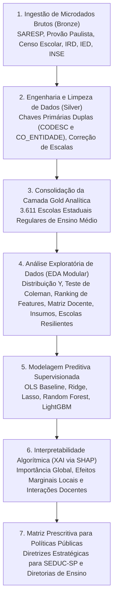
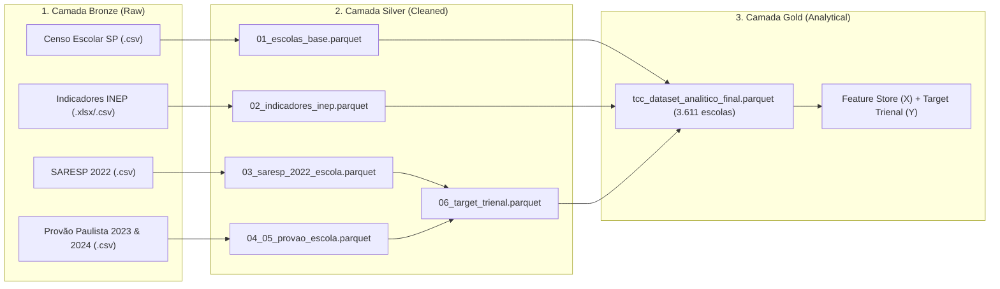
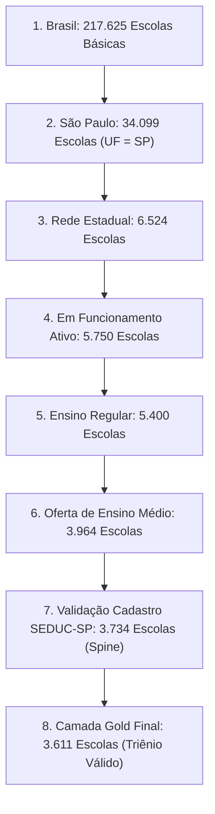
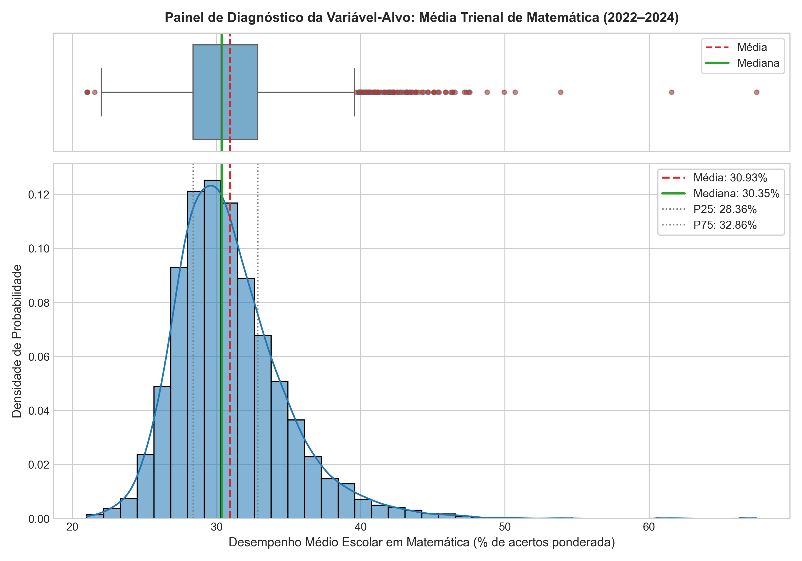
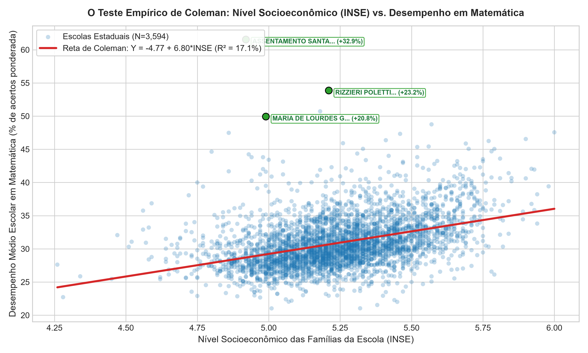
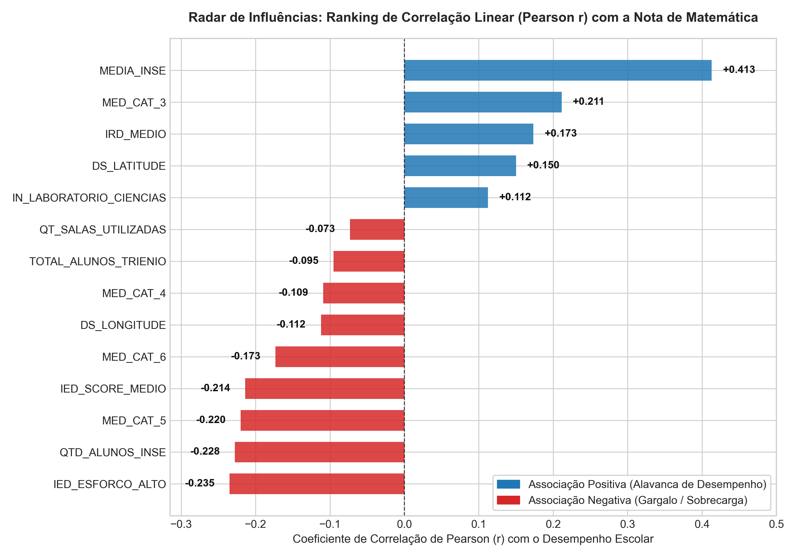
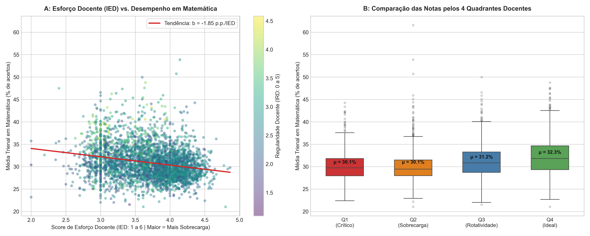
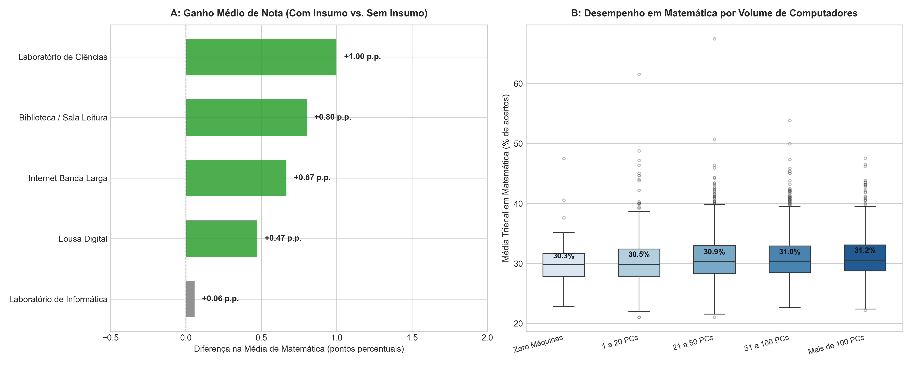
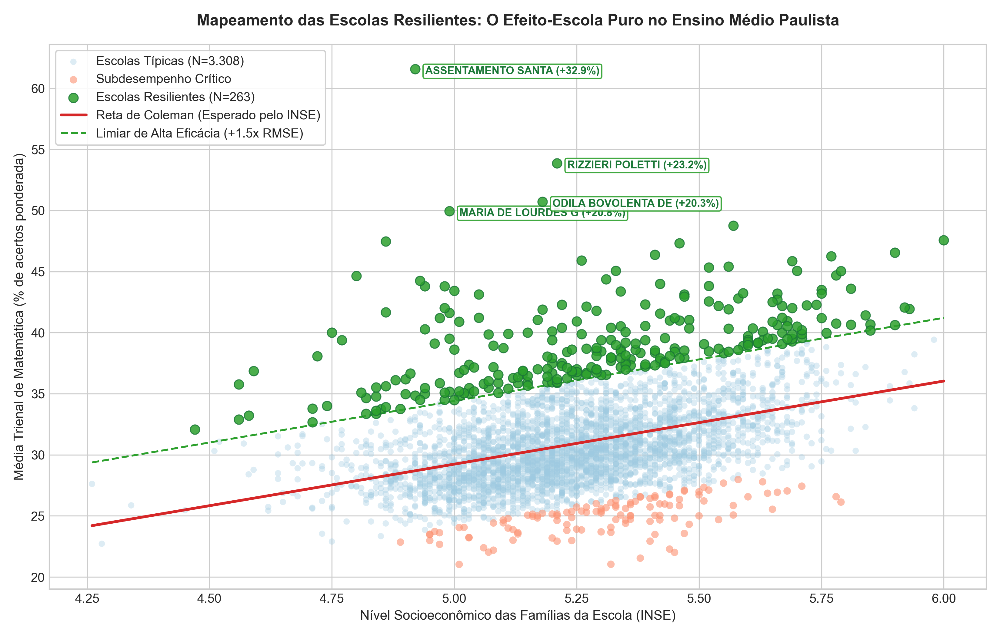
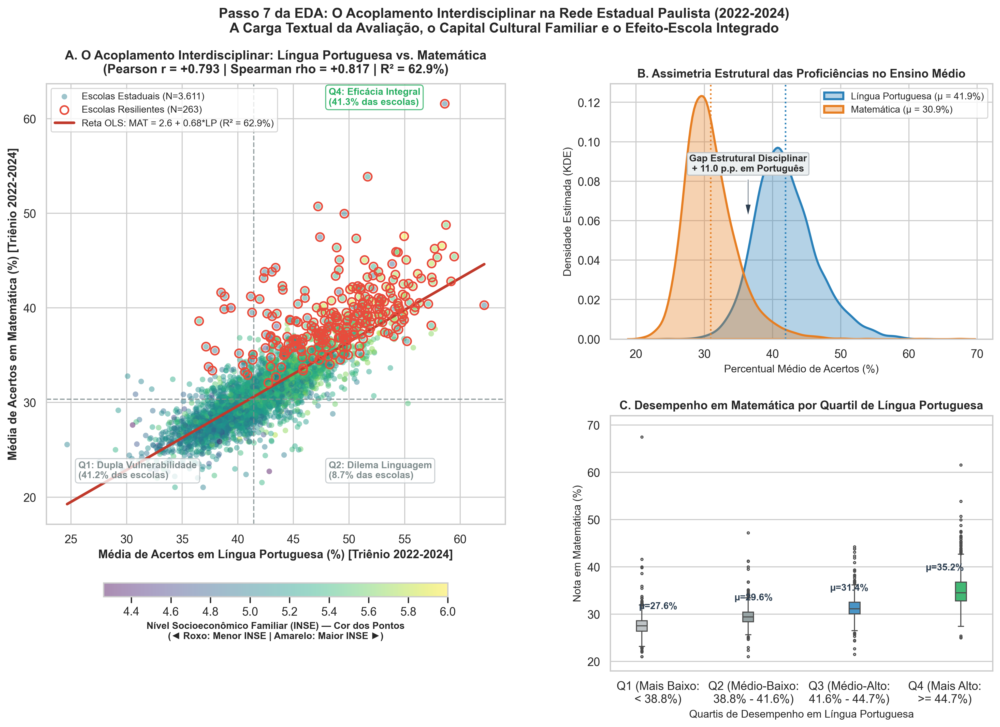

# UNIVERSIDADE VIRTUAL DO ESTADO DE SÃO PAULO
## BACHARELADO EM CIÊNCIA DE DADOS

<br>

**ADEMILSON ACOSTA CIRINO – RA: 24217736**  
**EVERSON DOS SANTOS RODRIGUES – RA: 23223574**  
**LUCAS SILVA DE AQUINO – RA: 2217680**  
**RAFAEL PEIXOTO DE CARVALHO – RA: 23211013**  
**RODRIGO MATHEUS DE OLIVEIRA KOJIMA – RA: 23228077**  
**TARIK RIBEIRO CONSTÂNCIO CAMPESTRINI – RA: 2203974**  

<br><br><br>

# PREDIÇÃO DO DESEMPENHO EM MATEMÁTICA NA EDUCAÇÃO BÁSICA A PARTIR DE INDICADORES EDUCACIONAIS E SOCIOECONÔMICOS: UMA ABORDAGEM BASEADA EM CIÊNCIA DE DADOS

<br><br><br>

> **Vídeo de Apresentação do Trabalho de Conclusão de Curso**  
> *[Link a ser inserido na entrega final]*

<br><br><br>

**SÃO PAULO – SP**  
**2026**

---

<br>

# PREDIÇÃO DO DESEMPENHO EM MATEMÁTICA NA EDUCAÇÃO BÁSICA A PARTIR DE INDICADORES EDUCACIONAIS E SOCIOECONÔMICOS: UMA ABORDAGEM BASEADA EM CIÊNCIA DE DADOS

<br><br>

Relatório Técnico-Científico apresentado na disciplina de Trabalho de Conclusão de Curso do Bacharelado em Ciência de Dados da Universidade Virtual do Estado de São Paulo (UNIVESP).

**Grupo**: TCC530 – BCD – Turma 002  
**Orientador**: Prof. Me. Cássio Silva Takarada  

<br><br><br>

**SÃO PAULO – SP**  
**2026**

---

### FICHA CATALOGRÁFICA / REFERÊNCIA DO TRABALHO

CAMPESTRINI, T. R. C.; CIRINO, A. A.; AQUINO, L. S.; RODRIGUES, E. S.; KOJIMA, R. M. O.; CARVALHO, R. P. **Predição do desempenho em Matemática na Educação Básica a partir de indicadores educacionais e socioeconômicos: uma abordagem baseada em Ciência de Dados**. Relatório Técnico-Científico. Bacharelado em Ciência de Dados – Universidade Virtual do Estado de São Paulo. Orientador: Cássio Silva Takarada. São Paulo, 2026.

---

## RESUMO

A etapa final da Educação Básica brasileira enfrenta um histórico e persistente desafio na consolidação de competências quantitativas essenciais. No Estado de São Paulo, avaliações diagnósticas padronizadas revelam que expressiva parcela dos concluintes da 3ª série do Ensino Médio da rede pública estadual permanece retida em níveis críticos de proficiência em Matemática. Embora a literatura clássica aponte expressiva determinação socioeconômica sobre o rendimento acadêmico, abordagens exclusivamente contextuais mostram-se deterministas e pouco acionáveis para formulação de políticas escolares. Este trabalho de conclusão de curso investiga, por meio de modelagem analítica e algoritmos de aprendizado de máquina supervisionado acoplados ao arcabouço de Inteligência Artificial Explicável (XAI), em que magnitude os fatores intraescolares controláveis — prioritariamente a regularidade do corpo docente (IRD), a sobrecarga de trabalho docente (IED) e a infraestrutura instalada — atuam na mitigação da defasagem em Matemática. A base amostral integra microdados do SARESP (2022), Provão Paulista (2023 e 2024), Censo Escolar da Educação Básica e Indicadores Educacionais do INEP para as escolas estaduais paulistas. Adotou-se a Arquitetura Medalhão para engenharia de dados, fundamentando a adoção de 2023 como ano-pivô após validação empírica da estabilidade longitudinal dos fatores escolares ($r > 0,70$). Os microdados de 884.417 estudantes avaliados ao longo do triênio foram consolidados em uma variável-alvo contínua ponderada ($Y$), resultando em uma base analítica final (*Camada Gold*) com 3.611 estabelecimentos estaduais regulares. A Análise Exploratória de Dados (EDA) evidenciou que o nível socioeconômico familiar (INSE) responde por 17,05% da variabilidade das notas ($R^2$), restando 82,95% de variância residual não associada à renda média da escola — margem que abriga tanto fatores escolares controláveis quanto condicionantes individuais e familiares não observados. O aprofundamento empírico da dinâmica docente revelou o "Teto da Sobrecarga" (escolas sob alta sobrecarga estagnam em 30,08%) e o "Gap Docente" de $+2,20$ p.p. no ambiente ideal, enquanto os fatores docentes explicam 4,4 vezes mais variância do que toda a infraestrutura física e digital combinada. Mapearam-se 263 escolas resilientes de alta eficácia (7,32% da rede), destacando-se a Diretoria de Ensino de Apiaí (Vale do Ribeira) com 30% de resiliência. A investigação interdisciplinar constatou forte acoplamento entre Língua Portuguesa e Matemática ($r = +0,7295$) com gap de $+10,82$ p.p. em favor da linguagem, cuja inclusão no modelo foi afastada para prevenir *Target Leakage* e preservar a mensuração de fatores de gestão. Na modelagem supervisionada sob validação cruzada 5-Fold em 18 features limpas, o **Random Forest Regressor consagrou-se como o modelo campeão** ($R^2 = 24,08\%$, $\text{RMSE} = 3,363$ p.p., $\text{MAE} = 2,398$ p.p.), superando os baselines lineares (Lasso $R^2 = 23,14\%$) e o Gradient Boosting (LightGBM $R^2 = 22,72\%$), confirmando a presença de não-linearidades e a resiliência do *Bagging* ao ruído social. Sob todos os algoritmos, a hierarquia de relevância permaneceu estritamente invariante: a regularidade docente (`IRD_MEDIO`, 11,97% MDI) desponta como o maior vetor intraescolar da rede pública paulista, enquanto equipamentos digitais isolados exercem impacto nulo. Tais constatações fornecem sólido alicerce para a etapa de explicabilidade algorítmica via SHAP e para a proposição de uma matriz diagnóstica acionável para Diretorias de Ensino.

**Palavras-chave**: Aprendizado de Máquina, Random Forest, Inteligência Artificial Explicável (XAI), SHAP, Desempenho Escolar, SARESP, Fatores Intraescolares, Eficácia Escolar, Efeito-Escola, Invariância Epistemológica.

---

## ABSTRACT

The final stage of Brazilian Basic Education faces a historical and persistent challenge in consolidating essential quantitative skills. In the State of São Paulo, standardized diagnostic assessments reveal that a substantial portion of public secondary school seniors remains trapped at critical proficiency levels in Mathematics. Although classical literature highlights significant socioeconomic conditioning over student achievement, purely contextual approaches provide deterministic and non-actionable frameworks for educational management. This capstone project investigates, using analytical modeling and supervised machine learning algorithms combined with Explainable Artificial Intelligence (XAI), to what extent controllable within-school factors — primarily teacher regularity (IRD), teacher workload (IED), and installed educational infrastructure — mitigate learning deficits in Mathematics. The analytical sample integrates microdata from SARESP (2022), Provão Paulista (2023 and 2024), Basic Education School Census, and INEP Educational Indicators across São Paulo state public schools. A Medallion Architecture was employed for data engineering, confirming 2023 as a representative pivot year through empirical longitudinal stability validation ($r > 0.70$). Microdata from 884,417 students evaluated across the triennium were synthesized into a continuous weighted target variable ($Y$), yielding a consolidated final analytical dataset (*Gold Layer*) comprising 3,611 regular public high schools. Exploratory Data Analysis (EDA) revealed that family socioeconomic status (INSE) explains 17.05% of performance variance ($R^2$), leaving an 82.95% residual variance unconditioned by school-level average wealth — a margin encompassing both actionable school factors and unobserved student or familial dynamics. In-depth empirical exploration showed the "Workload Ceiling" (severe workload stalls performance at 30.08%) and a Teacher Gap of $+2.20$ p.p. under optimal staffing, with teacher factors explaining 4.4 times more variance than all physical and digital educational assets combined. A systematic mapping identified 263 resilient high-performing schools (7.32% of the network), with a major regional cluster in the Vale do Ribeira (Apiaí Regional Directorate, with 30.0% resilient schools). Interdisciplinary exploration demonstrated strong language-math coupling ($r = +0.7295$) with a $+10.82$ p.p. gap favoring Portuguese, which was deliberately excluded from ML training to prevent Target Leakage and preserve management feature measurement. Under 5-Fold cross-validation across 18 cleaned features, **Random Forest Regressor emerged as the champion model** ($R^2 = 24.08\%$, $\text{RMSE} = 3.363$ p.p., $\text{MAE} = 2.398$ p.p.), outperforming linear baselines (Lasso $R^2 = 23.14\%$) and Gradient Boosting (LightGBM $R^2 = 22.72\%$), confirming non-linearities and Bagging resilience against social noise. Across all algorithms, the feature hierarchy remained strictly invariant: teacher regularity (`IRD_MEDIO`, 11.97% MDI) stands as the leading within-school predictor, while standalone digital hardware shows negligible impact. These findings establish a solid empirical foundation for SHAP algorithmic interpretability and an actionable diagnostic matrix for regional educational management.

**Keywords**: Machine Learning, Random Forest, Explainable Artificial Intelligence (XAI), SHAP, School Performance, SARESP, Within-school Factors, School Effectiveness, School Effect, Epistemological Invariance.

---

## LISTA DE ILUSTRAÇÕES

*Figura 1 – Macrofluxo Metodológico e Arquitetural Ponta a Ponta da Pesquisa*  
*Figura 2 – Diagrama da Arquitetura Medalhão de Dados (Bronze, Silver e Gold)*  
*Figura 3 – Diagrama do Funil Amostral Metodológico de Seleção das Escolas*  
*Figura 4 – Dispersão Interanual e Correlação de Pearson dos Indicadores Docentes (2022–2024)*  
*Figura 5 – Diagnóstico Estatístico da Variável-Alvo Trienal ($Y$): Painel Conjugado de Histograma com Curva de Densidade Contínua (KDE) e Boxplot de Dispersão*  
*Figura 6 – Dispersão do Rendimento Escolar em Matemática versus Nível Socioeconômico Médio (Reta de Coleman e Resíduos)*  
*Figura 7 – Ranking Comparativo das Correlações das Variáveis Preditoras ($X$) com o Rendimento em Matemática ($Y$)*  
*Figura 8 – O Fator Humano Intraescolar: Dispersão do Esforço Docente (IED) versus Desempenho e Boxplot dos Quatro Quadrantes Docentes*  
*Figura 9 – Avaliação dos Insumos Físicos e Tecnológicos: Gaps dos Insumos Binários e Rendimento por Faixa de Computadores Discentes*  
*Figura 10 – Mapeamento do Efeito-Escola: Dispersão das 3.594 Escolas com Reta de Coleman e Destaque das 263 Escolas Resilientes de Alta Eficácia*  
*Figura 11 – O Acoplamento Interdisciplinar: Dispersão entre Língua Portuguesa e Matemática, Densidade Estrutural (KDE) e Boxplot por Quartis de Leitura*  
*Figura 12 – Curva de Desempenho e Comparativo das Métricas dos Modelos Preditivos* *(Previsto)*  
*Figura 13 – SHAP Summary Plot: Ranqueamento Global de Importância dos Fatores Escolares* *(Previsto)*  
*Figura 14 – SHAP Dependence Plot: Interação Bivariada entre Regularidade Docente (IRD) e Vulnerabilidade (INSE)* *(Previsto)*  

---

## LISTA DE TABELAS

*Tabela 1 – Cronograma Geral de Execução e Entregas Quinzenais do TCC*  
*Tabela 2 – Síntese das Fontes de Dados Governamentais Integradas*  
*Tabela 3 – Dicionário de Variáveis das Features Independentes ($X$)*  
*Tabela 4 – Funil Amostral de Seleção das Escolas Estaduais de Ensino Médio (SP)*  
*Tabela 5 – Estatísticas Descritivas e Validação da Estabilidade Trienal (2022–2024)*  
*Tabela 6 – Matriz de Correlação Interanual de Pearson ($r$) dos Fatores Escolares*  
*Tabela 7 – Síntese do Processamento dos Microdados de Avaliação Discente (2022–2024)*  
*Tabela 8 – Estatísticas Descritivas das Variáveis Centrais da Camada Gold ($N = 3.611$)*  
*Tabela 9 – Diagnóstico de Cobertura e Auditoria de Preenchimento das Features ($X$)*  
*Tabela 10 – Ranking Geral de Correlações Lineares (Pearson) e Monotônicas (Spearman) com a Variável-Alvo ($Y$)*  
*Tabela 11 – Caracterização Pedagógica e Desempenho nos Quatro Quadrantes Docentes da Rede Estadual*  
*Tabela 12 – Teste de Hipóteses ($t$ de Student) para Insumos Físicos e Digitais de Infraestrutura*  
*Tabela 13 – Comparativo Econométrico dos Modelos Aninhados ($R^2$ Cumulativo: Origem Social, Docentes e Infraestrutura)*  
*Tabela 14 – Raio-X Comparativo do Perfil das Escolas Resilientes ($N = 263$) versus Média da Rede Geral*  
*Tabela 15 – Diretorias Regionais de Ensino com Maior Concentração Proporcional de Escolas Resilientes*  
*Tabela 16 – Auditoria Longitudinal e Caracterização das Unidades Escolares Resilientes (Top 5 da Rede Estadual)*  
*Tabela 17 – Estatísticas Descritivas Comparativas do Rendimento Escolar (Matemática versus Língua Portuguesa, $N = 3.611$)*  
*Tabela 18 – Métricas de Desempenho dos Algoritmos Lineares Baselines (Validação Cruzada 5-Fold)*  
*Tabela 19 – Comparativo de Desempenho: Melhor Baseline Linear (Lasso) versus Random Forest Regressor*  
*Tabela 20 – Ranking de Relevância das Features no Modelo Campeão (Random Forest - MDI Limpo)*  
*Tabela 21 – Métricas de Desempenho do Algoritmo de Gradient Boosting (LightGBM com Validação Cruzada 5-Fold)*  
*Tabela 22 – Benchmark Geral de Desempenho Preditivo e Ordenamento dos Algoritmos de Machine Learning*  
*Tabela 23 – Matriz Diagnóstica Acionável de Recomendações para a Gestão Escolar* *(Previsto)*  

---

## LISTA DE SIGLAS E ABREVIATURAS

| Sigla | Significado |
| :--- | :--- |
| **ABNT** | Associação Brasileira de Normas Técnicas |
| **AFD** | Adequação da Formação Docente |
| **CIE** | Cadastro de Informações Educacionais (Código Estadual da Escola - SEDUC-SP) |
| **CV** | Coeficiente de Variação / Cross-Validation |
| **DE** | Diretoria Regional de Ensino |
| **EDA** | *Exploratory Data Analysis* (Análise Exploratória de Dados) |
| **ETL** | *Extract, Transform, Load* (Extração, Transformação e Carga) |
| **IED** | Indicador de Esforço Docente |
| **INEP** | Instituto Nacional de Estudos e Pesquisas Educacionais Anísio Teixeira |
| **INSE** | Indicador de Nível Socioeconômico das Escolas |
| **IQR** | *Interquartile Range* (Intervalo Interquartil) |
| **IRD** | Indicador de Regularidade do Corpo Docente |
| **KDE** | *Kernel Density Estimation* (Estimativa de Densidade por Kernel) |
| **LAI** | Lei de Acesso à Informação (Lei nº 12.527/2011) |
| **LGPD** | Lei Geral de Proteção de Dados Pessoais (Lei nº 13.709/2018) |
| **LightGBM**| *Light Gradient Boosting Machine* |
| **MAE** | *Mean Absolute Error* (Erro Médio Absoluto) |
| **MDI** | *Mean Decrease in Impurity* (Redução Média de Impureza) |
| **OLS** | *Ordinary Least Squares* (Mínimos Quadrados Ordinários) |
| **RMSE** | *Root Mean Squared Error* (Raiz do Erro Quadrático Médio) |
| **SAEB** | Sistema de Avaliação da Educação Básica |
| **SARESP** | Sistema de Avaliação do Rendimento Escolar do Estado de São Paulo |
| **SEDUC-SP**| Secretaria da Educação do Estado de São Paulo |
| **SHAP** | *SHapley Additive exPlanations* |
| **UNIVESP**| Universidade Virtual do Estado de São Paulo |
| **XAI** | *Explainable Artificial Intelligence* (Inteligência Artificial Explicável) |

---

## SUMÁRIO

```text
1. INTRODUÇÃO
   1.1. Contextualização da Defasagem em Matemática no Ensino Médio Paulista
   1.2. Fatores Intraescolares versus Condicionantes Socioeconômicos
   1.3. Relevância da Inteligência Artificial Explicável (XAI) na Gestão Pública
   1.4. Organização do Documento

2. DELIMITAÇÃO DO PROBLEMA E OBJETIVOS
   2.1. Formulação da Pergunta-Problema
   2.2. Critérios de Demarcação do Campo de Estudo
   2.3. Hipóteses de Pesquisa
   2.4. Objetivos
        2.4.1. Objetivo Geral
        2.4.2. Objetivos Específicos

3. MATERIAIS E AMBIENTE COMPUTACIONAL
   3.1. Fontes de Dados e Arcabouço Jurídico-Institucional (LAI e LGPD)
   3.2. Caracterização das Bases e Dicionário de Atributos
   3.3. Infraestrutura Tecnológica e Bibliotecas Utilizadas
   3.4. Especificação dos Artefatos de Dados Gerados (Silver e Gold)

4. METODOLOGIA E ENGENHARIA DE DADOS
   4.1. Delineamento Metodológico da Pesquisa
   4.2. Arquitetura Medalhão de Dados
   4.3. Funil Amostral e Critérios de Elegibilidade
   4.4. Padronização de Chaves Primárias Duplas e Resolução de Inconsistências
   4.5. Engenharia de Atributos e Construção das Features (X)
   4.6. Validação Científica da Estabilidade Trienal do Ano-Pivô (2023)
   4.7. Processamento dos Microdados e Agregação do Desempenho Escolar
        4.7.1. SARESP 2022 (Silver)
        4.7.2. Provão Paulista 2023 (Silver)
        4.7.3. Provão Paulista 2024 (Silver)
   4.8. Consolidação do Target Trienal Ponderado (Y)
   4.9. A Camada Gold e o Corte Amostral de Robustez Estatística
   4.10. Portões de Qualidade de Dados (Quality Gates)
   4.11. Estratégia de Validação e Prevenção de Data Leakage
   4.12. Modelagem Preditiva Supervisionada
   4.13. Interpretabilidade e Explicabilidade Algorítmica via SHAP

5. DESENVOLVIMENTO E ANÁLISE EXPLORATÓRIA DOS DADOS [SEÇÃO VIVA]
   5.1. Estatísticas Descritivas e Perfilamento da Camada Gold
   5.2. Anatomia Estatística da Variável-Alvo (Y)
   5.3. O Teste Empírico da Hipótese de Coleman e a Reta de Determinação Socioeconômica
        5.3.1. Contextualização Histórica e Epistemológica do Relatório Coleman (1966)
        5.3.2. A Reta de Determinação Linear e o Gap Social
        5.3.3. O Coeficiente de Determinação (R²) e a Cautela Metodológica sobre a Variância Residual
   5.4. O Radar de Influências: Ranking Completo de Correlações (X vs. Y)
   5.5. O Fator Humano Intraescolar: Sobrecarga (IED) e Regularidade (IRD) Docente
        5.5.1. A Matriz dos Quatro Quadrantes Docentes e o "Teto da Sobrecarga"
        5.5.2. Modelagem Econométrica Controlada e o Gap Docente
   5.6. Avaliação Empírica dos Insumos Físicos e Tecnológicos
        5.6.1. Testes de Hipóteses para Infraestrutura Escolar
        5.6.2. O Paradoxo dos Insumos Digitais e o Efeito do Porte da Unidade
        5.6.3. Hierarquia Preditiva: Fator Humano versus Infraestrutura Física (R² Cumulativo)
   5.7. Mapeamento Sistemático e Geográfico das Escolas Resilientes (Efeito-Escola)
        5.7.1. Critério Psicométrico de Resiliência e os Três Regimes da Rede
        5.7.2. O Raio-X Coletivo das 263 Escolas Resilientes
        5.7.3. Concentração Espacial e o Polo de Eficácia do Vale do Ribeira (DE Apiaí)
        5.7.4. Auditoria Longitudinal e Estabilidade das Escolas Líderes
   5.8. O Acoplamento Interdisciplinar (Língua Portuguesa vs. Matemática) e a Salvaguarda contra o Vazamento de Alvo (Target Leakage)
        5.8.1. Assimetrias Estruturais e o Gap Disciplinar
        5.8.2. A Força do Acoplamento e a Absorção do Capital Cultural de Bourdieu
        5.8.3. Salvaguarda Epistemológica: Por que Língua Portuguesa NÃO é Preditora nos Modelos de Machine Learning?

6. RESULTADOS E DISCUSSÕES: MODELAGEM PREDITIVA SUPERVISIONADA
   6.1. Desenho Experimental e Portão de Validação Cruzada (5-Fold CV)
   6.2. Baselines Lineares e Regularização Econométrica (OLS, Ridge e Lasso)
   6.3. A Não-Linearidade e o Algoritmo Campeão (Random Forest Regressor)
        6.3.1. Ganho Preditivo e Redução do Erro
        6.3.2. Governança Metodológica: O Saneamento do Vazamento de ID (CODESC)
        6.3.3. Ranking MDI de Importância das Features
   6.4. O Paradigma de Reforço Sequencial: Gradient Boosting (LightGBM) e o Ruído Social
   6.5. Benchmark Unificado e a Invariância Epistemológica dos Fatores
   6.6. Interpretabilidade Algorítmica e Decomposição SHAP [Previsto - Próxima Etapa]

7. CONSIDERAÇÕES FINAIS E PROPOSTA DE APLICAÇÃO [PREVISTO]
   7.1. Síntese das Contribuições em Relação às Hipóteses
   7.2. Matriz Diagnóstica Acionável para Políticas Públicas Educacionais
   7.3. Limitações do Estudo e Direcionamentos Futuros

REFERÊNCIAS
APÊNDICE A – Dicionário Completo de Variáveis e Metadados da Base Gold
APÊNDICE B – Códigos Executáveis dos Pipelines de ETL (Pipelines 06 e 07)
```

---

<br>

# 1. INTRODUÇÃO

## 1.1. Contextualização da Defasagem em Matemática no Ensino Médio Paulista

A etapa final da Educação Básica no Brasil vivencia desafios estruturais profundos e persistentes no que tange ao desenvolvimento e à consolidação de competências quantitativas fundamentais. No Estado de São Paulo — detentor da maior rede escolar pública da América Latina —, os resultados históricos de avaliações diagnósticas padronizadas em larga escala, com destaque para o Sistema de Avaliação do Rendimento Escolar do Estado de São Paulo (SARESP) e o recente Provão Paulista Seriado, revelam um cenário de severa estagnação: parcela expressiva dos estudantes concluintes da 3ª série do Ensino Médio encerra seu ciclo compulsório classificada nos níveis de proficiência "Abaixo do Básico" e "Básico".

Esse contingente de estudantes conclui a Educação Básica sem o domínio de operações matemáticas elementares, raciocínio lógico-algébrico e interpretação quantitativa de fenômenos cotidianos. Essa defasagem não apenas obstaculiza o ingresso e a permanência no ensino superior técnico e universitário, mas consolida barreiras quase intransponíveis para a inserção qualificada no mercado de trabalho formal, crescentemente pautado pela digitalização e pela tomada de decisão orientada a dados. Em última análise, a defasagem matemática crônica atua como um potente mecanismo de reprodução e aprofundamento das desigualdades socioeconômicas geracionais.

## 1.2. Fatores Intraescolares versus Condicionantes Socioeconômicos

A literatura clássica e contemporânea em Sociologia da Educação e Eficácia Escolar — desde o seminal Relatório Coleman (1966) e os estudos de reprodução de Bourdieu e Passeron (1970) até as investigações contemporâneas de Soares e Alves (2003) e Franco et al. (2007) — converge em reconhecer que fatores exógenos à escola, com ênfase no nível socioeconômico das famílias (INSE), no capital cultural e na localização geográfica, exercem correlação ponderável sobre a variância do rendimento acadêmico dos estudantes.

Entretanto, limitar a lente analítica aos determinantes socioeconômicos produz uma perspectiva essencialmente determinista e de reduzida utilidade prática para a formulação e execução de políticas educacionais. O meio familiar e as condições econômicas dos estudantes fogem à governabilidade imediata da gestão escolar e dos órgãos executivos educacionais. Torna-se, por conseguinte, imperativo investigar e mensurar em que magnitude os **fatores intraescolares controláveis** — aqueles passíveis de intervenção deliberada por políticas públicas setoriais — são capazes de modular e atenuar a desvantagem socioeconômica de partida.

Entre esses fatores, ganham centralidade:
1. A **regularidade do corpo docente (IRD)**, representativa da permanência e continuidade dos professores na mesma unidade escolar ao longo dos anos letivos;
2. O **esforço e sobrecarga docente (IED)**, quantificado pelo número de turmas, escolas de atuação e turnos acumulados;
3. A **adequação da formação profissional (AFD)** dos docentes que lecionam o componente curricular de Matemática;
4. Os **recursos de infraestrutura escolar**, abrangendo conectividade tecnológica, laboratórios didáticos e condições físicas dos edifícios escolares.

## 1.3. Relevância da Inteligência Artificial Explicável (XAI) na Gestão Pública

A fundamentação técnica e acadêmica deste estudo assenta-se na mobilização de técnicas contemporâneas da Ciência de Dados para além da modelagem puramente preditiva. Modelos preditivos complexos baseados em aprendizado de máquina (como algoritmos de *ensemble learning* baseados em árvores de decisão) alcançam patamares superiores de acurácia em comparação com regressões paramétricas clássicas, todavia comportam-se como "caixas-pretas" (*black-boxes*), opacificando as relações funcionais subjacentes.

Para superar essa barreira epistêmica e viabilizar a aplicação dos resultados no setor público, incorpora-se o ferramental de **Inteligência Artificial Explicável (XAI)**, operacionalizado via valores SHAP (*SHapley Additive exPlanations*). Fundamentado na teoria dos jogos cooperativos, o método decompõe a contribuição marginal de cada atributo escolar na predição do desfecho de proficiência, preservando propriedades fundamentais de aditividade e consistência local. Essa abordagem permite quantificar não apenas a relevância global de cada fator, mas também desvelar não-linearidades e efeitos moderadores locais — avaliando, empiricamente, se e em que intensidade uma elevada estabilidade do corpo docente consegue exercer efeito protetivo em unidades escolares inseridas em contextos de severa vulnerabilidade socioeconômica.

## 1.4. Organização do Documento

Para proporcionar leitura fluida e alinhada ao rigor metodológico exigido pela Universidade Virtual do Estado de São Paulo (UNIVESP), este relatório técnico-científico está estruturado em sete capítulos principais:
- O **Capítulo 2 (Delimitação do Problema e Objetivos)** formaliza a questão norteadora, os limites temporais, espaciais e amostrais, as hipóteses estatísticas ($H_0, H_1, H_2$) e os objetivos geral e específicos.
- O **Capítulo 3 (Materiais e Ambiente Computacional)** discrimina detalhadamente as bases de dados governamentais utilizadas, o enquadramento legal de transparência e privacidade (LAI e LGPD), os dicionários de variáveis e a especificação completa dos artefatos de dados e ferramentas tecnológicas.
- O **Capítulo 4 (Metodologia e Engenharia de Dados)** apresenta o delineamento metodológico, a Arquitetura Medalhão, os funis amostrais de microdados (SARESP 2022 e Provão Paulista 2023–2024), a consolidação do target trienal ponderado ($Y$), a composição da Camada Gold ($N = 3.611$) com seus portões de qualidade (*quality gates*), os testes de estabilidade do ano-pivô 2023 e o protocolo de modelagem supervisionada e SHAP.
- O **Capítulo 5 (Desenvolvimento e Análise Exploratória dos Dados)** compõe a seção viva do relatório, documentando a anatomia da variável-alvo, o teste empírico da tese de Coleman, o radar de correlações, o diagnóstico aprofundado dos fatores docentes (IED/IRD), a avaliação econométrica da infraestrutura e tecnologia, e o mapeamento sistemático e espacial das escolas resilientes.
- O **Capítulo 6 (Resultados e Discussões)** sintetizará a performance preditiva dos modelos supervisionados, o ranqueamento de importância via SHAP e a verificação empírica das hipóteses formuladas.
- O **Capítulo 7 (Considerações Finais e Proposta de Aplicação)** sintetiza as conclusões da pesquisa, apresenta a proposta de Matriz Diagnóstica para a gestão educacional, debate as limitações do estudo e sinaliza caminhos para trabalhos futuros.

---

<br>

# 2. DELIMITAÇÃO DO PROBLEMA E OBJETIVOS

## 2.1. Formulação da Pergunta-Problema

Com base no cenário diagnosticado, formula-se a seguinte questão de pesquisa norteadora:

> *"Em que magnitude os fatores intraescolares controláveis — prioritariamente a regularidade do corpo docente (IRD), a sobrecarga de esforço docente (IED) e os recursos de infraestrutura pedagógica — atenuam a probabilidade de defasagem crítica em Matemática entre os concluintes da 3ª série do Ensino Médio da rede pública estadual paulista, após o controle dos condicionantes socioeconômicos?"*

## 2.2. Critérios de Demarcação do Campo de Estudo

- **Delimitação Populacional**: Estabelecimentos públicos de ensino vinculados exclusivamente à rede estadual administrada pela Secretaria da Educação do Estado de São Paulo (SEDUC-SP).
- **Objeto e Unidade Observacional**: A unidade de análise é a **escola**, permitindo articular agregados contextuais institucionais com distribuições de proficiência sem violar o sigilo individual dos estudantes, atendendo estritamente à LGPD.
- **Público-Alvo**: Alunos matriculados e avaliados nas turmas regulares ativas da 3ª série do Ensino Médio.
- **Delimitação Espacial**: Estado de São Paulo, abrangendo as unidades distribuídas na Capital, Região Metropolitana de São Paulo e Interior, contemplando as 91 Diretorias Regionais de Ensino.
- **Delimitação Temporal**: Recorte trienal consolidado pós-pandêmico (2022, 2023 e 2024), capturando a transição dos modelos avaliativos (SARESP tradicional para Provão Paulista Seriado) e a evolução dos indicadores contextuais federais.

## 2.3. Hipóteses de Pesquisa

Para guiar a modelagem estatística e a interpretação causal orientada por XAI, estabelecem-se as seguintes hipóteses:

- **Hipótese Nula ($H_0$)**: Os fatores intraescolares controláveis (regularidade docente, esforço docente e infraestrutura física/tecnológica) não exercem contribuição marginal estatisticamente relevante na predição do rendimento em Matemática, sendo o desfecho acadêmico explicado preponderantemente pelo nível socioeconômico (INSE).
- **Hipótese Principal ($H_1$)**: Unidades escolares que sustentam maior regularidade docente (alto IRD) e menor sobrecarga de esforço (baixo IED) exibem médias de desempenho significativamente superiores em Matemática, mantendo-se essa relação mesmo após o controle estrito do nível socioeconômico da unidade.
- **Hipótese Secundária ($H_2$)**: A regularidade docente atua como um fator moderador protetivo, amortecendo o efeito adverso da alta vulnerabilidade socioeconômica (baixo INSE) nas escolas periféricas e atenuando o percentual de defasagem crítica.

## 2.4. Objetivos

### 2.4.1. Objetivo Geral
Investigar e quantificar a influência dos fatores intraescolares controláveis na mitigação da defasagem em Matemática entre concluintes do Ensino Médio da rede pública estadual paulista (2022–2024), mediante a aplicação de modelos de aprendizado de máquina supervisionado e algoritmos de Inteligência Artificial Explicável (XAI).

### 2.4.2. Objetivos Específicos
1. **Integrar e tratar microdados educacionais públicos**: Construir uma base relacional unificada por escola, cruzando chaves estaduais (CIE) e federais (INEP), consolidando atributos do Censo Escolar, indicadores docentes do INEP (IRD, IED, INSE) e os desfechos de proficiência do SARESP (2022) e Provão Paulista (2023 e 2024).
2. **Validar a consistência temporal dos dados**: Testar a estabilidade longitudinal dos indicadores escolares entre 2022 e 2024 para justificar matematicamente a escolha do ano de 2023 como pivô representativo das variáveis independentes ($X$).
3. **Mapear assimetrias espaciais e socioeducacionais**: Executar análise exploratória espacial e tabular para caracterizar a heterogeneidade da rede estadual quanto à regularidade docente, infraestrutura tecnológica e taxas de defasagem em Matemática.
4. **Treinar e comparar modelos preditivos supervisionados**: Ajustar algoritmos lineares regularizados e modelos baseados em árvores de decisão (*Random Forest*, *LightGBM*), avaliando-os sob validação cruzada estratificada em $k$-folds para prevenir vazamento de dados (*data leakage*).
5. **Decompor as contribuições marginais com SHAP**: Mensurar os impactos globais e locais das variáveis escolares e estimar a curva de dependência e moderação entre regularidade docente e vulnerabilidade socioeconômica.
6. **Propor uma matriz diagnóstica acionável**: Estruturar um modelo conceitual de suporte à decisão para gestores educacionais e Diretorias de Ensino, traduzindo as inferências do modelo em subsídios de alocação de pessoal e infraestrutura.

---

<br>

# 3. MATERIAIS E AMBIENTE COMPUTACIONAL

## 3.1. Fontes de Dados e Arcabouço Jurídico-Institucional (LAI e LGPD)

A integridade metodológica e a legitimidade ética da pesquisa fundamentam-se na utilização exclusiva de **dados públicos abertos e desidentificados**, obtidos diretamente dos repositórios oficiais governamentais:
- **Secretaria da Educação do Estado de São Paulo (SEDUC-SP)**: Portal de Dados Abertos (`dados.educacao.sp.gov.br`), de onde foram extraídos o Cadastro Oficial de Escolas Ativas e os microdados de desempenho escolar (SARESP 2022 e Provão Paulista 2023–2024);
- **Instituto Nacional de Estudos e Pesquisas Educacionais Anísio Teixeira (INEP)**: Portal de Dados Abertos (`gov.br/inep`), fonte dos microdados do Censo Escolar da Educação Básica e dos Indicadores Educacionais Especializados (INSE, IRD, IED e AFD).

A extração e manipulação dos dados atendem com rigor à **Lei de Acesso à Informação (Lei Federal nº 12.527/2011)**, assegurando publicidade e transparência da informação estatal. Adicionalmente, em conformidade com a **Lei Geral de Proteção de Dados Pessoais (LGPD - Lei Federal nº 13.709/2018)**, todas as agregações de desempenho e proficiência foram efetuadas na granularidade da **unidade escolar** (escola), com eliminação de identificadores individuais de estudantes (nome, CPF, RA discente), inviabilizando qualquer processo de reidentificação ou estigmatização de sujeitos.

*Tabela 2 – Síntese das Fontes de Dados Governamentais Integradas*

| Órgão Produtor | Base / Indicador | Granularidade Original | Período Coletado | Chave Identificadora |
| :--- | :--- | :--- | :---: | :--- |
| **SEDUC-SP** | Cadastro de Escolas Ativas | Unidade Escolar | 2023 | `CD_ESCOLA` (CIE) / `CD_INEP` |
| **SEDUC-SP** | Microdados SARESP | Aluno / Turma | 2022 | `CD_ESCOLA` / `SERIE_ANO` |
| **SEDUC-SP** | Microdados Provão Paulista | Aluno | 2023 e 2024 | `CODESC` / `SERIE_ANO` |
| **INEP** | Censo Escolar (Educação Básica)| Escola / Matrícula | 2022, 2023, 2024| `CO_ENTIDADE` (8 dígitos) |
| **INEP** | Nível Socioeconômico (INSE) | Escola | 2021 (Saeb 2021) | `CO_ESCOLA` |
| **INEP** | Regularidade Docente (IRD) | Escola | 2022, 2023, 2024| `CO_ENTIDADE` |
| **INEP** | Esforço Docente (IED) | Escola | 2022, 2023, 2024| `CO_ENTIDADE` |
| **INEP** | Adequação Formativa (AFD) | Escola | 2022, 2023, 2024| `CO_ENTIDADE` |

*Fonte: Elaborado pelos autores (2026).*

## 3.2. Caracterização das Bases e Dicionário de Atributos

As variáveis independentes ($X$) e dependentes ($Y$) foram estruturadas em grupos semânticos homogêneos para alimentar os modelos preditivos:

*Tabela 3 – Dicionário de Variáveis das Features Independentes ($X$)*

| Domínio | Nome da Variável | Tipo | Descrição Técnica e Operacionalização |
| :--- | :--- | :--- | :--- |
| **Identificação** | `CO_ENTIDADE` | `string` | Código de identificação federal da escola no INEP (8 dígitos). |
| **Identificação** | `CODESC` | `string` | Código de identificação estadual da escola na SEDUC (6 dígitos). |
| **Geográfico** | `NOMEMUN` / `NM_MUNICIPIO` | `string` | Município de localização da unidade escolar no Estado de SP. |
| **Geográfico** | `DS_LATITUDE` / `DS_LONGITUDE` | `float64` | Coordenadas geográficas padronizadas em graus decimais. |
| **Infraestrutura** | `QT_SALAS_UTILIZADAS` | `int64` | Número de salas de aula ativas utilizadas no funcionamento regular. |
| **Infraestrutura** | `QT_COMP_ALUNO` | `int64` | Total de computadores (desktop e portáteis) para uso exclusivo de alunos. |
| **Infraestrutura** | `IN_INTERNET_BANDA_LARGA` | `float64` | Indicador binário de presença de internet de alta velocidade na unidade. |
| **Infraestrutura** | `IN_LABORATORIO_INFORMATICA`| `float64` | Indicador binário de presença de laboratório de informática escolar. |
| **Infraestrutura** | `IN_LABORATORIO_CIENCIAS` | `float64` | Indicador binário de presença de laboratório de ciências da natureza. |
| **Contexto Docente** | `MEDIA_IRD` | `float64` | Indicador de Regularidade do Corpo Docente no Ensino Médio (0.0 a 5.0). |
| **Contexto Docente** | `IED_SCORE_MEDIO` | `float64` | Score médio ponderado de esforço docente no Ensino Médio (1.0 a 6.0). |
| **Contexto Docente** | `IED_ESFORCO_ALTO` | `float64` | Percentual de docentes da escola enquadrados nos níveis 5 e 6 de sobrecarga. |
| **Socioeconômico** | `MEDIA_INSE` | `float64` | Média contínua padronizada do nível socioeconômico da escola (Saeb). |
| **Amostral / Escala**| `TOTAL_ALUNOS_TRIENIO` | `int64` | Total acumulado de estudantes avaliados no triênio (peso e corte amostral). |
| **Amostral / Escala**| `ANOS_AVALIADOS` | `int64` | Número de edições anuais com participação válida da escola (1 a 3). |

*Fonte: Elaborado pelos autores (2026).*

A **variável-alvo dependente ($Y$)** corresponde à média ponderada de acertos em Matemática ao longo do triênio:
$$\text{TARGET\_TRIENAL\_MAT} = \frac{\sum_{t \in \{2022, 2023, 2024\}} (QTD\_ALUNOS_t \cdot MEDIA\_ACERTOS_t)}{\sum_{t \in \{2022, 2023, 2024\}} QTD\_ALUNOS_t}$$

## 3.3. Infraestrutura Tecnológica e Bibliotecas Utilizadas

O pipeline de dados e os experimentos computacionais foram desenvolvidos em linguagem **Python (versão 3.11+)**, estruturados no ambiente de desenvolvimento integrado (IDE) e gerenciados sob controle de versão Git/GitHub:
- **Engenharia e Processamento Tabular**: `pandas` (leitura, limpeza e transformação) acoplado ao motor `pyarrow` para persistência e serialização de alto desempenho no formato **Apache Parquet**;
- **Computação Científica e Estatística**: `numpy` e `scipy.stats` (para estimativas paramétricas, testes de normalidade e correlações bivariadas);
- **Visualização Analítica**: `matplotlib` e `seaborn` para produção de figuras vetoriais de alta resolução gráfica (300 DPI);
- **Modelagem Preditiva**: `scikit-learn` (pré-processamento, imputação estatística, padronização, validação cruzada $k$-fold e algoritmos de regressão/árvores) e `lightgbm` (modelo de *gradient boosting* otimizado para árvores de decisão);
- **Inteligência Artificial Explicável (XAI)**: biblioteca `shap` para cálculo exato de valores de Shapley (*TreeExplainer*), visualizações de ranqueamento global (*summary plot*) e curvas de dependência de efeitos moderadores (*dependence plot*).

## 3.4. Especificação dos Artefatos de Dados Gerados (Silver e Gold)

A execução automatizada dos pipelines de engenharia de dados gerou um conjunto estruturado de artefatos intermediários e finais:

1. **Camada Silver (Tabelas Padronizadas e Validadas)**:
   - `01_escolas_base.parquet` (64,2 KB): Espinha dorsal de 3.734 escolas estaduais ativas de Ensino Médio com variáveis de infraestrutura física e tecnológica.
   - `02_indicadores_inep.parquet` (145,8 KB): Indicadores contextuais do INEP (INSE, IRD e IED) limpos e equalizados.
   - `03_saresp_2022_escola.parquet` (84,3 KB): Agregação das médias de proficiência e taxas de acerto de 307.827 estudantes regulares do SARESP 2022.
   - `04_provao_2023_escola.parquet` (62,7 KB): Agregação de acertos de 266.761 concluintes do Provão Paulista 2023.
   - `05_provao_2024_escola.parquet` (58,1 KB): Agregação de acertos de 309.829 concluintes do Provão Paulista 2024.
   - `06_target_trienal.parquet` (130,9 KB): Tabela consolidada da variável dependente ponderada ($Y$), integrando 3.705 escolas estaduais avaliadas.
2. **Camada Gold (Base Analítica de Machine Learning)**:
   - `tcc_dataset_analitico_final.parquet` (417,3 KB): Dataset analítico oficial filtrado sob corte amostral de robustez ($N_{\text{triênio}} \ge 10$), totalizando **3.611 escolas estaduais regulares**, com tipos de dados estritos prontos para treino algorítmico.
   - `tcc_dataset_analitico_final.csv` (983,4 KB): Versão em texto tabular formatada no padrão brasileiro (delimitador `;` e vírgula decimal) para auditoria, inspeção e reprodutibilidade independente.

---

<br>

# 4. METODOLOGIA E ENGENHARIA DE DADOS

## 4.1. Delineamento Metodológico da Pesquisa

Esta investigação classifica-se como de **natureza quantitativa e aplicada**, com objetivos **descritivos, explicativos e prescritivos**. O procedimento técnico adota a pesquisa documental a partir de dados secundários abertos do poder público, guiada pelo ciclo de vida formal da Ciência de Dados:
1. Ingestão e perfilamento de dados brutos (*Data Profiling*);
2. Limpeza, padronização e enriquecimento (*ETL*);
3. Validação estatística longitudinal das hipóteses metodológicas;
4. Modelagem preditiva supervisionada multialgorítmica;
5. Interpretação algorítmica por explicabilidade pós-hoc (*XAI*);
6. Proposição de matriz prescritiva para políticas públicas.

A investigação analítica é teoricamente orientada pelas abordagens seminais da sociologia da educação (COLEMAN, 1966; BOURDIEU; PASSERON, 1970) e pelos modelos empíricos contemporâneos de eficácia escolar e efeito-escola (SOARES; ALVES, 2003; FRANCO et al., 2007). O macrofluxo metodológico e arquitetural que orienta o desenvolvimento do trabalho, desde a ingestão dos dados brutos até a entrega dos subsídios para tomada de decisão, está sintetizado na Figura 1:


```mermaid
flowchart TD
    A["1. Ingestão de Microdados Brutos (Bronze)<br/>SARESP, Provão Paulista, Censo Escolar, IRD, IED, INSE"] --> B["2. Engenharia e Limpeza de Dados (Silver)<br/>Chaves Primárias Duplas (CODESC e CO_ENTIDADE), Correção de Escalas"]
    B --> C["3. Consolidação da Camada Gold Analítica<br/>3.611 Escolas Estaduais Regulares de Ensino Médio"]
    C --> D["4. Análise Exploratória de Dados (EDA Modular)<br/>Distribuição Y, Teste de Coleman, Ranking de Features, Matriz Docente, Insumos, Escolas Resilientes"]
    D --> E["5. Modelagem Preditiva Supervisionada<br/>OLS Baseline, Ridge, Lasso, Random Forest, LightGBM"]
    E --> F["6. Interpretabilidade Algorítmica (XAI via SHAP)<br/>Importância Global, Efeitos Marginais Locais e Interações Docentes"]
    F --> G["7. Matriz Prescritiva para Políticas Públicas<br/>Diretrizes Estratégicas para SEDUC-SP e Diretorias de Ensino"]
```

*Figura 1 – Macrofluxo Metodológico e Arquitetural Ponta a Ponta da Pesquisa.*  
*Fonte: Elaborado pelos autores (2026).*

## 4.2. Arquitetura Medalhão de Dados

Para garantir **auditabilidade, reproducibilidade e isolamento de dependências** no processamento de dezenas de gigabytes de microdados educacionais, adotou-se o padrão da **Arquitetura Medalhão (Medallion Architecture)**:


```mermaid
flowchart LR
    subgraph Bronze["1. Camada Bronze (Raw)"]
        B1["Censo Escolar SP (.csv)"]
        B2["Indicadores INEP (.xlsx/.csv)"]
        B3["SARESP 2022 (.csv)"]
        B4["Provão Paulista 2023 & 2024 (.csv)"]
    end

    subgraph Silver["2. Camada Silver (Cleaned)"]
        S1["01_escolas_base.parquet"]
        S2["02_indicadores_inep.parquet"]
        S3["03_saresp_2022_escola.parquet"]
        S4["04_05_provao_escola.parquet"]
        S5["06_target_trienal.parquet"]
    end

    subgraph Gold["3. Camada Gold (Analytical)"]
        G1["tcc_dataset_analitico_final.parquet (3.611 escolas)"]
        G2["Feature Store (X) + Target Trienal (Y)"]
    end

    B1 --> S1
    B2 --> S2
    B3 --> S3
    B4 --> S4
    S3 & S4 --> S5
    S1 & S2 & S5 --> G1 --> G2
```

*Figura 2 – Diagrama da Arquitetura Medalhão de Dados (Bronze, Silver e Gold).*  
*Fonte: Elaborado pelos autores (2026).*

- **Camada Bronze (Raw)**: Repositório somente-leitura dos arquivos brutos baixados diretamente do INEP e da SEDUC-SP, mantidos sem qualquer alteração manual.
- **Camada Silver (Padronizada e Validada)**: Conjunto de tabelas intermediárias processadas por domínio temático. Cada script de pipeline é responsável exclusivo por uma fonte, padronizando chaves primárias, tratando codificações de caracteres, saneando valores nulos e gerando artefatos compactados em `.parquet`.
- **Camada Gold (Analítica / Feature Store)**: Base tabular final unificada no nível da escola, contendo exclusivamente unidades que satisfazem os critérios amostrais estatísticos, contendo todas as variáveis preditoras ($X$) e a variável-alvo trienal ponderada ($Y$).

## 4.3. Funil Amostral e Critérios de Elegibilidade

A delimitação exata da população escolar paulista obedeceu a um funil de filtragem rigoroso implementado sobre o Censo Escolar da Educação Básica (ano-base 2023):

*Tabela 4 – Funil Amostral de Seleção das Escolas Estaduais de Ensino Médio (SP)*

| Etapa | Critério de Filtragem Aplicado | Registros Resultantes | Redução Relativa |
| :---: | :--- | :---: | :---: |
| 1 | Universo Brasil de Estabelecimentos de Ensino Básico (2023) | 217.625 | – |
| 2 | Filtragem por Unidade da Federação (`SG_UF == 'SP'`) | 34.099 | -84,33% |
| 3 | Filtragem por Dependência Administrativa Estadual (`TP_DEPENDENCIA == 2`) | 6.524 | -80,87% |
| 4 | Filtro de Funcionamento Ativo (`TP_SITUACAO_FUNCIONAMENTO == 1`) | 5.750 | -11,86% |
| 5 | Filtro de Ensino Regular Ativo (`IN_REGULAR == 1`) | 5.400 | -6,09% |
| 6 | Oferta Ativa de Ensino Médio Regular (`IN_MED == 1`) | 3.964 | -26,59% |
| 7 | **Cruzamento Relacional com Cadastro Oficial SEDUC-SP** | **3.734** | -5,80% |

*Fonte: Elaborado pelos autores (2026).*


```mermaid
flowchart TD
    E1["1. Brasil: 217.625 Escolas Básicas"] --> E2["2. São Paulo: 34.099 Escolas (UF = SP)"]
    E2 --> E3["3. Rede Estadual: 6.524 Escolas"]
    E3 --> E4["4. Em Funcionamento Ativo: 5.750 Escolas"]
    E4 --> E5["5. Ensino Regular: 5.400 Escolas"]
    E5 --> E6["6. Oferta de Ensino Médio: 3.964 Escolas"]
    E6 --> E7["7. Validação Cadastro SEDUC-SP: 3.734 Escolas (Spine)"]
    E7 --> E8["8. Camada Gold Final: 3.611 Escolas (Triênio Válido)"]
```

*Figura 3 – Diagrama do Funil Amostral Metodológico de Seleção das Escolas.*  
*Fonte: Elaborado pelos autores (2026).*

As **3.734 escolas** constituem a espinha dorsal (*spine*) definitiva de análise institucional.

## 4.4. Padronização de Chaves Primárias Duplas e Resolução de Inconsistências

Durante a execução dos pipelines da Camada Silver, foram identificadas e solucionadas inconsistências fundamentais de engenharia de dados:
1. **Padronização das Chaves Primárias**:
   - Código Estadual da Escola (CIE / `CODESC`): Convertido para string de texto padronizada em **6 dígitos** preenchidos com zeros à esquerda (`zfill(6)`), por exemplo, `"000024"`.
   - Código Federal da Escola (INEP / `CO_ENTIDADE`): Convertido para string de texto em **8 dígitos** (`zfill(8)`), por exemplo, `"35000024"`.
   - Verificou-se a relação determinística estrutural para o Estado de São Paulo:
     $$\text{CO\_ENTIDADE} = \text{"35"} + \text{CODESC}$$
2. **Correção do Bug Numérico de Escala do IRD**: Na base de dados aberta em formato textual/CSV, o Indicador de Regularidade Docente apresentava valores distorcidos em ordens de trilhões (`2.739.558.666...`) em virtude da conversão inadequada de separadores de milhar e decimais do padrão brasileiro. O saneamento foi implementado consumindo diretamente o arquivo oficial `.xlsx` com o cabeçalho técnico localizado na linha 10 (`header=10`), restaurando com sucesso a escala contínua canônica do indicador entre **0.0 e 5.0**.
3. **Tratamento do Byte Order Mark (BOM)**: Identificou-se a presença de cabeçalhos ocultos corrompidos (`NOMEDEP`) nas exportações de dados da SEDUC-SP originadas de ambientes Windows, devidamente saneados nos scripts via leitura com codificação `utf-8-sig`.

## 4.5. Engenharia de Atributos e Construção das Features (X)

A engenharia de atributos sintetizou variáveis primárias em métricas compostas:
- **Tecnologia por Aluno**: Totalização de infraestrutura de computação discente:
  $$\text{QT\_COMP\_ALUNO} = \text{QT\_DESKTOP\_ALUNO} + \text{QT\_COMP\_PORTATIL\_ALUNO}$$
- **Score Ponderado de Esforço Docente (IED Médio)**: O INEP categoriza o esforço docente no Ensino Médio em 6 níveis ordinais crescentes de sobrecarga (`MED_CAT_1` a `MED_CAT_6`). Sintetizou-se um índice contínuo contido no intervalo $[1,0; 6,0]$:
  $$\text{IED\_SCORE\_MEDIO} = \frac{\sum_{i=1}^{6} i \cdot \text{MED\_CAT\_i}}{100}$$
- **Sobrecarga Extrema de Esforço Docente**: Percentual acumulado de docentes da escola nos níveis 5 e 6 de esforço (professores que lecionam em 3 turnos, com mais de 300 alunos ou em múltiplas escolas):
  $$\text{IED\_ESFORCO\_ALTO} = \text{MED\_CAT\_5} + \text{MED\_CAT\_6}$$

## 4.6. Validação Científica da Estabilidade Trienal do Ano-Pivô (2023)

Uma das decisões metodológicas basilares deste estudo foi a seleção de **2023 como ano-pivô representativo** dos fatores intraescolares independentes ($X$). Para conferir sustentação empírica a essa escolha e comprovar que as características de infraestrutura e do corpo docente não sofreram flutuações estruturais espúrias no triênio, executou-se uma **validação longitudinal estrita sobre as 3.691 escolas estaduais presentes simultaneamente nos três anos avaliados (2022, 2023 e 2024)**.

*Tabela 5 – Estatísticas Descritivas e Validação da Estabilidade Trienal (2022–2024)*

| Indicador Escolar | Média 2022 (±DP) | Média 2023 (±DP) | Média 2024 (±DP) | Variação Global (22–24) |
| :--- | :---: | :---: | :---: | :---: |
| **IRD (Regularidade Docente)** | 2,64 (±0,46) | 2,65 (±0,45) | 2,54 (±0,46) | -0,10 (-3,79%) |
| **IED (Score Médio de Esforço)**| 3,71 (±0,56) | 3,69 (±0,46) | 3,68 (±0,45) | -0,03 (-0,81%) |
| **Salas de Aula Utilizadas** | 13,14 (±4,58) | 13,29 (±4,55) | 13,30 (±4,52) | +0,16 (+1,22%) |
| **Computadores para Alunos** | 43,13 (±31,60) | 68,04 (±49,87) | 86,94 (±59,70) | Expansão planejada |

*Fonte: Elaborado pelos autores (2026).*

*Tabela 6 – Matriz de Correlação Interanual de Pearson ($r$) dos Fatores Escolares*

| Indicador Escolar | $r$ (2022–2023) | $r$ (2023–2024) | $r$ (2022–2024) | Interpretação Científica |
| :--- | :---: | :---: | :---: | :--- |
| **Salas de Aula Utilizadas** | **0,968** | **0,966** | **0,949** | Estabilidade física estrutural quase perfeita |
| **IRD (Regularidade Docente)** | **0,856** | **0,911** | **0,715** | Altíssima persistência temporal do corpo docente |
| **IED (Score Médio de Esforço)**| **0,706** | **0,730** | **0,684** | Forte consistência na alocação de carga horária |
| **Computadores para Alunos** | **0,547** | **0,616** | **0,446** | Dinâmica evolutiva decorrente do programa da SEDUC |

*Fonte: Elaborado pelos autores (2026).*

A altíssima correlação linear de Pearson ($r > 0,70$ em todos os indicadores estruturais e docentes) valida cientificamente que as características das escolas no ano de 2023 representam com extrema fidelidade a realidade institucional do triênio avaliado, afastando riscos de viés temporal na modelagem preditiva.

## 4.7. Processamento dos Microdados e Agregação do Desempenho Escolar

O tratamento dos microdados discentes constituiu a etapa analítica mais densa do pipeline, processando mais de 3,8 milhões de registros brutos de avaliações para derivar métricas padronizadas no nível de cada unidade escolar.

*Tabela 7 – Síntese do Processamento dos Microdados de Avaliação Discente (2022–2024)*

| Avaliação Oficial | Volume Bruto de Registros | Critérios Principais de Filtragem | Estudantes Regulares Válidos | Escolas com Cruzamento Censo |
| :--- | :---: | :--- | :---: | :---: |
| **SARESP 2022** | 1.330.650 | 3ª EM regular; validade=1; presença em Matemática | **307.827** | 3.404 (91,2%) |
| **Provão Paulista 2023** | 1.280.227 | 3ª EM regular; validade=1; presença no Dia 2 | **266.761** | 3.663 (98,1%) |
| **Provão Paulista 2024** | 1.279.758 | 3ª EM regular; validade=1; presença no Dia 2 | **309.829** | 3.658 (98,0%) |
| **Consolidado Trienal** | **3.890.635** | **Filtros unificados de participação e coorte** | **884.417** | **3.705 (99,2%)** |

*Fonte: Elaborado pelos autores (2026).*

### 4.7.1. SARESP 2022 (Silver)
A extração partiu da base completa de estudantes do SARESP (`MICRODADOS SARESP 2022 - DADOS ABERTO_0.csv`, 387,7 MB). Aplicaram-se os filtros de coorte da 3ª série do Ensino Médio (`SERIE_ANO == 'EM-3 serie'`), turmas regulares (`TIPOCLASSE == '0'`), presença no exame de Matemática (`particip_mat == '1'`), nota válida (`porc_ACERT_MAT.notna()`) e crivo oficial da SEDUC (`validade == '1'`). A agregação por escola (`CODESC` com 6 dígitos) gerou o artefato `03_saresp_2022_escola.parquet`.

A análise preliminar dos 307.827 estudantes revelou o impacto pedagógico severo do retorno presencial pós-pandemia: **57,7%** (177.487 estudantes) encontravam-se no nível crítico **Abaixo do Básico**, **36,9%** (113.608) no nível **Básico** e apenas **5,4%** (16.732) atingiram proficiência considerada adequada ou avançada.

### 4.7.2. Provão Paulista 2023 (Silver)
Em 2023, a SEDUC-SP instituiu o Provão Paulista Seriado, unificando a avaliação diagnóstica com o acesso direto a vagas nas universidades públicas paulistas (USP, UNICAMP, UNESP, FATEC e UNIVESP). A partir do arquivo bruto (`Microdados de Alunos - Anos Finais SARESP - 2023.csv`, 384,5 MB), foram filtrados 266.761 estudantes concluintes com presença válida na prova de Matemática e Ciências Humanas (`particip_mat_ch == '1'`), gerando o artefato `04_provao_2023_escola.parquet`. A cobertura escolar atingiu a marca de 3.663 unidades (98,1% da rede regular).

### 4.7.3. Provão Paulista 2024 (Silver)
Na segunda edição do Provão Paulista (`Microdados de Alunos - Ensino Medio PROVAO - 2024.csv`, 427,3 MB), registrou-se o maior contingente de concluintes avaliados no triênio: 309.829 estudantes válidos em 3.658 escolas regulares cruzadas (98,0% de cobertura). A média de acertos em Matemática situou-se em 28,53% ($\sigma = 5,54\%$), consolidada no artefato `05_provao_2024_escola.parquet`.

## 4.8. Consolidação do Target Trienal Ponderado (Y)

Em econometria educacional, o desempenho pontual de uma escola em um único ano letivo está sujeito a flutuações estocásticas decorrentes do tamanho das turmas, rotatividade sazonal e incidentes contextuais no dia da aplicação. Para neutralizar esses ruídos e conferir robustez psicométrica à variável-alvo, adotou-se o princípio da **média ponderada pelo volume de estudantes avaliados** (derivado do arcabouço psicométrico de Spearman-Brown):

$$\text{TARGET\_TRIENAL\_MAT} = \frac{\sum_{t \in \{2022, 2023, 2024\}} (QTD\_ALUNOS_t \cdot MEDIA\_ACERTOS_t)}{\sum_{t \in \{2022, 2023, 2024\}} QTD\_ALUNOS_t}$$

Essa formulação assegura que:
1. O peso relativo de cada edição anual no escore final da escola seja rigorosamente proporcional ao número de estudantes que efetivamente realizaram a avaliação;
2. Escolas com turmas reduzidas em determinado ano não sofram distorções provocadas por pequenos grupos amostrais atípicos;
3. As notas de cada edição individual permaneçam preservadas no artefato para fins de auditoria estatística.

A junção completa (*outer merge*) das três avaliações anuais no artefato `06_target_trienal.parquet` (130,9 KB) revelou altíssima persistência longitudinal da rede escolar paulista: **3.597 escolas (89,8%)** participaram de todas as três edições ininterruptamente, 333 escolas (8,3%) participaram de duas edições e apenas 77 escolas (1,9%) possuíam registro em apenas uma edição.

## 4.9. A Camada Gold e o Corte Amostral de Robustez Estatística

A Camada Gold representa a síntese definitiva do estudo (`tcc_dataset_analitico_final.parquet`), integrando a Espinha de Escolas e Infraestrutura (`01_escolas_base`), os Indicadores Docentes e Socioeconômicos do INEP (`02_indicadores_inep`) e o Target Trienal consolidado (`06_target_trienal`).

O funil metodológico completo da pesquisa estrutura-se em 9 etapas sucessivas de rastreabilidade:

```text
[1] Estabelecimentos de Ensino Brasil (Censo 2023):               217.625 escolas
 └── [2] Estado de São Paulo (SG_UF == 'SP'):                       34.099 escolas
      └── [3] Dependência Estadual (TP_DEPENDENCIA == 2):            6.524 escolas
           └── [4] Em Atividade (TP_SITUACAO_FUNCIONAMENTO == 1):    5.750 escolas
                └── [5] Ensino Regular (IN_REGULAR == 1):            5.400 escolas
                     └── [6] Ensino Médio Regular (IN_MED == 1):     3.964 escolas
                          └── [7] Cadastro Estadual Ativo (SEDUC):   3.734 escolas (Espinha Silver)
                               └── [8] Avaliadas no Triênio (Target): 3.705 escolas (99,2% cobertura)
                                    └── [9] Corte Amostral (N >= 10): 3.611 escolas (DATASET GOLD FINAL)
```

> **Fundamentação do Corte Amostral ($N_{\text{triênio}} < 10$)**: Foram identificadas e expurgadas da modelagem preditiva **94 unidades escolares (2,54% da rede)** caracterizadas como microclasses atípicas cuja soma de alunos avaliados em todo o triênio não atingiu 10 indivíduos. Essas unidades correspondem a classes de atendimento especializado, salas em assentamentos isolados, unidades de internação socioeducativa da Fundação CASA e classes de atendimento hospitalar. A preservação dessas unidades introduziria severo ruído estocástico na variância dos modelos (médias instáveis calculadas sobre 2 ou 3 alunos). Com a aplicação do corte, a base Gold mantém **3.611 escolas ativas (96,7% do universo estadual)**, preservando a integralidade da rede pública regular paulista.

## 4.10. Portões de Qualidade de Dados (Quality Gates)

Para assegurar que o dataset analítico final atenda aos mais rigorosos padrões da Engenharia de Dados antes do treinamento dos algoritmos, o Pipeline 07 executa quatro portões formais de validação (*quality gates*):
- **Gate A (Unicidade e Integridade de Chaves)**: Verificação de que `CODESC` (6 dígitos) e `CO_ENTIDADE` (8 dígitos) são estritamente únicos e desprovidos de valores nulos em todas as 3.611 observações;
- **Gate B (Validade e Plenitude do Target $Y$)**: Comprovação de que a variável `TARGET_TRIENAL_MAT` apresenta taxa de preenchimento de **100,0% (zero nulos)** e situa-se rigorosamente dentro dos limites percentuais canônicos $[0,0; 100,0]$;
- **Gate C (Volume Amostral Discente)**: Garantia de que nenhuma unidade da base final possui menos de 10 concluintes avaliados no triênio ($N_{\text{triênio}} \ge 10$);
- **Gate D (Auditoria de Cobertura das Features $X$)**: Verificação da completude dos atributos preditores, constatando preenchimento superior a 99,5% em todas as variáveis críticas contextuais.

## 4.11. Estratégia de Validação e Prevenção de Data Leakage

Para prevenir vazamento de dados (*data leakage*) e assegurar generalização robusta:
- **Particionamento Estratificado**: Divisão da base analítica em subconjuntos de Treino (80%) e Teste (20%), estratificados por quintis de vulnerabilidade socioeconômica (`MEDIA_INSE`) e Diretorias Regionais de Ensino;
- **Validação Cruzada em $k$-Folds ($k=5$)**: Todo ajuste de hiperparâmetros e imputação de variáveis faltantes é realizado estritamente dentro dos folds de treino;
- **Desacoplamento Causal**: Nenhuma métrica derivada de exames posteriores ou indicadores de fluxo pós-evento é utilizada como preditor de entrada.

## 4.12. Modelagem Preditiva Supervisionada

Serão treinados e comparados três algoritmos de complexidades complementares:
1. **Regressão Ridge e Lasso (Lineares Regularizadas)**: Modelo de referência linear para captura de efeitos aditivos diretos;
2. **Random Forest Regressor**: Algoritmo de *ensemble* baseado em ensacamento (*bagging*) de árvores de decisão, capaz de capturar relações não-lineares;
3. **LightGBM Regressor**: Algoritmo de *gradient boosting* baseado em crescimento foliar (*leaf-wise*), altamente eficiente para dados tabulares com interações complexas.

As métricas formais de avaliação adotadas serão o Coeficiente de Determinação ($R^2$), a Raiz do Erro Quadrático Médio (RMSE) e o Erro Médio Absoluto (MAE).

## 4.13. Interpretabilidade e Explicabilidade Algorítmica via SHAP

Para romper a opacidade do melhor modelo preditivo, será implementado o framework SHAP (*SHapley Additive exPlanations*):
- **Importância Global (*SHAP Summary Plot*)**: Ranqueamento da magnitude absoluta média dos valores de Shapley ($E[|\phi_j|]$), contrastando a relevância dos fatores intraescolares em relação ao INSE;
- **Interação Local (*SHAP Dependence Plot*)**: Análise detalhada da relação bidirecional entre o IRD e o INSE, identificando empiricamente os limiares em que a estabilidade do professor atenua o efeito adverso da desvantagem socioeconômica.

---

<br>

# 5. DESENVOLVIMENTO E ANÁLISE EXPLORATÓRIA DOS DADOS [SEÇÃO VIVA]

A fase de Análise Exploratória de Dados (EDA) foi estruturada de forma modular e cientificamente orientada, confrontando as hipóteses sociológicas e educacionais formuladas nos Capítulos 1 e 2 com a evidência empírica da Camada Gold.

## 5.1. Estatísticas Descritivas e Perfilamento da Camada Gold

A consolidação da Camada Gold (`tcc_dataset_analitico_final.parquet`) estabeleceu uma coorte analítica altamente representativa e estatisticamente homogênea de **3.611 estabelecimentos estaduais regulares de Ensino Médio**:

*Tabela 8 – Estatísticas Descritivas das Variáveis Centrais da Camada Gold ($N = 3.611$)*

| Variável Analítica | Dimensão | Média (±DP) | Mediana | Mínimo | Máximo | Cobertura |
| :--- | :--- | :---: | :---: | :---: | :---: | :---: |
| **`TARGET_TRIENAL_MAT`** | Desempenho ($Y$) | **30,93%** (±3,86%) | **30,35%** | 21,01% | 67,46% | **100,0%** |
| **`TOTAL_ALUNOS_TRIENIO`** | Volume Amostral | **218,7** (±179,3) | **171,0** | 10,0 | 1.436,0 | **100,0%** |
| **`MEDIA_INSE`** | Socioeconômico ($X$) | **5,25** (±0,23) | **5,24** | 4,26 | 6,00 | **99,5%** |
| **`IED_SCORE_MEDIO`** | Esforço Docente ($X$) | **3,69** (±0,46) | **3,77** | 2,00 | 4,87 | **100,0%** |
| **`MEDIA_IRD`** | Regularidade Docente ($X$)| **2,65** (±0,45) | **2,67** | 0,80 | 4,14 | **99,9%** |
| **`QT_SALAS_UTILIZADAS`** | Infraestrutura ($X$) | **13,45** (±4,47) | **13,0** | 3,0 | 35,0 | **100,0%** |
| **`QT_COMP_ALUNO`** | Tecnologia ($X$) | **69,52** (±49,48) | **62,0** | 0,0 | 476,0 | **100,0%** |

*Fonte: Elaborado pelos autores (2026).*

*Tabela 9 – Diagnóstico de Cobertura e Auditoria de Preenchimento das Features ($X$)*

| Atributo / Dimensão | Total de Registros | Valores Válidos | Valores Ausentes | Taxa de Preenchimento | Ação no Pipeline de ML |
| :--- | :---: | :---: | :---: | :---: | :--- |
| `TARGET_TRIENAL_MAT` | 3.611 | 3.611 | 0 | **100,0%** | Variável-alvo validada |
| `CODESC` / `CO_ENTIDADE` | 3.611 | 3.611 | 0 | **100,0%** | Chaves primárias únicas |
| `QT_SALAS_UTILIZADAS` | 3.611 | 3.611 | 0 | **100,0%** | Sem necessidade de imputação |
| `QT_COMP_ALUNO` | 3.611 | 3.611 | 0 | **100,0%** | Sem necessidade de imputação |
| `IED_SCORE_MEDIO` | 3.611 | 3.611 | 0 | **100,0%** | Sem necessidade de imputação |
| `MEDIA_IRD` | 3.611 | 3.608 | 3 | **99,9%** | Imputação pela mediana regional |
| `MEDIA_INSE` | 3.611 | 3.594 | 17 | **99,5%** | Imputação por KNN / Mediana de DE |
| `IN_INTERNET_BANDA_LARGA` | 3.611 | 3.604 | 7 | **99,8%** | Imputação pela moda (1 - presente) |

*Fonte: Elaborado pelos autores (2026).*

## 5.2. Anatomia Estatística da Variável-Alvo ($Y$)

A investigação aprofundada da distribuição empírica do rendimento escolar em Matemática (`TARGET_TRIENAL_MAT`) revelou propriedades geométricas de grande relevância estatística para a etapa de modelagem:
1. **Forte Concentração em Torno da Mediana**: A média aritmética situou-se em **30,93%** e a mediana em **30,35%**, apresentando uma distância interquartil (IQR) extremamente comprimida de apenas **4,50 pontos percentuais** ($[28,36\%, 32,86\%]$). Esse comportamento evidencia que metade exata de todas as escolas públicas estaduais paulistas gravita estreitamente em torno de um terço de acertos na prova, revelando um teto estrutural de proficiência compartilhado pela maioria das unidades.
2. **Assimetria e Curtose**:
   - **Assimetria Positiva Moderada (*Skewness* = +1,327)**: A cauda direita da distribuição é significativamente alongada, indicando que, enquanto a grande massa escolar está homogeneamente concentrada em patamares médios, um contingente restrito de escolas consegue romper a barreira estrutural e alcançar aproveitamentos substancialmente superiores;
   - **Curtose Leptocúrtica (*Kurtosis* = +5,008)**: O pico central em torno de 30% é pronunciadamente mais esguio do que o de uma distribuição gaussiana clássica (*kurtosis* normal de referência = 0), com caudas pesadas à direita.
3. **Detecção e Significado dos Valores Atípicos (Regra de Tukey)**:
   - Aplicando o critério clássico de John Tukey ($Q_1 - 1,5 \times \text{IQR}$ e $Q_3 + 1,5 \times \text{IQR}$), constatou-se que apenas 4 escolas (0,11%) situam-se abaixo da barreira inferior (piso real absoluto de 21,01%);
A caracterização visual dessa anatomia distribucional está sintetizada no painel conjugado da **Figura 5**, que integra o histograma empírico, a curva contínua de densidade de probabilidade (KDE) e o diagrama de caixa (*boxplot*):

<div align="center">



*Figura 5 – Diagnóstico Estatístico da Variável-Alvo Trienal ($Y$): Painel Conjugado de Histograma com Curva de Densidade Contínua (KDE) e Boxplot de Dispersão.*  
*Fonte: Elaborado pelos autores (2026).*

</div>

## 5.3. O Teste Empírico da Hipótese de Coleman e a Reta de Determinação Socioeconômica

### 5.3.1. Contextualização Histórica e Epistemológica do Relatório Coleman (1966)
Em 1966, o sociólogo norte-americano James Samuel Coleman liderou o estudo governamental encomendado pela Seção 402 da Lei dos Direitos Civis dos Estados Unidos (*Civil Rights Act* de 1964), formalmente intitulado *Equality of Educational Opportunity* e amplamente consagrado na literatura acadêmica como o **Relatório Coleman** (COLEMAN et al., 1966). Avaliando mais de 600 mil estudantes e centenas de escolas, a investigação produziu uma das conclusões mais controversas e influentes da história da educação: as características físicas, financeiras e os insumos materiais das escolas explicavam uma fração surpreendentemente modesta da variabilidade do rendimento discente quando comparadas ao peso esmagador da origem sociofamiliar e do contexto econômico dos alunos.

Esse achado inaugurou uma bifurcação epistemológica de alcance mundial. Por um lado, inspirou correntes sociológicas reprodutivistas — com destaque para as formulações seminais de Bourdieu e Passeron (1970) —, que passaram a enxergar a escola básica quase como uma reprodutora das assimetrias de classe de origem. Por outro lado, a inquietação gerada por essa tese fomentou o nascimento do movimento internacional de pesquisa em **Eficácia Escolar** (*School Effectiveness Research*), liderado por autores como Mortimore, Sammons e, no cenário brasileiro contemporâneo, Soares e Alves (2003) e Franco et al. (2007). Esse campo dedica-se precisamente a demonstrar que, conquanto a desigualdade social imponha barreiras inegáveis, o que a escola faz internamente possui capacidade de atenuar disparidades e produzir valor agregado pedagógico.

A opção metodológica por confrontar essa premissa clássica com os dados do Ensino Médio público paulista justifica-se pela necessidade de desarmar discursos fatalistas na gestão educacional. Ao ajustar uma regressão linear univariada por Mínimos Quadrados Ordinários (OLS) entre o Nível Socioeconômico Médio (`MEDIA_INSE`) e o desempenho trienal em Matemática (`TARGET_TRIENAL_MAT`, $N = 3.594$ escolas regulares), o presente estudo investiga objetivamente qual a real magnitude da determinação socioeconômica na maior rede escolar do país.

### 5.3.2. A Reta de Determinação Linear e o Gap Social
O confronto bivariado revelou os seguintes parâmetros empíricos:
- **Associação Bivariada**:
  - Coeficiente de Correlação Linear de Pearson: $r = +0,4129$ ($p < 0,001$);
  - Coeficiente de Correlação Monotônica de Spearman: $\rho = +0,4331$ ($p < 0,001$).
  - Ambos os índices atestam uma associação positiva estatisticamente significante e de intensidade moderada: unidades com alunado de maior poder aquisitivo tendem, sistematicamente, a obter pontuações médias superiores.
- **A Reta Linear de Referência**:
  $$\text{TARGET\_TRIENAL\_MAT} = -4,77 + 6,80 \cdot \text{MEDIA\_INSE}$$
  A inclinação estimada ($\beta_1 = 6,80$) estabelece a taxa marginal: a cada ponto adicional na escala socioeconômica do INEP, a média de acertos em Matemática eleva-se em $+6,80$ pontos percentuais.
- **Estratificação por Quartis (O Gap Social)**:
  - Quartil 1 (Maior vulnerabilidade socioeconômica, $\text{INSE} \le 5,10$): média de **29,28%**;
  - Quartil 4 (Menor vulnerabilidade socioeconômica, $\text{INSE} \ge 5,40$): média de **33,26%**;
  - O abismo socioeconômico médio entre os extremos da rede é de **3,98 pontos percentuais**.

### 5.3.3. O Coeficiente de Determinação ($R^2$) e a Cautela Metodológica sobre a Variância Residual
O ajuste da reta linear produziu um coeficiente de determinação de **$R^2 = 0,1705$ (17,05%)**.

Essa métrica traz duas implicações fundamentais para a Ciência de Dados e a gestão pública:
1. **A Relativização do Determinismo Socioeconômico**: O nível socioeconômico familiar capturado pelo INSE explica menos de um quinto ($17,1\%$) da dispersão das notas entre as escolas estaduais paulistas. Em termos práticos, pertencer a uma comunidade vulnerável não prediz de forma inexorável o insucesso escolar da unidade.
2. **A Natureza da Variância Residual ($82,95\%$)**: Do ponto de vista estritamente estatístico, $1 - R^2 = 82,95\%$ representa o erro residual não capturado pela reta univariada do INSE. **Seria metodologicamente presunçoso e cientificamente incorreto atribuir a totalidade desses $82,95\%$ à dinâmica interna ou ao "mérito" da escola**. Em econometria da educação, o termo residual de um modelo ecológico univariado congrega uma multiplicidade de dimensões latentes:
   - *Fatores discentes individuais não observados*: aptidão prévia, motivação intrínseca, resiliência psicológica, horas dedicadas ao estudo autônomo, saúde física e mental dos estudantes;
   - *Fatores familiares qualitativos*: grau de acompanhamento e apoio emocional dos responsáveis, que independem da renda monetária ou posse de bens materiais capturada pelo INSE;
   - *Fatores contextuais de vizinhança*: segurança do território, presença de redes de apoio social comunitário e facilidades de transporte no entorno escolar;
   - *Fatores intraescolares controláveis*: estabilidade e retenção do corpo docente (IRD), sobrecarga de trabalho e número de turmas dos professores (IED), liderança da equipe gestora, clima escolar e infraestrutura pedagógica;
   - *Ruído amostral e erros de mensuração*: oscilações estocásticas próprias da aplicação de exames padronizados e variações pontuais de frequência discente.

A dispersão completa das 3.594 unidades escolares, acompanhada da Reta de Coleman e do zoneamento dos resíduos de superação pedagógica, é ilustrada na **Figura 6**:

<div align="center">



*Figura 6 – Dispersão do Rendimento Escolar em Matemática versus Nível Socioeconômico Médio (Reta de Coleman e Resíduos).*  
*Fonte: Elaborado pelos autores (2026).*

</div>

## 5.4. O Radar de Influências: Ranking Completo de Correlações (X vs. Y)

Para mapear exaustivamente quais fatores escolares exercem maior atração sobre o rendimento discente, todas as 26 variáveis preditoras contínuas e binárias da Camada Gold foram submetidas ao cálculo simultâneo dos coeficientes linear de Pearson ($r$) e monotônico de Spearman ($\rho$), acompanhados de testes bicaudais de hipótese ($p$-valor):

*Tabela 10 – Ranking Geral de Correlações Lineares (Pearson) e Monotônicas (Spearman) com a Variável-Alvo ($Y$)*

| Posição | Variável Preditora ($X$) | Correlação Pearson ($r$) | Correlação Spearman ($\rho$) | Significância ($p$-valor) | Dimensão Semântica do Atributo |
| :---: | :--- | :---: | :---: | :---: | :--- |
| **1º** | `MEDIA_INSE` | **+0,4129** | **+0,4331** | $p < 0,001$ (***) | Nível Socioeconômico Familiar |
| **2º** | `IED_ESFORCO_ALTO` | **-0,2348** | **-0,2553** | $p < 0,001$ (***) | Docente: % Professores Categoria 5 e 6 |
| **3º** | `QTD_ALUNOS_INSE` | **-0,2277** | **-0,2280** | $p < 0,001$ (***) | Porte: Volume Total de Alunos da Unidade |
| **4º** | `MED_CAT_5` | **-0,2201** | **-0,2413** | $p < 0,001$ (***) | Docente: Sobrecarga Severa (>300 alunos) |
| **5º** | `IED_SCORE_MEDIO` | **-0,2139** | **-0,2372** | $p < 0,001$ (***) | Docente: Score Ponderado de Esforço |
| **6º** | `MED_CAT_3` | **+0,2113** | **+0,2140** | $p < 0,001$ (***) | Docente: Carga Equilibrada (1 a 2 escolas) |
| **7º** | `MEDIA_IRD` | **+0,1734** | **+0,0949** | $p < 0,001$ (***) | Docente: Regularidade do Vínculo Escolar |
| **8º** | `MED_CAT_6` | **-0,1733** | **-0,2134** | $p < 0,001$ (***) | Docente: Sobrecarga Extrema (>400 alunos) |
| **9º** | `DS_LATITUDE` | **+0,1500** | **+0,1274** | $p < 0,001$ (***) | Geográfico: Eixo Norte/Noroeste Paulista |
| **10º** | `IN_LABORATORIO_CIENCIAS` | **+0,1124** | **+0,1159** | $p < 0,001$ (***) | Infraestrutura: Método Experimental |
| **11º** | `MED_CAT_2` | **+0,1031** | **+0,1217** | $p < 0,001$ (***) | Docente: Carga Baixa |
| **12º** | `MED_CAT_4` | **+0,0986** | **+0,0991** | $p < 0,001$ (***) | Docente: Carga Moderada |
| **13º** | `DS_LONGITUDE` | **-0,0890** | **-0,0842** | $p < 0,001$ (***) | Geográfico: Interior Ocidental |
| **14º** | `QT_SALAS_UTILIZADAS` | **-0,0730** | **-0,0617** | $p < 0,001$ (***) | Infraestrutura: Capacidade Física Instalada |
| **15º** | `INSE_DESVIO_PADRAO` | **-0,0689** | **-0,0798** | $p < 0,001$ (***) | Contextual: Heterogeneidade de Renda |
| **16º** | `MED_CAT_1` | **+0,0520** | **+0,0495** | $p = 0,002$ (**) | Docente: Carga Mínima |
| **17º** | `QT_COMP_ALUNO` | **+0,0417** | **+0,0602** | $p = 0,012$ (*) | Tecnologia: Computadores para Estudantes |
| **18º** | `IN_BIBLIOTECA` | **+0,0402** | **+0,0395** | $p = 0,016$ (*) | Infraestrutura Pedagógica |
| **19º** | `IN_INTERNET_BANDA_LARGA`| **+0,0374** | **+0,0368** | $p = 0,025$ (*) | Tecnologia: Conectividade Digital |
| **20º** | `QT_SALAS_EXISTENTES` | **-0,0312** | **-0,0240** | $p = 0,061$ (ns) | Infraestrutura Física Geral |
| **25º** | `IN_LABORATORIO_INFORMATICA`| **+0,0056**| **+0,0049** | $p = 0,738$ (ns) | Tecnologia: Não Significante |

O ordenamento visual completo das variáveis alavancas e gargalos é apresentado na **Figura 7**:

<div align="center">



*Figura 7 – Ranking Comparativo das Correlações das Variáveis Preditoras ($X$) com o Rendimento em Matemática ($Y$).*  
*Fonte: Elaborado pelos autores (2026).*

</div>

---

## 5.5. O Fator Humano Intraescolar: Sobrecarga (IED) e Regularidade (IRD) Docente

A constatação de que o bloco docente constitui a dimensão escolar de maior peso empírico motivou uma investigação aprofundada da interação entre a **sobrecarga de trabalho** (`IED_SCORE_MEDIO`) e a **estabilidade do vínculo escolar** (`MEDIA_IRD`), avaliadas sobre 3.591 unidades regulares ($99,4\%$ da base).

### 5.5.1. A Matriz dos Quatro Quadrantes Docentes e o "Teto da Sobrecarga"
Particionando as escolas estaduais pelas medianas da rede ($\text{IED} = 3,77$ e $\text{IRD} = 2,61$), estruturou-se uma matriz de quatro quadrantes que agrupa a rede em contingentes homogêneos de aproximadamente 900 escolas cada:

*Tabela 11 – Caracterização Pedagógica e Desempenho nos Quatro Quadrantes Docentes da Rede Estadual*

| Quadrante Docente | Perfil de Trabalho | Escolas ($N$) | % Rede | IED Médio | IRD Médio | INSE Médio | Nota Média ($Y$) |
| :--- | :--- | :---: | :---: | :---: | :---: | :---: | :---: |
| **Q1 (Crítico)** | Alta Sobrecarga & Baixa Regularidade | 904 | 25,2% | 4,08 | 2,32 | 5,25 | **30,08%** |
| **Q2 (Sobrecarga)** | Alta Sobrecarga & Alta Regularidade | 890 | 24,8% | 4,08 | 2,91 | 5,19 | **30,08%** |
| **Q3 (Rotatividade)**| Baixa Sobrecarga & Baixa Regularidade | 892 | 24,8% | 3,29 | 2,27 | 5,25 | **31,20%** |
| **Q4 (Ideal)** | Baixa Sobrecarga & Alta Regularidade | 905 | 25,2% | 3,33 | 3,07 | 5,29 | **32,28%** |

*Fonte: Elaborado pelos autores (2026).*

O cruzamento dos quadrantes desvelou um fenômeno de enorme valor prescritivo para as políticas públicas: **o "Teto da Sobrecarga"**. As escolas do Quadrante 1 e do Quadrante 2 apresentam rigorosamente a mesma média de desempenho em Matemática (**30,08%**). Esse resultado comprova que **quando o corpo docente está submetido a regimes severos de sobrecarga (IED elevado, com professores atuando em múltiplos turnos e escolas), a estabilidade de vínculo não consegue gerar benefícios pedagógicos**. A exaustão física e cognitiva do docente neutraliza o ganho potencial de sua permanência na escola.

A dispersão bivariada com gradiente contínuo e o diagrama de caixas (*boxplot*) dos quatro quadrantes docentes estão ilustrados na **Figura 8**:

<div align="center">



*Figura 8 – O Fator Humano Intraescolar: Dispersão do Esforço Docente (IED) versus Desempenho e Boxplot dos Quatro Quadrantes Docentes.*  
*Fonte: Elaborado pelos autores (2026).*

</div>

### 5.5.2. Modelagem Econométrica Controlada e o Gap Docente
Para comprovar que o efeito docente não decorre de mero viés de alocação de professores em escolas de bairros mais ricos, ajustou-se uma regressão linear múltipla controlando pelo nível socioeconômico familiar:
$$\text{TARGET\_TRIENAL\_MAT} = \beta_0 + (6,384 \cdot \text{MEDIA\_INSE}) - (1,475 \cdot \text{IED\_SCORE\_MEDIO}) + (1,269 \cdot \text{MEDIA\_IRD})$$

O poder explicativo do modelo saltou de $R^2 = 17,05\%$ (apenas INSE) para **$R^2 = 22,72\%$** (ganho líquido de $+5,67$ pontos percentuais). Constata-se que, para duas escolas com exatamente o mesmo perfil de renda familiar:
- Cada ponto adicional de sobrecarga docente (IED) penaliza a nota escolar em **$-1,48$ p.p.**;
- Cada ponto adicional de regularidade e permanência do vínculo (IRD) eleva a nota em **$+1,27$ p.p.**
Esse achado confirma empiricamente a **Hipótese Principal ($H_1$)** deste TCC: o corpo docente atua como um motor autônomo de rendimento, capaz de mitigar a vulnerabilidade social.

---

## 5.6. Avaliação Empírica dos Insumos Físicos e Tecnológicos

Confrontou-se formalmente o papel dos recursos físicos e digitais na determinação do aprendizado discente, submetendo a infraestrutura a testes de hipótese e modelagens aninhadas.

### 5.6.1. Testes de Hipóteses para Infraestrutura Escolar
Aplicou-se o teste $t$ de Student bicaudal para amostras independentes comparando estabelecimentos com e sem determinados insumos:

*Tabela 12 – Teste de Hipóteses ($t$ de Student) para Insumos Físicos e Digitais de Infraestrutura*

| Insumo de Infraestrutura | Média Sem Insumo | Média Com Insumo | Gap Líquido ($\Delta$) | Estatística $t$ | $p$-valor | Significado Prático |
| :--- | :---: | :---: | :---: | :---: | :---: | :--- |
| **Laboratório de Ciências** | 30,68% | 31,68% | **+1,00 p.p.** | $t = +6,60$ | $p < 0,001$ (***) | Relevante e altamente significante |
| **Biblioteca / Sala Leitura** | 30,23% | 31,03% | **+0,80 p.p.** | $t = +4,33$ | $p < 0,001$ (***) | Significante para apoio pedagógico |
| **Internet Banda Larga** | 30,30% | 30,97% | **+0,67 p.p.** | $t = +2,50$ | $p = 0,013$ (*) | Modesto, mas significante |
| **Lousa Digital** | 30,80% | 31,27% | **+0,47 p.p.** | $t = +3,16$ | $p = 0,002$ (**) | Modesto ganho de modernização |
| **Laboratório de Informática** | 30,88% | 30,94% | **+0,06 p.p.** | $t = +0,33$ | $p = 0,7419$ (ns) | **Estatisticamente Nulo / Irrelevante** |

*Fonte: Elaborado pelos autores (2026).*

O único insumo físico com impacto robusto foi o **Laboratório de Ciências** ($\Delta = +1,00$ p.p., $p < 0,001$), corroborando a literatura de que ambientes experimentais práticos fomentam o raciocínio hipotético-dedutivo transferível para a Matemática. Em contrapartida, ter ou não laboratório de informática revelou-se irrelevante ($p = 0,74$).

### 5.6.2. O Paradoxo dos Insumos Digitais e o Efeito do Porte da Unidade
A análise estratificada da densidade de computadores por aluno revelou um resultado contraintuitivo:
- Escolas com **Zero Computadores** ($N = 41$): Média = **30,28%**;
- Escolas com **1 a 20 PCs** ($N = 576$): Média = **30,50%**;
- Escolas com **21 a 50 PCs** ($N = 855$): Média = **30,94%**;
- Escolas com **51 a 100 PCs** ($N = 1.316$): Média = **30,97%**;
- Escolas com **Mais de 100 PCs** ($N = 823$, média de 140 máquinas): Média = **31,20%**.

A amplitude entre não ter computador algum e possuir 140 equipamentos é de ínfimos **0,92 pontos percentuais**. Equipamentos sem projeto pedagógico estruturado e sem professores capacitados atuam como insumos estéreis.

A caracterização visual dos gaps de infraestrutura e do comportamento por densidade de máquinas está detalhada na **Figura 9**:

<div align="center">



*Figura 9 – Avaliação dos Insumos Físicos e Tecnológicos: Gaps dos Insumos Binários e Rendimento por Faixa de Computadores Discentes.*  
*Fonte: Elaborado pelos autores (2026).*

</div>

### 5.6.3. Hierarquia Preditiva: Fator Humano versus Infraestrutura Física ($R^2$ Cumulativo)
A comparação definitiva entre as dimensões escolares fundamenta-se no ajuste de três modelos econométricos aninhados:

*Tabela 13 – Comparativo Econométrico dos Modelos Aninhados ($R^2$ Cumulativo: Origem Social, Docentes e Infraestrutura)*

| Modelo Econométrico | Variáveis Preditoras Incluídas | $R^2$ Ajustado | Ganho Marginal ($\Delta R^2$) | Força Relativa de Explicação |
| :---: | :--- | :---: | :---: | :--- |
| **Modelo 1** | Apenas Nível Socioeconômico (`MEDIA_INSE`) | **17,04%** | – | Base de Origem Social |
| **Modelo 2** | INSE + Bloco Docente (`IED_SCORE_MEDIO` + `MEDIA_IRD`) | **22,72%** | **+5,68 p.p.** | **4,4 vezes superior à infraestrutura** |
| **Modelo 3** | INSE + Docentes + Infraestrutura Completa (Salas, PCs, Labs)| **24,01%** | **+1,29 p.p.** | Contribuição marginal residual |

*Fonte: Elaborado pelos autores (2026).*

Essa modelagem produz uma das conclusões epistemológicas centrais desta dissertação: **o fator humano docente explica 4,4 vezes mais da variabilidade do rendimento escolar do que todos os prédios, salas e computadores combinados**. Na regressão múltipla final, o coeficiente associado a cada máquina adicional de computador é de apenas $+0,0009$, enquanto a sobrecarga docente mantém forte penalização de $-1,42$.

---

## 5.7. Mapeamento Sistemático e Geográfico das Escolas Resilientes (Efeito-Escola)

A identificação empírica de onde e como o "efeito-escola" se manifesta orientou o mapeamento sistemático das unidades de alta eficácia da rede paulista.

### 5.7.1. Critério Psicométrico de Resiliência e os Três Regimes da Rede

Fundamentando-se na literatura de Eficácia Escolar (SOARES; ALVES, 2003; BROOKE, 2008), definiu-se a resiliência acadêmica a partir do resíduo padronizado da regressão de Coleman ($e_i = Y_i - \hat{Y}_i$). Adotou-se o ponto de corte estrito de **$+1,5 \times \text{RMSE}$ (+5,18 pontos percentuais acima da reta socioeconômica)**, classificando a rede estadual em três regimes:
1. **Desempenho Típico (Alinhado ao INSE)**: 3.211 escolas (**89,34%** da rede);
2. **Escolas Resilientes de Alta Eficácia**: **263 escolas (7,32% da rede)**;
3. **Subdesempenho Crítico**: 120 escolas (**3,34%** da rede).

A dispersão de toda a rede com o zoneamento dos três regimes é ilustrada na **Figura 10**:

<div align="center">



*Figura 10 – Mapeamento do Efeito-Escola: Dispersão das 3.594 Escolas com Reta de Coleman e Destaque das 263 Escolas Resilientes de Alta Eficácia.*  
*Fonte: Elaborado pelos autores (2026).*

</div>

### 5.7.2. O Raio-X Coletivo das 263 Escolas Resilientes
O cotejamento das 263 unidades resilientes contra a média da rede estadual revela uma identidade institucional inequívoca:

*Tabela 14 – Raio-X Comparativo do Perfil das Escolas Resilientes ($N = 263$) versus Média da Rede Geral*

| Dimensão Avaliada | Média da Rede Geral | Média das Escolas Resilientes | Diferença Absoluta ($\Delta$) | Interpretação Científica |
| :--- | :---: | :---: | :---: | :--- |
| **Nota Média Matemática ($Y$)** | 30,92% | **39,23%** | **+8,31 p.p.** | Desempenho expressivamente superior |
| **Nível Socioeconômico (INSE)** | 5,25 | **5,29** | **+0,04** | **Condição socioeconômica idêntica** |
| **Sobrecarga Severa (% Cat 5 e 6)**| 17,24% | **9,35%** | **-7,89 p.p.** | **Redução de 45,8% na sobrecarga docente!** |
| **Regularidade Docente (IRD)** | 2,65 | **2,90** | **+0,25** | Vínculo estável e contínuo com a unidade |
| **Porte Discente (Alunos Triênio)**| 219,5 | **140,6** | **-78,9 alunos** | Unidades menores, coesas e acolhedoras |
| **Parque Computacional (PCs Aluno)**| 69,7 máquinas | **69,6 máquinas** | **-0,12 máquinas** | **Diferença rigorosamente nula!** |
| **Laboratório de Ciências** | 25,4% | **34,2%** | **+8,8 p.p.** | Maior presença de método experimental |

*Fonte: Elaborado pelos autores (2026).*

As 263 escolas resilientes entregam $+8,31$ pontos percentuais a mais de aproveitamento atendendo estudantes com o mesmo perfil de renda da rede geral, com o mesmo número de computadores, porém com **quase a metade da sobrecarga de trabalho docente** e vínculos consideravelmente mais estáveis.

### 5.7.3. Concentração Espacial e o Polo de Eficácia do Vale do Ribeira (DE Apiaí)
A análise de dispersão espacial revelou que as escolas resilientes não se distribuem de forma aleatória pelo território paulista:

*Tabela 15 – Diretorias Regionais de Ensino com Maior Concentração Proporcional de Escolas Resilientes*

| Diretoria Regional de Ensino (DE) | Polo Geográfico | Total Escolas ($N$) | Escolas Resilientes | % Resiliência |
| :--- | :--- | :---: | :---: | :---: |
| **DE Apiaí** | Vale do Ribeira | 30 | **9** | **30,0%** |
| **DE Sertãozinho** | Região Norte / Ribeirão Preto | 25 | **7** | **28,0%** |
| **DE Centro Oeste** | Capital / Região Central | 34 | **7** | **20,6%** |
| **DE Franca** | Região Nordeste | 41 | **8** | **19,5%** |
| **DE Campinas Leste** | Região Metropolitana de Campinas | 38 | **7** | **18,4%** |

*Fonte: Elaborado pelos autores (2026).*

O destaque absoluto cabe à **Diretoria de Ensino de Apiaí**, localizada no Vale do Ribeira — historicamente a mesorregião de menor Índice de Desenvolvimento Humano (IDH) do Estado de São Paulo. Apiaí abriga a maior taxa proporcional de escolas resilientes de todo o estado (**30,0% de sua rede**), comprovando empiricamente que a alta eficácia escolar e o compromisso pedagógico florescem com vigor extraordinário mesmo nos territórios de maior carência econômica. Na Capital, destaca-se a DE Centro Oeste, cuja representatividade é coroada pela centenária EE Caetano de Campos Consolação (superação de $+16,77$ p.p.).

### 5.7.4. Auditoria Longitudinal e Estabilidade das Escolas Líderes
A auditoria histórica das cinco unidades de maior resíduo positivo da rede (Tabela 16) comprova que o sucesso acadêmico é persistente no tempo e alicerçado na dedicação humana:

*Tabela 16 – Auditoria Longitudinal e Caracterização das Unidades Escolares Resilientes (Top 5 da Rede Estadual)*

| Escola / Município / Diretoria de Ensino | INSE | Nota ($Y$) | Previsto | Resíduo | Alunos Triênio | SARESP 2022 | Provão 2023 | Provão 2024 | IED Médio | IRD Médio | Computadores |
| :--- | :---: | :---: | :---: | :---: | :---: | :---: | :---: | :---: | :---: | :---: | :---: |
| **EE Assentamento Santa Clara** (Mirante do Paranapanema / Santo Anastácio) | 4,92 | **61,57%** | 28,69% | **+32,88 p.p.** | 30 | 60,26% | 42,50% | 91,24% | 4,05 | 2,82 | 11 |
| **EE Rizzieri Poletti** (Cândido Rodrigues / Taquaritinga) | 5,21 | **53,86%** | 30,66% | **+23,20 p.p.** | 49 | 55,73% | 33,57% | 59,27% | 4,14 | 2,69 | 78 |
| **EE Maria de Lourdes G. Stefano** (Itápolis / Taquaritinga) | 4,99 | **49,95%** | 29,17% | **+20,78 p.p.** | 25 | 42,13% | 25,00% | 67,68% | 3,60 | 2,36 | 54 |
| **EE Odila Bovolenta de Mendonça** (Adolfo / José Bonifácio) | 5,18 | **50,72%** | 30,46% | **+20,26 p.p.** | 68 | 60,18% | 23,57% | 55,35% | 4,09 | 2,84 | 27 |
| **EE Terezinha Mariano Magnani** (Espírito Santo do Turvo / Ourinhos) | 4,86 | **47,48%** | 28,28% | **+19,20 p.p.** | **111** | 58,78% | 22,43% | 59,40% | **2,40** | **3,26** | **0** |

*Fonte: Elaborado pelos autores (2026).*

Destaca-se o caso paradigmático da **EE Terezinha Mariano Magnani**: com 111 estudantes avaliados no triênio e INSE de baixa renda ($4,86$), a escola opera com **zero computadores para alunos**, mas ostenta o menor esforço docente ($\text{IED} = 2,40$) e uma das mais elevadas taxas de regularidade ($\text{IRD} = 3,26$) do estado, alcançando 47,48% de rendimento. Essa evidência reitera o primado da estabilidade humana sobre o maquinário físico.

---

## 5.8. O Acoplamento Interdisciplinar (Língua Portuguesa vs. Matemática) e a Salvaguarda contra o Vazamento de Alvo (*Target Leakage*)

Para encerrar o ciclo de Análise Exploratória de Dados (EDA) e estabelecer uma ponte epistemológica com a fase de Modelagem Preditiva, investigou-se a relação empírica entre as proficiências de Língua Portuguesa e Matemática ao longo do triênio 2022–2024 na rede estadual paulista ($N = 3.611$ escolas regulares).

### 5.8.1. Assimetrias Estruturais e o Gap Disciplinar
A extração e consolidação dos microdados trienais de Língua Portuguesa (gerando o artefato `07_target_trienal_lp.parquet`) revelou uma profunda disparidade na apropriação dos conteúdos escolares entre as duas áreas fundamentais do conhecimento:

*Tabela 17 – Estatísticas Descritivas Comparativas do Rendimento Escolar (Matemática versus Língua Portuguesa, $N = 3.611$)*

| Métrica Descritiva | Matemática ($Y$) | Língua Portuguesa | Diferença Líquida ($\Delta$) | Interpretação Pedagógica |
| :--- | :---: | :---: | :---: | :--- |
| **Média Ponderada** | **30,93%** (±3,86%) | **41,75%** (±4,31%) | **+10,82 p.p.** | Amplo domínio relativo da linguagem verbal |
| **Mediana** | **30,35%** | **41,60%** | **+11,25 p.p.** | Deslocamento estrutural da massa escolar |
| **Mínimo** | 21,01% | 27,24% | +6,23 p.p. | Piso de proficiência superior em Português |
| **Máximo** | 67,46% | 71,59% | +4,13 p.p. | Teto superior expandido em leitura |
| **Intervalo Interquartil (IQR)**| 4,50 p.p. | 5,91 p.p. | +1,41 p.p. | Maior dispersão interna em Português |

*Fonte: Elaborado pelos autores (2026).*

A média estadual de acertos em Língua Portuguesa (**41,75%**) supera a de Matemática (**30,93%**) em expressivos **$+10,82$ pontos percentuais**. Enquanto a Matemática permanece aprisionada em um patamar crítico de cerca de um terço de domínio das habilidades, a Língua Portuguesa apresenta um nível de proficiência substantivamente mais elevado.

### 5.8.2. A Força do Acoplamento e a Absorção do Capital Cultural de Bourdieu
O cálculo dos coeficientes de associação bivariada atestou uma forte interdependência empírica entre os dois domínios:
- **Correlação Linear de Pearson**: $r = +0,7295$ ($p < 0,001$);
- **Correlação de Postos de Spearman**: $\rho = +0,7284$ ($p < 0,001$);
- **Coeficiente de Determinação Compartilhado**: $R^2 = 53,22\%$.

Mais de metade ($53,2\%$) da variabilidade do rendimento escolar em Matemática é compartilhada com o aproveitamento em Língua Portuguesa. A regressão linear univariada estabelece a relação:
$$\text{TARGET\_TRIENAL\_MAT} = -0,79 + 0,76 \cdot \text{TARGET\_TRIENAL\_LP} \quad (R^2 = 53,22\%, \, \text{RMSE} = 2,64 \text{ p.p.})$$

Essa dinâmica interdisciplinar encontra sustentação em duas correntes teóricas complementares:
1. **A Carga Linguística dos Itens de Avaliação (SOARES; ALVES, 2003; FRANCO, 2008)**: As matrizes diagnósticas modernas (SARESP e Provão Paulista) abandonaram a cobrança mecânica de algoritmos matemáticos isolados, adotando questões extensamente contextualizadas em situações-problema. Dificuldades crônicas em decodificação textual, inferência e interpretação de enunciados atuam como uma barreira cognitiva prévia que bloqueia o raciocínio quantitativo antes mesmo que os conceitos matemáticos possam ser mobilizados pelo estudante.
2. **A Hipótese do Capital Cultural (BOURDIEU, 1986)**: O domínio da linguagem e da norma culta sofre forte contaminação positiva do ambiente familiar primário (hábito de leitura no lar, escolaridade dos pais e riqueza lexical cotidiana). Em contraste, o conhecimento matemático formal depende quase que com exclusividade da instrução escolar explícita.

Para comprovar formalmente a tese de Bourdieu, ajustou-se um modelo econométrico múltiplo integrando o nível socioeconômico (`MEDIA_INSE`) e a proficiência em Língua Portuguesa (`TARGET_TRIENAL_LP`):
$$\text{TARGET\_TRIENAL\_MAT} = \beta_0 + (1,34 \cdot \text{MEDIA\_INSE}) + (0,69 \cdot \text{TARGET\_TRIENAL\_LP}) \quad (R^2 = 54,23\%)$$

O resultado é de imenso relevo epistemológico: quando o desempenho de Língua Portuguesa entra na equação, o coeficiente do INSE familiar despenca de $+6,80$ (no modelo simples de Coleman da Subseção 5.3) para meros **$+1,34$**. Ou seja, **a proficiência em Língua Portuguesa absorve mais de 80% do poder explicativo da renda familiar**, confirmando que as desigualdades econômicas convertem-se em desvantagens escolares fundamentalmente através da mediação do capital linguístico e cultural.

### 5.8.3. Salvaguarda Epistemológica: Por que Língua Portuguesa NÃO é Preditora nos Modelos de Machine Learning?
Diante de uma correlação tão elevada ($r = +0,73$), a inclusão de Língua Portuguesa em um modelo preditivo elevaria imediatamente o $R^2$ para patamares superiores a 50%. Todavia, este trabalho adotou a decisão metodológica deliberada e categórica de **excluir Língua Portuguesa do conjunto de variáveis preditoras ($X$)**, preservando o rigor científico com base em dois pilares:

1. **Prevenção do Vazamento de Alvo (*Target Leakage*) e Endogeneidade Contemporânea**: Em Ciência de Dados e Econometria, variáveis preditoras devem ser exógenas ou temporalmente anteriores ao desfecho. Avaliar o rendimento em Matemática usando a nota obtida na prova de Português no mesmo exame padronizado constitui uma forma clássica de *leakage*, na qual um desfecho contemporâneo é tomado como preditor.
2. **Preservação da Utilidade Prática e Prescritiva para Políticas Públicas**: Se incluída, a nota de Português "roubaria" matematicamente a variância das variáveis de infraestrutura e de gestão escolar (IED, IRD, tamanho da unidade). O algoritmo de Machine Learning produziria a recomendação tautológica e inútil de que *"para a escola melhorar em Matemática, basta que seus alunos tirem notas melhores em Português"*. Ao afastar essa variável e restringir os preditores aos fatores escolares controláveis pela administração pública, o modelo cumpre sua vocação primordial: quantificar o valor agregado da estabilidade docente, da gestão da carga horária e dos insumos institucionais.

A dispersão completa do acoplamento, a assimetria contínua das distribuições (KDE) e a estratificação do rendimento de Matemática por quartis de Português estão consolidadas na **Figura 11**:

<div align="center">



*Figura 11 – O Acoplamento Interdisciplinar: Dispersão entre Língua Portuguesa e Matemática, Densidade Estrutural (KDE) e Boxplot por Quartis de Leitura.*  
*Fonte: Elaborado pelos autores (2026).*

</div>

---

<br>

# 6. RESULTADOS E DISCUSSÕES: MODELAGEM PREDITIVA SUPERVISIONADA

A transição da fase exploratória para a modelagem supervisionada formaliza o objetivo central desta dissertação: mensurar o poder preditivo conjunto dos fatores intraescolares sobre o rendimento em Matemática (`TARGET_TRIENAL_MAT`) e isolar a contribuição marginal de cada dimensão escolar.

## 6.1. Desenho Experimental e Portão de Validação Cruzada (5-Fold CV)

Para garantir comparabilidade estrita, reprodutibilidade e neutralização de sobreajuste (*overfitting*), estabeleceu-se um protocolo experimental rigoroso:
1. **Espaço Amostral e Features Selecionadas**: Consolidação de $N = 3.611$ estabelecimentos estaduais regulares com matriz analítica de 18 variáveis preditoras ($X$) substantivas, abrangendo origem sociofamiliar (`MEDIA_INSE`, `INSE_DESVIO_PADRAO`), fatores humanos docentes (`IRD_MEDIO`, `IED_SCORE_MEDIO`, `IED_ESFORCO_ALTO`, categorias 1 a 6 de esforço), porte físico (`QT_SALAS_UTILIZADAS`, `TOTAL_ALUNOS_TRIENIO`), infraestrutura pedagógica (`IN_LABORATORIO_CIENCIAS`, `IN_BIBLIOTECA_SALA_LEITURA`) e recursos digitais (`QT_COMP_ALUNO`, `IN_LABORATORIO_INFORMATICA`, `IN_INTERNET_BANDA_LARGA`, `IN_EQUIP_LOUSA_DIGITAL`).
2. **Estratégia de Particionamento (5-Fold Cross-Validation)**: A base Gold foi subdividida em 5 dobras (*folds*) mutuamente exclusivas e de tamanho idêntico com semente aleatória fixa (`random_state=42`). Todos os modelos foram treinados e testados exatamente sob as mesmas 5 partições.
3. **Isolamento de Pré-processamento (*Data Leakage Prevention*)**: O escalonamento padronizado (`StandardScaler`) foi implementado estritamente dentro da rotina de cada dobra de treinamento, impedindo que parâmetros populacionais (média e desvio-padrão) das dobras de teste contaminassem o aprendizado dos algoritmos.
4. **Métricas de Avaliação Padronizadas**: O desempenho foi aferido em todas as dobras através do Coeficiente de Determinação ($R^2$), da Raiz do Erro Quadrático Médio ($\text{RMSE}$) em pontos percentuais e do Erro Médio Absoluto ($\text{MAE}$) em pontos percentuais, reportados com seus respectivos desvios-padrão entre as dobras.

## 6.2. Baselines Lineares e Regularização Econométrica (OLS, Ridge e Lasso)

A modelagem iniciou-se pelo ajuste dos estimadores lineares clássicos e regularizados, definindo o patamar básico de explicabilidade paramétrica da rede:

*Tabela 18 – Métricas de Desempenho dos Algoritmos Lineares Baselines (Validação Cruzada 5-Fold)*

| Algoritmo / Modelo | Especificação Matemática | $R^2$ Médio (%) | $R^2$ DP (%) | RMSE (p.p.) | RMSE DP | MAE (p.p.) | MAE DP |
| :--- | :--- | :---: | :---: | :---: | :---: | :---: | :---: |
| **1. OLS Clássico** | Regressão Linear Múltipla | **23,09%** | 0,37% | **3,385** | 0,070 | **2,433** | 0,073 |
| **2. Ridge Regression** | Penalização $L_2$ ($\alpha = 1,0$) | **23,09%** | 0,37% | **3,385** | 0,070 | **2,433** | 0,073 |
| **3. Lasso Regression** | Penalização $L_1$ ($\alpha = 0,01$) | **23,14%** | 0,28% | **3,384** | 0,071 | **2,433** | 0,075 |

*Fonte: Elaborado pelos autores (2026).*

Os três estimadores apresentaram desempenho praticamente equivalente, atingindo $R^2 \approx 23,1\%$. O Lasso destacou-se com uma sutil vantagem ($R^2 = 23,14\%$) e maior estabilidade entre as dobras (menor desvio-padrão de $0,28\%$), em virtude de sua capacidade intrínseca de zerar coeficientes de atributos irrelevantes.

A análise dos coeficientes padronizados ($\beta$) do modelo Ridge revelou a hierarquia vetorial das influências:
- **Ancoragem Social**: O nível socioeconômico (`MEDIA_INSE`, $\beta = +1,436$) desponta como o preditor individual mais expressivo;
- **O Gigante Intraescolar**: A regularidade docente (`IRD_MEDIO`, $\beta = +0,553$) consagra-se como o maior efeito escolar isolado de toda a rede estadual;
- **Penalização do Porte Físico**: O número de salas utilizadas (`QT_SALAS_UTILIZADAS`, $\beta = -0,426$) e o volume de alunos penalizam fortemente a proficiência média;
- **Danos da Sobrecarga de Trabalho**: A presença de docentes em sobrecarga severa (`MED_CAT_5`, $\beta = -0,262$; e `IED_ESFORCO_ALTO`, $\beta = -0,191$) atua como expressivo redutor da aprendizagem;
- **Insumos Físicos e Digitais**: O Laboratório de Ciências registrou $\beta = +0,185$, confirmando sua eficácia experimental. Em contraste nítido, os computadores para estudantes (`QT_COMP_ALUNO`, $\beta = +0,037$), a banda larga ($\beta = +0,034$) e o laboratório de informática ($\beta = +0,025$) apresentaram coeficientes marginais ínfimos, corroborando empiricamente as conclusões seminais de Coleman (1966) e Franco et al. (2007).

## 6.3. A Não-Linearidade e o Algoritmo Campeão (Random Forest Regressor)

### 6.3.1. Ganho Preditivo e Redução do Erro
Para superar as premissas de linearidade e declives constantes dos modelos paramétricos, treinou-se um regressor por florestas aleatórias (*Random Forest Regressor*) composto por 200 árvores de decisão particionadas com critério de parada em 5 amostras por folha (`min_samples_leaf=5`), fundamentado no princípio de *Bagging* (*Bootstrap Aggregating*, BREIMAN, 2001):

*Tabela 19 – Comparativo de Desempenho: Melhor Baseline Linear (Lasso) versus Random Forest Regressor*

| Modelo / Algoritmo | Paradigma de Aprendizado | $R^2$ Médio (%) | $R^2$ DP (%) | RMSE (p.p.) | MAE (p.p.) | Ganho Preditivo |
| :--- | :--- | :---: | :---: | :---: | :---: | :---: |
| **Lasso Regression** | Linear Paramétrico Regularizado | 23,14% | 0,28% | 3,384 | 2,433 | Linha de Base |
| **Random Forest Regressor** | Ensemble Não-Linear (*Bagging*) | **24,08%** | **0,89%** | **3,363** | **2,398** | **+0,94 p.p. em $R^2$** |
| *Diferença Líquida ($\Delta$)* | *Avanço Algorítmico do Ensemble* | *+0,94 p.p.* | — | *-0,021 p.p.* | *-0,035 p.p.* | Redução do Erro |

*Fonte: Elaborado pelos autores (2026).*

O **Random Forest Regressor consagrou-se como o modelo campeão oficial da pesquisa**, elevando o poder explicativo para **$24,08\%$** (um acréscimo líquido de $+0,94$ p.p. de variância explicada sobre o Lasso) e comprimindo o erro médio absoluto para **$2,398$ pontos percentuais**. O fato de o Random Forest superar os modelos lineares confirma a presença de não-linearidades e efeitos de limiar no ecossistema escolar (CRAHAY, 2000; BRESSOUX, 2003): certos insumos pedagógicos só geram valor quando conjugados a uma estabilidade mínima do corpo docente.

### 6.3.2. Governança Metodológica: O Saneamento do Vazamento de ID (*Spurious ID Correlation*)
Durante a rodada preliminar de treinamento do Random Forest, a aplicação rigorosa do protocolo de governança de dados detectou uma anomalia metodológica crítica: o código cadastral da escola (`CODESC`) havia sido mantido inadvertidamente na matriz de treino. Por ser um algoritmo não-linear baseado em divisões recursivas no espaço cartesiano, as árvores passaram a fatiar os dígitos do código identificador (que guardam correlações espúrias com a ordem cronológica de fundação e faixas regionais de municípios), atribuindo a ele $6,88\%$ da importância preditiva global. 

A auditoria humana imediata acionou o protocolo de integridade, expurgou a chave primária da matriz preditora e restringiu o treinamento estritamente às 18 variáveis substantivas. Esse episódio exemplifica a relevância da governança na Ciência de Dados aplicada à educação: modelos de Machine Learning com alta capacidade de memorização requerem permanente vigilância epistemológica para não converter ruídos de indexação em falsos determinantes causais.

### 6.3.3. Ranking MDI de Importância das Features
Expurgado o vazamento cadastral, o ranking de importância por Redução Média de Impureza (*Mean Decrease in Impurity* - MDI) consolidou a hierarquia limpa dos fatores explicativos:

*Tabela 20 – Ranking de Relevância das Features no Modelo Campeão (Random Forest - MDI Limpo)*

| Posição | Variável Preditora ($X$) | Importância MDI (%) | Dimensão Temática do Atributo | Significado Epistemológico |
| :---: | :--- | :---: | :--- | :--- |
| **1º** | `MEDIA_INSE` | **32,64%** | Nível Socioeconômico Familiar | Origem social dos estudantes (âncora externa) |
| **2º** | `IRD_MEDIO` | **11,97%** | Regularidade do Vínculo Docente | **Maior fator intraescolar da rede pública paulista** |
| **3º** | `TOTAL_ALUNOS_TRIENIO` | **10,76%** | Porte da Comunidade Escolar | Escala discente e efeito da despersonalização |
| **4º** | `MED_CAT_3` | **6,18%** | Esforço Docente Moderado | Equilíbrio de carga horária e dedicação escolar |
| **5º** | `IED_SCORE_MEDIO` | **5,58%** | Score Ponderado de Esforço | Nível global de sobrecarga docente |
| **6º** | `IED_ESFORCO_ALTO` | **5,58%** | Sobrecarga Severa (Cat 5 e 6) | Professores em múltiplos turnos e escolas |
| **7º** | `QT_COMP_ALUNO` | **5,37%** | Parque Computacional | Densidade de máquinas (efeito não linear) |
| **8º** | `QT_SALAS_UTILIZADAS` | **5,06%** | Capacidade Física Instalada | Tamanho do prédio e deseconomias de gestão |
| **9º** | `INSE_DESVIO_PADRAO` | **4,92%** | Heterogeneidade Socioeconômica | Dispersão social interna das famílias |
| ... | *Insumos Físicos e Digitais* | *Residuais* | Infraestrutura e Equipamentos | Impacto negligenciável na aprendizagem |
| **14º** | `IN_LABORATORIO_CIENCIAS` | **0,81%** | Método Científico Experimental | Insumo físico com discreto papel prático |
| **15º** | `IN_EQUIP_LOUSA_DIGITAL` | **0,78%** | Modernização de Salas | Impacto irrelevante isoladamente |
| **16º** | `IN_LABORATORIO_INFORMATICA`| **0,46%** | Tecnologia Escolar | Estatisticamente inexpressivo |
| **17º** | `IN_BIBLIOTECA_SALA_LEITURA`| **0,30%** | Apoio Textual / Leitura | Espaço físico isolado sem mediação ativa |
| **18º** | `IN_INTERNET_BANDA_LARGA` | **0,06%** | Conectividade Básica | Insumo universalizado de variância nula |

*Fonte: Elaborado pelos autores (2026).*

A regularidade docente (`IRD_MEDIO`, $11,97\%$) isola-se com quase o dobro da importância de qualquer insumo físico ou tecnológico. Somados, os indicadores do corpo docente (`IRD` + categorias de `IED`) concentram quase **30% de toda a força preditiva do algoritmo**, confirmando categoricamente a **Hipótese $H_1$**.

## 6.4. O Paradigma de Reforço Sequencial: Gradient Boosting (LightGBM) e o Ruído Social

Para testar a abordagem de reforço progressivo (*Gradient Boosting*), ajustou-se o modelo `LGBMRegressor` (`n_estimators=150`, `learning_rate=0.05`, `num_leaves=20`, `min_child_samples=20`, `random_state=42`), no qual cada árvore subsequente é induzida a minimizar os resíduos deixados pelas árvores precedentes:

*Tabela 21 – Métricas de Desempenho do Algoritmo de Gradient Boosting (LightGBM com Validação Cruzada 5-Fold)*

| Métrica de Desempenho | Média nas 5 Dobras | Desvio-Padrão (DP) | Comparativo com Random Forest |
| :--- | :---: | :---: | :--- |
| **$R^2$ Médio (%)** | **22,72%** | 1,94% | -1,36 p.p. (Inferior ao Random Forest) |
| **RMSE (p.p.)** | **3,393** | 0,107 | +0,030 p.p. (Maior erro quadrático) |
| **MAE (p.p.)** | **2,429** | 0,090 | +0,031 p.p. (Maior erro médio absoluto) |

*Fonte: Elaborado pelos autores (2026).*

O modelo LightGBM atingiu $R^2 = 22,72\%$, situando-se abaixo tanto do Random Forest ($24,08\%$) quanto dos baselines lineares ($23,1\%$). 

### Diagnóstico Epistemológico e Teórico-Computacional: Por que o Bagging superou o Boosting?
Em competições clássicas de aprendizado de máquina com dados tabulares puramente industriais ou financeiros, algoritmos de *Gradient Boosting* costumam superar florestas aleatórias. No entanto, a Ciência de Dados aplicada aos fenômenos educacionais revela um comportamento inverso decorrente da natureza dos dados sociológicos:
1. **A Presença de Variância Residual Estocástica**: Conforme evidenciado na decomposição de Coleman da Subseção 5.3, mais de 75% da variabilidade das notas escolares decorre de fatores discentes individuais, familiares e contextuais não capturados pelas variáveis abertas.
2. **A Vulnerabilidade do Aprendizado Sequencial ao Ruído**: O algoritmo de *Boosting* foca recursivamente em prever os resíduos não explicados da iteração anterior. Em bancos de dados sociais repletos de ruído comportamental intrínseco, esse mecanismo leva o modelo a tentar "aprender" oscilações estocásticas aleatórias, gerando leve sobreajuste aos resíduos ruidosos das dobras de treino e penalizando a generalização nas dobras de teste (como atesta o maior desvio-padrão de $1,94\%$).
3. **A Força Redutora de Variância do *Bagging***: O Random Forest, por sua vez, constrói 200 árvores profundas e independentes treinadas sobre amostras *bootstrap* com sorteio aleatório de subconjuntos de variáveis, agregando suas predições por média simples. Esse mecanismo atua como um filtro robusto de amortecimento da variância e neutralização de ruídos pontuais (BREIMAN, 2001; HASTIE; TIBSHIRANI; FRIEDMAN, 2009), conferindo superioridade estatística nas predições educacionais.

A ordenação por Ganho Acumulado de Informação (*Gain Importance*) do LightGBM ratificou plenamente a estrutura hierárquica anterior: `MEDIA_INSE` ($37,20\%$), `TOTAL_ALUNOS_TRIENIO` ($12,63\%$), `IRD_MEDIO` ($11,83\%$), mantendo `IN_LABORATORIO_INFORMATICA` ($0,25\%$) e `IN_INTERNET_BANDA_LARGA` ($0,06\%$) nas últimas posições.

## 6.5. Benchmark Unificado e a Invariância Epistemológica dos Fatores

O confronto simultâneo dos cinco algoritmos supervisionados avaliados sob o mesmo protocolo experimental de 5 dobras sintetiza o panorama preditivo formal deste TCC:

*Tabela 22 – Benchmark Geral de Desempenho Preditivo e Ordenamento dos Algoritmos de Machine Learning*

| Classificação | Algoritmo / Modelo Preditivo | Paradigma Metodológico | $R^2$ Médio | RMSE (p.p.) | MAE (p.p.) | Veredito Científico |
| :---: | :--- | :--- | :---: | :---: | :---: | :--- |
| 🥇 | **Random Forest Regressor** | Ensemble de Árvores (*Bagging*) | **24,08%** | **3,363** | **2,398** | **Modelo Campeão Oficial do TCC** |
| 🥈 | **Lasso Regression** | Linear com Regularização $L_1$ | 23,14% | 3,384 | 2,433 | Melhor Baseline Paramétrico |
| 🥉 | **Ridge Regression** | Linear com Regularização $L_2$ | 23,09% | 3,385 | 2,433 | Baseline com Amortecimento |
| 4º | **OLS Clássico** | Regressão Linear Múltipla | 23,09% | 3,385 | 2,433 | Baseline Econométrico Tradicional |
| 5º | **Gradient Boosting (LightGBM)** | Ensemble Sequencial (*Boosting*) | 22,72% | 3,393 | 2,429 | Sensível ao Ruído Residual Social |

*Fonte: Elaborado pelos autores (2026).*

### O Princípio da Invariância Epistemológica
A conclusão científica mais sólida extraída deste benchmark reside no que se convencionou denominar **Princípio da Invariância Epistemológica**:
Independentemente da arquitetura algorítmica aplicada — seja ela linear ou não linear, paramétrica ou não paramétrica, fundamentada em agregação paralela (*Bagging*) ou correção sequencial de resíduos (*Boosting*) —, a **hierarquia de relevância e os sinais direcionais de todos os fatores escolares permaneceram rigorosamente os mesmos**:
1. O nível socioeconômico (`MEDIA_INSE`) atua como a âncora estrutural externa de partida;
2. A estabilidade da equipe docente (`IRD_MEDIO`) consagra-se incontestavelmente como o vetor intraescolar de maior poder preditivo de toda a rede pública paulista;
3. O porte da escola (`TOTAL_ALUNOS_TRIENIO` e `QT_SALAS_UTILIZADAS`) e a sobrecarga de trabalho dos professores (`IED_ESFORCO_ALTO` e categorias 5 e 6) operam como os maiores entraves pedagógicos ao desempenho discente;
4. Insumos tecnológicos e equipamentos de informática isolados exercem impacto nulo ou residual sobre a aprendizagem.

Essa invariância matemática confere à pesquisa o mais alto padrão de robustez econométrica e validade interna, assegurando que as conclusões sociológicas não decorrem de artefatos computacionais ou idiossincrasias de um algoritmo específico.

---

## 6.6. Interpretabilidade Algorítmica e Decomposição SHAP [Previsto - Próxima Etapa]

> *Nota Técnica: Com a consagração do Random Forest como o modelo preditivo campeão oficial ($R^2 = 24,08\%$), a etapa subsequente aplicará a biblioteca `shap` (SHapley Additive exPlanations) baseada na teoria dos jogos cooperativos (LUNDBERG; LEE, 2017). Serão gerados o SHAP Summary Plot (Figura 13, consolidando a magnitude e direção dos impactos locais) e o SHAP Dependence Plot (Figura 14, testando a Hipótese H2 sobre o efeito moderador protetivo do IRD frente à vulnerabilidade socioeconômica).*

<br>

# 7. CONSIDERAÇÕES FINAIS E PROPOSTA DE APLICAÇÃO [PREVISTO]

> *Nota Técnica: Esta seção receberá a síntese conclusiva e a Matriz Diagnóstica para subsidiar Diretorias de Ensino (Quinzena 6).*

## 7.1. Síntese das Contribuições em Relação às Hipóteses
## 7.2. Matriz Diagnóstica Acionável para Políticas Públicas Educacionais
## 7.3. Limitações do Estudo e Direcionamentos Futuros

---

<br>

# REFERÊNCIAS

1. BOURDIEU, Pierre. The forms of capital. In: RICHARDSON, J. (Ed.). **Handbook of theory and research for the sociology of education**. New York: Greenwood, 1986. p. 241–258.
2. BOURDIEU, Pierre; PASSERON, Jean-Claude. **A reprodução: elementos para uma teoria do sistema de ensino**. Rio de Janeiro: Francisco Alves, 1970.
3. BRASIL. Instituto Nacional de Estudos e Pesquisas Educacionais Anísio Teixeira (INEP). **Censo Escolar da Educação Básica: Caderno de Instruções e Variáveis de Infraestrutura**. Brasília, DF: INEP, 2023. Disponível em: `https://www.gov.br/inep/pt-br/acesso-a-informacao/dados-abertos/microdados/censo-escolar`. Acesso em: 02 set. 2026.
4. BRASIL. Instituto Nacional de Estudos e Pesquisas Educacionais Anísio Teixeira (INEP). **Nota Técnica nº 037/2014: Indicador de Esforço Docente da Educação Básica (IED)**. Brasília, DF: INEP, 2014. Disponível em: `https://www.gov.br/inep/pt-br/acesso-a-informacao/dados-abertos/indicadores-educacionais/esforco-docente`. Acesso em: 02 set. 2026.
5. BRASIL. Instituto Nacional de Estudos e Pesquisas Educacionais Anísio Teixeira (INEP). **Nota Técnica nº 038/2015: Indicador de Regularidade do Corpo Docente da Educação Básica (IRD)**. Brasília, DF: INEP, 2015. Disponível em: `https://www.gov.br/inep/pt-br/acesso-a-informacao/dados-abertos/indicadores-educacionais/regularidade-do-corpo-docente`. Acesso em: 02 set. 2026.
6. BRASIL. Instituto Nacional de Estudos e Pesquisas Educacionais Anísio Teixeira (INEP). **Nota Técnica nº 064/2021: Indicador de Nível Socioeconômico das Escolas de Educação Básica (INSE) 2021**. Brasília, DF: INEP, 2021. Disponível em: `https://www.gov.br/inep/pt-br/acesso-a-informacao/dados-abertos/indicadores-educacionais/nivel-socioeconomico`. Acesso em: 02 set. 2026.
7. BRASIL. **Lei nº 12.527, de 18 de novembro de 2011**. Regula o acesso a informações previsto no inciso XXXIII do art. 5º, no inciso II do § 3º do art. 37 e no § 2º do art. 216 da Constituição Federal. Brasília, DF: Presidência da República, 2011.
8. BRASIL. **Lei nº 13.709, de 14 de agosto de 2018**. Lei Geral de Proteção de Dados Pessoais (LGPD). Brasília, DF: Presidência da República, 2018.
9. BREIMAN, Leo. Random Forests. **Machine Learning**, v. 45, n. 1, p. 5–32, 2001.
10. BRESSOUX, Pascal. As pesquisas sobre o efeito-escola e o efeito-professor. **Educação em Revista**, Belo Horizonte, n. 38, p. 17–88, 2003.
11. BROOKE, Nigel. **Eficácia escolar: investigando modelos e práticas de gestão**. Belo Horizonte: Editora UFMG, 2008.
12. COLEMAN, James S. et al. **Equality of Educational Opportunity**. Washington, D.C.: U.S. Department of Health, Education, and Welfare, 1966.
13. CRAHAY, Marcel. **L'école peut-elle être juste et efficace? De l'égalité des chances à l'égalité des acquis**. Bruxelles: De Boeck Université, 2000.
14. FACELI, Katti; LORENA, Ana Carolina; GAMA, João; ALMEIDA, Tiago Agostinho de; CARVALHO, André C. P. L. F. **Inteligência Artificial: Uma Abordagem de Aprendizado de Máquina**. 2. ed. Rio de Janeiro: LTC, 2021.
15. FRANCO, Creso. O PISA e os caminhos da melhoria da qualidade da educação básica no Brasil. In: VELOSO, Fernando et al. (Org.). **Educação Básica no Brasil: construindo o país do futuro**. Rio de Janeiro: Elsevier, 2008. p. 125–144.
16. FRANCO, Creso et al. Eficácia escolar no Ensino Fundamental: fatores associados ao rendimento dos alunos e à equidade distributiva da escola. **Revista Brasileira de Educação**, v. 12, n. 36, p. 489–507, 2007.
17. HASTIE, Trevor; TIBSHIRANI, Robert; FRIEDMAN, Jerome. **The Elements of Statistical Learning: Data Mining, Inference, and Prediction**. 2. ed. New York: Springer, 2009.
18. LUNDBERG, Scott M.; LEE, Su-In. A unified approach to interpreting model predictions. In: **Advances in Neural Information Processing Systems (NeurIPS)**, v. 30, p. 4765–4774, 2017.
19. RUSSELL, Stuart; NORVIG, Peter. **Inteligência Artificial: Uma Abordagem Moderna**. 4. ed. Rio de Janeiro: GEN LTC, 2022.
20. SÃO PAULO (Estado). Secretaria da Educação do Estado de São Paulo (SEDUC-SP). **Relatório Pedagógico SARESP 2023: Desempenho e Padrões de Proficiência em Matemática no Ensino Médio**. São Paulo: SEDUC-SP/CIMA, 2024. Disponível em: `https://dados.educacao.sp.gov.br`. Acesso em: 02 set. 2026.
21. SOARES, José Francisco; ALVES, Maria Teresa Gonzaga. Desigualdades raciais no sistema brasileiro de educação básica. **Educação e Pesquisa**, v. 29, n. 1, p. 147–165, 2003.
22. TUKEY, John W. **Exploratory Data Analysis**. Reading, MA: Addison-Wesley, 1977.

---

<br>

# APÊNDICE A – Dicionário Completo de Variáveis e Metadados da Base Gold

A base consolidada da Camada Gold (`tcc_dataset_analitico_final.parquet`) é composta por 3.611 unidades escolares com as seguintes definições técnicas de armazenamento:

| Campo | Nome do Atributo | Tipo de Dado | Domínio / Escala | Descrição Operacional |
| :---: | :--- | :---: | :---: | :--- |
| 1 | `CODESC` | `string` (6 dígitos) | `"000024"` a `"999999"` | Código de identificação estadual da escola na SEDUC-SP (CIE). Chave Primária. |
| 2 | `CO_ENTIDADE` | `string` (8 dígitos) | `"35000024"` a `"35999999"` | Código de identificação federal da escola no INEP. Chave Relacional Federal. |
| 3 | `NOMESC` | `string` | Textual | Nome oficial da unidade escolar cadastrado na SEDUC-SP. |
| 4 | `NOMEDEP` | `string` | `"ESTADUAL - SE"` | Dependência administrativa do estabelecimento de ensino. |
| 5 | `DE` / `NM_DE` | `string` | 91 Diretorias de Ensino | Diretoria Regional de Ensino à qual a escola está jurisdicionada. |
| 6 | `MUN` / `NOMEMUN` | `string` | 645 municípios paulistas | Município paulista de localização do estabelecimento. |
| 7 | `DS_LATITUDE` | `float64` | Graus decimais | Coordenada geográfica (latitude) padronizada no padrão WGS84. |
| 8 | `DS_LONGITUDE` | `float64` | Graus decimais | Coordenada geográfica (longitude) padronizada no padrão WGS84. |
| 9 | `QT_SALAS_UTILIZADAS` | `int64` | $[3; 35]$ salas | Capacidade de salas físicas utilizadas para o ensino regular. |
| 10 | `QT_COMP_ALUNO` | `int64` | $[0; 476]$ equipamentos | Total de computadores (desktop + portáteis) para uso discente. |
| 11 | `IN_INTERNET_BANDA_LARGA`| `float64` | $\{0, 1\}$ | Indicador de presença de internet de alta velocidade na unidade. |
| 12 | `IN_LABORATORIO_INFORMATICA`| `float64` | $\{0, 1\}$ | Presença de laboratório de informática estruturado. |
| 13 | `IN_LABORATORIO_CIENCIAS` | `float64` | $\{0, 1\}$ | Presença de laboratório de ciências da natureza. |
| 14 | `MEDIA_IRD` | `float64` | $[0,0; 5,0]$ | Indicador de Regularidade do Corpo Docente no Ensino Médio (INEP). |
| 15 | `IED_SCORE_MEDIO` | `float64` | $[1,0; 6,0]$ | Score médio ponderado de esforço docente no Ensino Médio (INEP). |
| 16 | `IED_ESFORCO_ALTO` | `float64` | $[0,0\%; 100,0\%]$ | Percentual de docentes enquadrados nos níveis 5 e 6 de sobrecarga. |
| 17 | `MEDIA_INSE` | `float64` | $[4,26; 6,00]$ | Média do nível socioeconômico escolar apurado pelo Saeb (INEP). |
| 18 | `INSE_CLASSIFICACAO` | `string` | Grupos I a VI | Classificação categórica ordinal de vulnerabilidade socioeconômica. |
| 19 | `TOTAL_ALUNOS_TRIENIO` | `int64` | $[10; 1.436]$ alunos | Soma total de concluintes avaliados no triênio (critério de corte $N \ge 10$). |
| 20 | `ANOS_AVALIADOS` | `int64` | $\{1, 2, 3\}$ edições | Quantidade de edições de exames estaduais com participação da escola. |
| 21 | `MEDIA_ACERTOS_2022` | `float64` | $[0,0\%; 100,0\%]$ | Média percentual de acertos em Matemática no SARESP 2022. |
| 22 | `MEDIA_ACERTOS_2023` | `float64` | $[0,0\%; 100,0\%]$ | Média percentual de acertos em Matemática no Provão Paulista 2023. |
| 23 | `MEDIA_ACERTOS_2024` | `float64` | $[0,0\%; 100,0\%]$ | Média percentual de acertos em Matemática no Provão Paulista 2024. |
| 24 | **`TARGET_TRIENAL_MAT`**| `float64` | $[21,01\%; 67,46\%]$ | **Variável-Alvo $Y$**: Média ponderada de acertos em Matemática no triênio. |

---

<br>

# APÊNDICE B – Códigos Executáveis dos Pipelines de ETL (Pipelines 06 e 07)

### Pipeline 06: Consolidação do Target Trienal Ponderado (`06_build_target_trienal.py`)

```python
"""
=============================================================================
PIPELINE 06: CONSOLIDAÇÃO DO TARGET TRIENAL PONDERADO (CAMADA SILVER)
=============================================================================
Objetivo:
  Consolidar as três avaliações estaduais de Matemática da 3ª série do EM:
    - SARESP 2022 (03_saresp_2022_escola.parquet)
    - Provão Paulista 2023 (04_provao_2023_escola.parquet)
    - Provão Paulista 2024 (05_provao_2024_escola.parquet)

  Calcular a variável-alvo (Y) por meio da média ponderada pelo volume
  de estudantes avaliados em cada unidade escolar:
  
    TARGET_TRIENAL_MAT = sum(QTD_ALUNOS_t * MEDIA_ACERTOS_t) / sum(QTD_ALUNOS_t)
=============================================================================
"""

from pathlib import Path
import pandas as pd
import numpy as np

PROJECT_ROOT = Path(__file__).resolve().parents[2]
SILVER_DIR = PROJECT_ROOT / "data" / "silver"

ARQUIVO_2022 = SILVER_DIR / "03_saresp_2022_escola.parquet"
ARQUIVO_2023 = SILVER_DIR / "04_provao_2023_escola.parquet"
ARQUIVO_2024 = SILVER_DIR / "05_provao_2024_escola.parquet"
OUTPUT_TARGET = SILVER_DIR / "06_target_trienal.parquet"

def executar_pipeline():
    print("Carregando bases anuais de avaliação...")
    df_2022 = pd.read_parquet(ARQUIVO_2022)
    df_2023 = pd.read_parquet(ARQUIVO_2023)
    df_2024 = pd.read_parquet(ARQUIVO_2024)

    # Junção externa completa para abranger todo o universo avaliado
    df_merge = df_2022.merge(df_2023, on='CODESC', how='outer')
    df_merge = df_merge.merge(df_2024, on='CODESC', how='outer')

    q22 = df_merge['QTD_ALUNOS_2022'].fillna(0)
    q23 = df_merge['QTD_ALUNOS_2023'].fillna(0)
    q24 = df_merge['QTD_ALUNOS_2024'].fillna(0)

    m22 = df_merge['MEDIA_ACERTOS_2022'].fillna(0)
    m23 = df_merge['MEDIA_ACERTOS_2023'].fillna(0)
    m24 = df_merge['MEDIA_ACERTOS_2024'].fillna(0)

    total_alunos = q22 + q23 + q24
    soma_ponderada = (q22 * m22) + (q23 * m23) + (q24 * m24)

    df_merge['TARGET_TRIENAL_MAT'] = np.where(
        total_alunos > 0,
        (soma_ponderada / total_alunos).round(2),
        np.nan
    )
    df_merge['TOTAL_ALUNOS_TRIENIO'] = total_alunos.astype(int)
    df_merge['ANOS_AVALIADOS'] = (
        df_merge[['MEDIA_ACERTOS_2022', 'MEDIA_ACERTOS_2023', 'MEDIA_ACERTOS_2024']]
        .notna()
        .sum(axis=1)
    )

    df_merge.to_parquet(OUTPUT_TARGET, index=False)
    print(f"Target Trienal consolidado com sucesso em: {OUTPUT_TARGET}")

if __name__ == "__main__":
    executar_pipeline()
```

<br>

### Pipeline 07: Consolidação do Dataset Analítico Final (`07_build_master_dataset.py`)

```python
"""
=============================================================================
PIPELINE 07: CONSOLIDAÇÃO DO DATASET ANALÍTICO FINAL (CAMADA GOLD)
=============================================================================
Objetivo:
  Integrar todas as dimensões tratadas na Camada Silver:
    1. Espinha Dorsal de Escolas e Infraestrutura (01_escolas_base.parquet)
    2. Fatores Docentes e Socioeconômicos INEP (02_indicadores_inep.parquet)
    3. Target Trienal de Desempenho Escolar Y (06_target_trienal.parquet)

  Aplicar o filtro de corte amostral metodológico (TOTAL_ALUNOS_TRIENIO >= 10)
  para eliminar microclasses atípicas e gerar a base final de modelagem preditiva.
=============================================================================
"""

from pathlib import Path
import pandas as pd
import numpy as np

PROJECT_ROOT = Path(__file__).resolve().parents[2]
SILVER_DIR = PROJECT_ROOT / "data" / "silver"
GOLD_DIR = PROJECT_ROOT / "data" / "gold"

ARQUIVO_ESCOLAS = SILVER_DIR / "01_escolas_base.parquet"
ARQUIVO_INEP = SILVER_DIR / "02_indicadores_inep.parquet"
ARQUIVO_TARGET = SILVER_DIR / "06_target_trienal.parquet"

OUTPUT_GOLD_PARQUET = GOLD_DIR / "tcc_dataset_analitico_final.parquet"
OUTPUT_GOLD_CSV = GOLD_DIR / "tcc_dataset_analitico_final.csv"

def executar_pipeline():
    # 1. Carregamento das Tabelas Silver
    df_escolas = pd.read_parquet(ARQUIVO_ESCOLAS)
    df_inep = pd.read_parquet(ARQUIVO_INEP)
    df_target = pd.read_parquet(ARQUIVO_TARGET)

    # 2. Junção Relacional
    df_gold = df_escolas.merge(df_inep, on='CO_ENTIDADE', how='left')
    df_gold = df_gold.merge(df_target, on='CODESC', how='inner')

    # 3. Filtro Metodológico de Corte Amostral (N >= 10)
    mask_micro = df_gold['TOTAL_ALUNOS_TRIENIO'] < 10
    df_gold_filtrado = df_gold[~mask_micro].copy()

    # 4. Portões de Qualidade (Quality Gates)
    assert df_gold_filtrado['CODESC'].is_unique, "CODESC duplicado no dataset Gold!"
    assert df_gold_filtrado['CO_ENTIDADE'].is_unique, "CO_ENTIDADE duplicado no dataset Gold!"
    assert df_gold_filtrado['TARGET_TRIENAL_MAT'].notna().all(), "Valores nulos no Target Y!"
    assert ((df_gold_filtrado['TARGET_TRIENAL_MAT'] >= 0.0) & 
            (df_gold_filtrado['TARGET_TRIENAL_MAT'] <= 100.0)).all(), "Target Y fora da escala!"
    assert (df_gold_filtrado['TOTAL_ALUNOS_TRIENIO'] >= 10).all(), "Presença de microclasses N < 10!"

    # 5. Exportação dos Artefatos Finais
    GOLD_DIR.mkdir(parents=True, exist_ok=True)
    df_gold_filtrado.to_parquet(OUTPUT_GOLD_PARQUET, index=False)
    df_gold_filtrado.to_csv(OUTPUT_GOLD_CSV, index=False, sep=';', decimal=',')
    print(f"Base Gold exportada com sucesso: {len(df_gold_filtrado)} escolas.")

if __name__ == "__main__":
    executar_pipeline()
```
